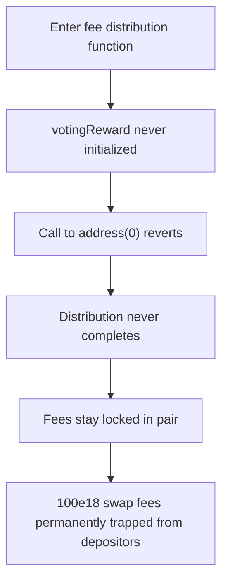

# KittenSwap: `votingReward` not set on `Gauge` traps all swap fees

> **Vulnerability classes:** vuln/dos · vuln/logic
>
> **Reproduction:** a faithful minimal reproduction of the vulnerable finding — the fee-claim block of `Gauge.notifyRewardAmount()` is reproduced **verbatim** (marked `@>`) with faithful minimal doubles; local deploy, no fork.

<!-- source-auditvault: https://github.com/pashov/audits/blob/master/team/md/KittenSwap-security-review_2025-06-12.md -->

## Root cause

The `Gauge` contract never sets `votingReward` during initialization and exposes no setter, so it stays `address(0)`. When `notifyRewardAmount()` claims the pair's swap fees and reaches the forwarding call, it invokes a function on a zero-code address, which reverts and permanently blocks fee distribution. The vulnerable block, reproduced verbatim:

```solidity
        (claimed0, claimed1) = IPair(address(lpToken)).claimFees();
        (address _token0, address _token1) = IPair(address(lpToken)).tokens();
        if (claimed0 > 0) {
            IERC20(_token0).approve(address(votingReward), claimed0);
    @>      votingReward.notifyRewardAmount(_token0, claimed0);
```

`votingReward` is declared with the `IVotingReward` type but is assigned nowhere — the constructor sets only `lpToken`, and no `setVotingReward`-style function exists. Because Solidity guards this high-level external call with an `extcodesize` check on the target, every call to the codeless `address(0)` reverts, taking the whole `notifyRewardAmount()` transaction (including the `claimFees()` that already moved fees to the gauge) down with it.

## Why it's exploitable here

The failure needs no attacker — it triggers on the protocol's own reward-distribution flow:

1. Swap fees accrue in the pair; in the reproduction `100e18` of `token0` fees are available to be claimed.
2. Anyone calls `Gauge.notifyRewardAmount()`. It runs `claimFees()`, pulling the `100e18` into the gauge, and enters the `claimed0 > 0` branch.
3. The verbatim line `votingReward.notifyRewardAmount(_token0, claimed0)` calls `address(0)` — the `extcodesize` check fails and the call reverts.
4. The entire transaction rolls back: the `100e18` of claimed fees is never forwarded and stays trapped in the pair. Distribution stays broken for every future call until an entirely new `Gauge` implementation is deployed, at which point the accrued split among depositors may already have shifted — an unfair distribution.

## Attack path



## Marked-line walkthrough (Playground)

The EVM Playground pins each step to the exact executed source line in `0xbd4fd5a3…`:

1. **L140** — Enter fee distribution function: The gauge's `notifyRewardAmount()` entrypoint runs, claiming the pair's accrued swap fees so they can be forwarded on to the voting-reward contract.
2. **L150** — votingReward never initialized: Root cause: `votingReward` was never set on init and has no setter, so it stays `address(0)`; the gauge approves this zero-code address before calling it.
3. **L151** — Call to address(0) reverts: The gauge invokes `notifyRewardAmount()` on the `address(0)` votingReward, a high-level call to a codeless address that reverts and aborts the distribution.
4. **L153** — Distribution never completes: Because the forwarding call reverts, execution never reaches this closing brace; the whole transaction rolls back and no swap fees are ever forwarded.
5. **L156** — Fees stay locked in pair: Every `notifyRewardAmount()` attempt reverts identically, so the claimed swap fees remain stuck in the pair until an entirely new `Gauge` is deployed.
6. **L157** — Harm: 100e18 rewards trapped: The driver accrues `100e18` of swap fees, then shows every distribution call reverts, permanently trapping depositors' rewards inside the pair.

## PoC

Registry (Foundry, local deploy — verbatim vulnerable source + harm-asserting test):

```bash
cd 58208-h-01-votingreward-not-set-on-gauge-pashov-audit-group-none-k_exp && forge test -vvv
```

The browser Playground replays the same synthetic opcode-for-opcode and measures the harm: **accrue 100e18 of swap fees, then show every `notifyRewardAmount()` call reverts, leaving the fees permanently stuck in the pair**. Both gates are green (registry `forge test` PASS + Playground `_verify-poc` **VERDICT: PASS**).
