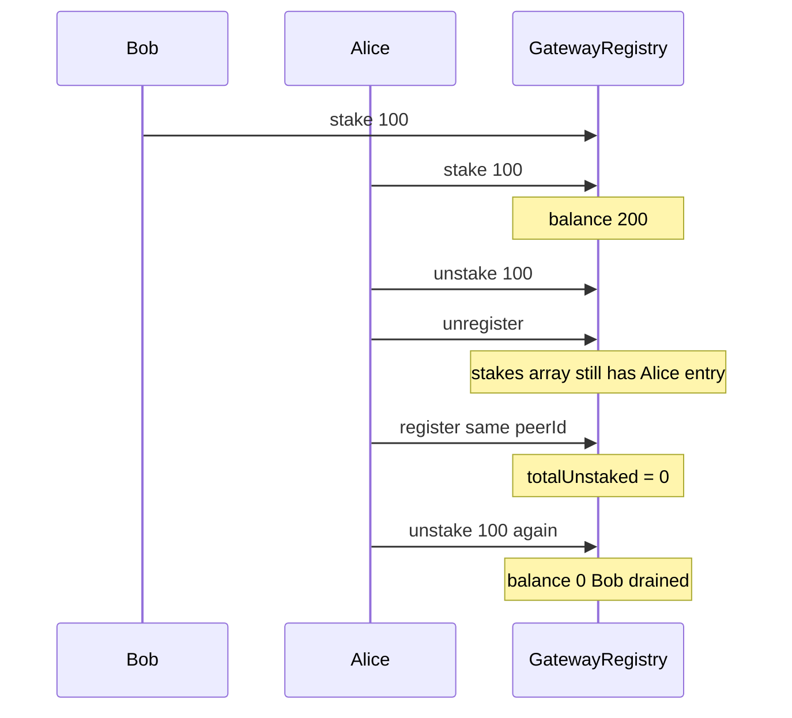

# Subsquid — Gateway creator can steal all tokens from the GatewayRegistry

> **Vulnerability classes:** lockup · permanent · direct-drain · cross-contract-state-consistency

> **Reproduction:** self-contained Foundry PoC with only `forge-std` — no fork.
> [output.txt](output.txt) · [test/58244-…sol](test/58244-c-01-gateway-creator-can-steal-all-tokens-from-the-gatewayre.sol).

<!-- non-defihacklabs -->
<!-- source-auditvault: https://github.com/Auditware/AuditVault/blob/main/findings/58244-c-01-gateway-creator-can-steal-all-tokens-from-the-gatewayre.md -->
<!-- date: 2024-01 -->

**AuditVault taxonomy:** `lang/solidity` · `platform/pashov` · `severity/high` · `impact/loss-of-funds/direct-drain` · `sector/bridge` · genome: `lockup` · `permanent` · `direct-drain` · `cross-contract-state-consistency`

---

## Key info

| | |
|---|---|
| **Impact** | **HIGH** — double-unstake drains other gateways' SQD from the shared registry balance |
| **Protocol** | Subsquid Network — `GatewayRegistry` |
| **Vulnerable code** | `register` resets `totalUnstaked: 0` while `unregister` never deletes `stakes[]` |
| **Bug class** | Stale stake array / accounting reset on re-register |
| **Finding** | Pashov Audit Group — Subsquid · #58244 |
| **Report** | [Subsquid-security-review.md](https://github.com/pashov/audits/blob/master/team/md/Subsquid-security-review.md) |
| **Source** | [AuditVault](https://github.com/Auditware/AuditVault/blob/main/findings/58244-c-01-gateway-creator-can-steal-all-tokens-from-the-gatewayre.md) |
| **Fix** | `delete stakes[peerIdHash]` on unregister |
| **Compiler** | `^0.8.24` (PoC) |
| **Repo** | `subsquid/subsquid-network-contracts` commit `3545236` |

---

## TL;DR

1. Stake tokens into a gateway; after unlock, unstake them.
2. Unregister the gateway — Gateway struct deleted, **stakes[] kept**.
3. Re-register the same peerId — `totalUnstaked` resets to 0.
4. Unstake again against leftover stakes[] — pulls other depositors' tokens.

## Vulnerable code

```solidity
gateways[peerIdHash] = Gateway({
  // ...
  totalStaked: 0,
  totalUnstaked: 0 // @> VULN: reset without clearing stakes[]
});
```

```solidity
// unregister deletes gateways[peerIdHash] but NOT stakes[peerIdHash]
return total - gateway.totalUnstaked; // recomputes from stale stakes
```

## Root cause

Two stores track the same economic reality (`stakes[]` amounts vs `totalUnstaked`). Unregister only clears one; re-register resets the other to zero, so `_unstakeable` overstates unlockable funds.

## Preconditions

- Operator can register/unregister a peerId.
- At least one mature stake entry exists for that peerId.
- Registry holds other users' tokens (shared ERC20 balance).

## Attack walkthrough

1. Bob stakes 100 SQD; Alice stakes 100 SQD (registry = 200).
2. Alice unstakes 100, unregisters, re-registers same peerId.
3. Alice unstakes 100 again → registry balance 0; Alice holds 200.

## Diagrams



## Impact

Any gateway operator can drain the entire registry balance after one legitimate stake/unstake cycle on a recycled peerId.

## Sources

- [AuditVault #58244](https://github.com/Auditware/AuditVault/blob/main/findings/58244-c-01-gateway-creator-can-steal-all-tokens-from-the-gatewayre.md)
- [Pashov Subsquid review](https://github.com/pashov/audits/blob/master/team/md/Subsquid-security-review.md)
- [subsquid-network-contracts@3545236 GatewayRegistry.sol](https://github.com/subsquid/subsquid-network-contracts/blob/3545236f5b34076820fe747eb607a16d8b664a08/packages/contracts/src/GatewayRegistry.sol)
