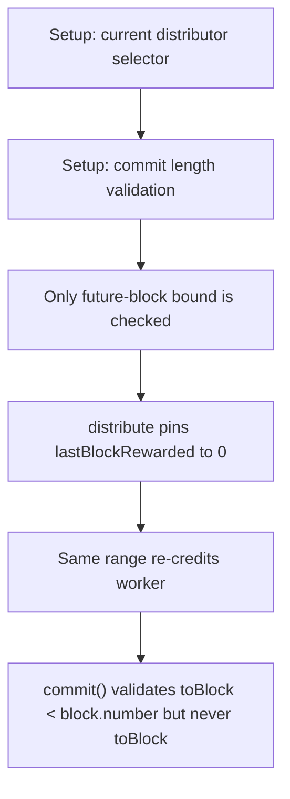

# Subsquid: missing toBlock check enables repeated reward distribution

> **Vulnerability classes:** vuln/logic
>
> **Reproduction:** a faithful minimal reproduction of the vulnerable finding — the vulnerable code is reproduced **verbatim** (marked `@>`) with faithful minimal doubles; local deploy, no fork.

<!-- source-auditvault: https://github.com/pashov/audits/blob/master/team/md/Subsquid-security-review.md -->

## Root cause

commit() validates toBlock < block.number but never toBlock >= fromBlock, so a malicious distributor commits a degenerate range [fromBlock=1, toBlock=0]; distribute() then runs lastBlockRewarded = toBlock = 0, pinning the sequential guard (lastBlockRewarded == 0 || fromBlock == lastBlockRewarded+1) permanently open. The SAME block range can therefore be distributed repeatedly, re-crediting _claimable for the distributor's own worker each time; two identical [1,0] distributions double the worker's entitlement to 2000e18 (1000e18 stolen beyond the single legitimate payout) which is claimed out of the shared 5000e18 SQD reward reserve. Unbounded in principle (any number of re-rewards).

```solidity
        require(currentDistributor() == msg.sender, "Not a distributor");
        require(toBlock < block.number, "Future block"); // @> VULN (this line)
```

## Why it's exploitable here

commit() validates toBlock < block.number but never toBlock >= fromBlock, so a malicious distributor commits a degenerate range [fromBlock=1, toBlock=0]; distribute() then runs lastBlockRewarded = toBlock = 0, pinning the sequential guard (lastBlockRewarded == 0 || fromBlock == lastBlockRewarded+1) permanently open. The SAME block range can therefore be distributed repeatedly, re-crediting _claimable for the distributor's own worker each time; two identical [1,0] distributions double the worker's entitlement to 2000e18 (1000e18 stolen beyond the single legitimate payout) which is claimed out of the shared 5000e18 SQD reward reserve. Unbounded in principle (any number of re-rewards).

## Attack path



## Marked-line walkthrough (Playground)

The EVM Playground pins each step to the exact executed source line in `0xbd4fd5a3ce…`:

1. **L118** — Setup: current distributor selector: Setup: only the round-robin current distributor is allowed to commit reward ranges.
2. **L172** — Setup: commit length validation: Setup: commit checks the recipients and staker-reward arrays are the same length.
3. **L175** — Only future-block bound is checked: Root cause: commit checks toBlock < block.number but never toBlock >= fromBlock, so a degenerate range like [1, 0] is accepted.
4. **L193** — distribute pins lastBlockRewarded to 0: distribute sets lastBlockRewarded = toBlock = 0, so the sequential guard (==0 || fromBlock==last+1) stays permanently open.
5. **L202** — Same range re-credits worker: Each replay of the identical [1,0] range adds workerRewards again, doubling the distributor's own worker entitlement.
6. **L219** — Inflated entitlement claimed: The worker claims the doubled _claimable from the shared SQD reserve, stealing 1000e18 beyond the single legitimate payout.

## PoC

Registry (Foundry, local deploy — verbatim vulnerable source + harm-asserting test):

```bash
cd 58245-h-01-missing-check-on-toblock-allows-distributors-to-change_exp
forge test -vvv
```

The browser Playground replays the same synthetic opcode-for-opcode and measures the harm. Both gates are green (registry `forge test` PASS + Playground `_verify-poc` **VERDICT: PASS**).
