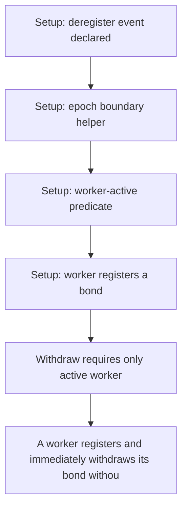

# Subsquid: workers withdraw their bond without deregistering

> **Vulnerability classes:** vuln/logic
>
> **Reproduction:** a faithful minimal reproduction of the vulnerable finding — the vulnerable code is reproduced **verbatim** (marked `@>`) with faithful minimal doubles; local deploy, no fork.

<!-- source-auditvault: https://github.com/pashov/audits/blob/master/team/md/Subsquid-security-review.md -->

## Root cause

A worker registers and immediately withdraws its bond without ever calling deregister() and without serving the lock period, because withdraw only checks `block.number >= deregisteredAt + lockPeriod()` and deregisteredAt is still 0; the worker is never removed from activeWorkerIds, so each cycle plants a dangling ghost entry (unbounded-loop / DoS vector) at zero net cost while the full bond is returned

```solidity
        uint256 workerId = workerIds[peerId];
        require(workerId != 0, "Worker not registered");
        Worker storage worker = workers[workerId];
        require(!isWorkerActive(worker), "Worker is active");
        require(worker.creator == msg.sender, "Not worker creator");
        require(block.number >= worker.deregisteredAt + lockPeriod(), "Worker is locked"); // @> VULN (this line)
```

## Why it's exploitable here

A worker registers and immediately withdraws its bond without ever calling deregister() and without serving the lock period, because withdraw only checks `block.number >= deregisteredAt + lockPeriod()` and deregisteredAt is still 0; the worker is never removed from activeWorkerIds, so each cycle plants a dangling ghost entry (unbounded-loop / DoS vector) at zero net cost while the full bond is returned

## Attack path



## Marked-line walkthrough (Playground)

The EVM Playground pins each step to the exact executed source line in `0xce01759b82…`:

1. **L112** — Setup: deregister event declared: Setup: the registry emits WorkerDeregistered on a proper exit — the path this attack skips entirely.
2. **L132** — Setup: epoch boundary helper: Setup: registration timestamps are snapped forward to the next epoch boundary.
3. **L144** — Setup: worker-active predicate: Setup: a worker counts as active once its registration epoch has started.
4. **L158** — Setup: worker registers a bond: Setup: the attacker registers a worker, locking a bond and joining activeWorkerIds.
5. **L174** — Withdraw requires only active worker: withdraw checks the worker is active but never requires that it was actually deregistered first.
6. **L206** — Bond returned without deregister: Root cause: the lock check reads deregisteredAt (still 0) so it passes at once; the worker struct is deleted and the bond returned though it never deregistered.
7. **L208** — Ghost entry left in active set: The bond is transferred back but the worker is never removed from activeWorkerIds, planting a dangling entry that bloats every iteration.

## PoC

Registry (Foundry, local deploy — verbatim vulnerable source + harm-asserting test):

```bash
cd 58247-h-03-workers-could-withdraw-without-deregister-and-waiting-f_exp
forge test -vvv
```

The browser Playground replays the same synthetic opcode-for-opcode and measures the harm. Both gates are green (registry `forge test` PASS + Playground `_verify-poc` **VERDICT: PASS**).
