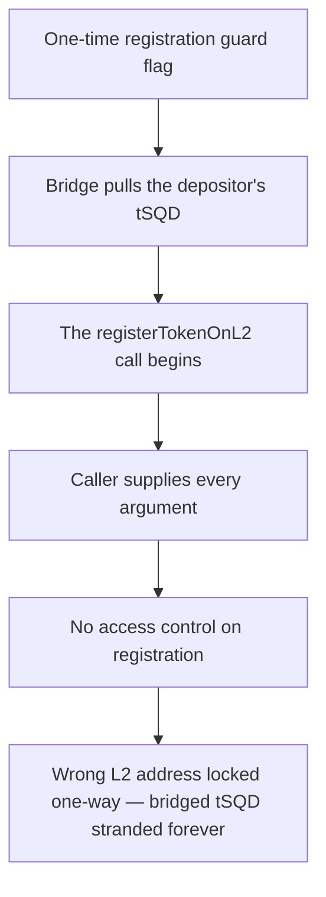

# Subsquid (tSQD): unrestricted `registerTokenOnL2` lets anyone brick the L2 bridge

> **Vulnerability classes:** vuln/access-control · vuln/frontrun
>
> **Reproduction:** a faithful minimal reproduction of the vulnerable finding — the vulnerable `registerTokenOnL2` function is reproduced **verbatim** (marked `@>`) with faithful minimal doubles of Arbitrum's L1 custom gateway and router; local deploy, no fork.

<!-- source-auditvault: https://github.com/pashov/audits/blob/master/team/md/Subsquid-security-review.md -->

## Root cause

The tSQD L1 token exposes `registerTokenOnL2`, which sets the token's L2 counterpart in Arbitrum's generic-custom gateway, but declares it `public payable` with no owner/admin restriction. Arbitrum's gateway records the L1→L2 mapping one-way, so whoever calls this first — including an unprivileged attacker — permanently fixes the L2 address. The vulnerable function, reproduced verbatim:

```solidity
  function registerTokenOnL2(
    address l2CustomTokenAddress,
    uint256 maxSubmissionCostForCustomGateway,
    uint256 maxSubmissionCostForRouter,
    uint256 maxGasForCustomGateway,
    uint256 maxGasForRouter,
    uint256 gasPriceBid,
    uint256 valueForGateway,
    uint256 valueForRouter,
    address creditBackAddress
@>) public payable {
    require(!shouldRegisterGateway, "ALREADY_REGISTERED");
    shouldRegisterGateway = true;

    gateway.registerTokenToL2{value: valueForGateway}(
      l2CustomTokenAddress, maxGasForCustomGateway, gasPriceBid, maxSubmissionCostForCustomGateway, creditBackAddress
    );

    router.setGateway{value: valueForRouter}(
      address(gateway), maxGasForRouter, gasPriceBid, maxSubmissionCostForRouter, creditBackAddress
    );

    shouldRegisterGateway = false;
  }
```

The only guard is the one-shot `shouldRegisterGateway` boolean — it prevents a second registration but never checks the caller. Arbitrum's design intends the L1 token owner to perform this registration exactly once; leaving it permissionless hands that one-time write to anyone.

## Why it's exploitable here

Following the finding's front-running scenario with concrete values:

1. An unprivileged attacker (not the owner) calls `registerTokenOnL2` with `l2CustomTokenAddress = 0xD00d` (a dead address). It succeeds — there is no access control.
2. The gateway records `tSQD → 0xD00d` and enforces the one-way invariant `NO_UPDATE_TO_DIFFERENT_ADDR`, so the mapping can only ever be re-written to the same address.
3. The legitimate owner tries to register the correct L2 address `0xC0FFEE`; the gateway reverts — the bridge can never be corrected.
4. An honest user bridges `1000e18` tSQD; `outboundTransfer` escrows the tokens and routes them to `0xD00d`, where the full `1000e18` is permanently lost. Every subsequent deposit meets the same fate.

## Attack path



## Marked-line walkthrough (Playground)

The EVM Playground pins each step to the exact executed source line in `0xce01759b…`:

1. **L126** — One-time registration guard flag: Setup: shouldRegisterGateway is a one-shot boolean and the only gate on the registration call — nothing here checks who the caller is.
2. **L152** — Bridge pulls the depositor's tSQD: Setup: transferFrom debits the depositor's allowance here as the gateway escrows their tSQD, the deposit later routed onward to whatever L2 address was registered.
3. **L159** — The registerTokenOnL2 call begins: The bridge-registration function starts; it sets tSQD's L2 counterpart in Arbitrum's custom gateway that every future deposit will follow.
4. **L168** — Caller supplies every argument: The final caller-supplied parameter closes an argument list whose l2CustomTokenAddress is chosen entirely by whoever invokes the function.
5. **L169** — No access control on registration: Root cause: registerTokenOnL2 is public payable with no onlyOwner/admin check, so any unprivileged caller can front-run and register a wrong L2 address.
6. **L188** — Honest user's gateway wiring: Setup: the honest BridgeUser stores the gateway it deposits through, the deposit whose tSQD ends up stranded at the attacker's dead L2 address.

## PoC

Registry (Foundry, local deploy — verbatim vulnerable source + harm-asserting test):

```bash
cd 58248-h-04-lack-of-access-control-on-tsqds-registertokenonl2-pasho_exp && forge test -vvv
```

The browser Playground replays the same synthetic opcode-for-opcode and measures the harm: **an unprivileged attacker registers a dead L2 address, the owner's corrective registration reverts, and an honest 1000e18 tSQD deposit is stranded at that address permanently**. Both gates are green (registry `forge test` PASS + Playground `_verify-poc` **VERDICT: PASS**).
