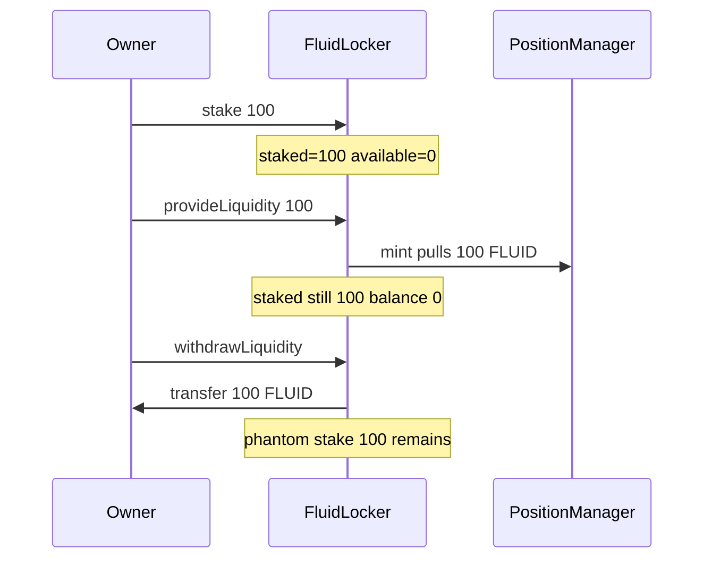

# Superfluid Locker — Staked tokens inside FluidLocker can be withdrawn without Unstake

> **Vulnerability classes:** cross-contract-state-consistency · variant · staking integrity

> **Reproduction:** self-contained Foundry PoC with only `forge-std` — no fork.
> [output.txt](output.txt) · [test/58281-…sol](test/58281-h-1-staked-tokens-inside-fluidlocker-can-be-withdrawn-withou.sol).

<!-- non-defihacklabs -->
<!-- source-auditvault: https://github.com/Auditware/AuditVault/blob/main/findings/58281-h-1-staked-tokens-inside-fluidlocker-can-be-withdrawn-withou.md -->
<!-- date: 2025-06 -->

**AuditVault taxonomy:** `lang/solidity` · `sector/dex` · `sector/staking` · `platform/sherlock` · `severity/high` · genome: `cross-contract-state-consistency` · `variant`

---

## Key info

| | |
|---|---|
| **Impact** | **HIGH** — phantom stake accrues reward units after tokens left the locker |
| **Protocol** | Superfluid Locker System — `FluidLocker.provideLiquidity` |
| **Vulnerable code** | `provideLiquidity` never checks `supAmount <= getAvailableBalance()` |
| **Bug class** | Missing available-balance validation / double-use of staked funds |
| **Finding** | Sherlock 2025-06-superfluid-locker-system · H-1 · #58281 · newspacexyz et al. |
| **Report** | [judging issue #177](https://github.com/sherlock-audit/2025-06-superfluid-locker-system-judging/issues/177) |
| **Source** | [AuditVault](https://github.com/Auditware/AuditVault/blob/main/findings/58281-h-1-staked-tokens-inside-fluidlocker-can-be-withdrawn-withou.md) |
| **Fix** | [superfluid-finance/fluid#26](https://github.com/superfluid-finance/fluid/pull/26) — require available balance |
| **Compiler** | `^0.8.24` (PoC) |
| **Repo** | `sherlock-audit/2025-06-superfluid-locker-system@d8beaeed` |

---

## TL;DR

1. Owner stakes all FLUID in the locker (`_stakedBalance = balance`).
2. `provideLiquidity(supAmount)` does **not** check available balance — staked tokens leave to Uniswap.
3. After tax-free `withdrawLiquidity`, FLUID is at the owner; `_stakedBalance` still full.
4. Staking reward units keep accruing on phantom stake; `getAvailableBalance` underflows.

## Vulnerable code

```solidity
function provideLiquidity(uint256 supAmount) external payable {
    // missing: require(supAmount <= getAvailableBalance());
    // ...
    NONFUNGIBLE_POSITION_MANAGER.mint(..., supAmount, ...); // @> VULN
}
```

## Root cause

Stake accounting (`_stakedBalance`) is independent of the FLUID path used by `provideLiquidity`. Only `stake`/`unstake` touch the stake counter; LP paths move the actual tokens.

## Preconditions

- Locker holds FLUID and has a locker owner.
- Owner can stake and call `provideLiquidity` / `withdrawLiquidity`.

## Attack walkthrough

1. Fund locker with 100 FLUID; stake all 100.
2. `provideLiquidity(100)` — tokens leave despite being staked.
3. Tax-free withdraw (delay reduced to 0 in synthetic) returns FLUID to owner.
4. `getStakedBalance() == 100` while locker balance is 0.

## Diagrams



## Impact

Unbounded phantom stake corrupts the staker reward distribution; free points dominate future reward shares.

## Sources

- [AuditVault #58281](https://github.com/Auditware/AuditVault/blob/main/findings/58281-h-1-staked-tokens-inside-fluidlocker-can-be-withdrawn-withou.md)
- [Sherlock judging #177](https://github.com/sherlock-audit/2025-06-superfluid-locker-system-judging/issues/177)
- [FluidLocker.sol@d8beaeed](https://github.com/sherlock-audit/2025-06-superfluid-locker-system/blob/d8beaeed47f766659a1600a87372a7905109aa3c/fluid/packages/contracts/src/FluidLocker.sol)
