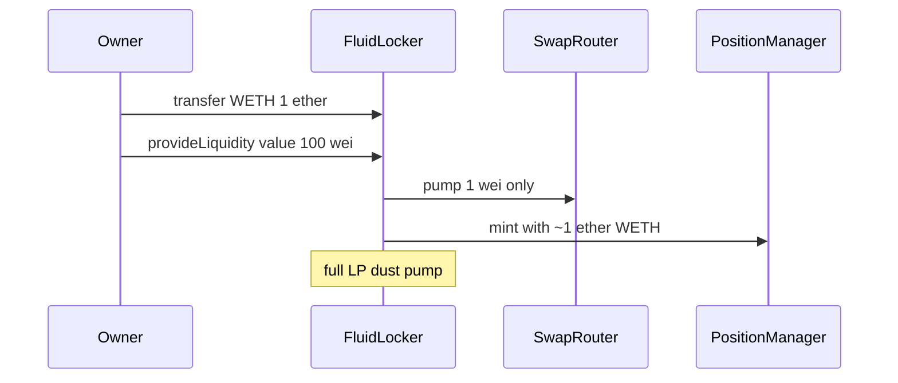

# Superfluid Locker — Pumponomics can be skipped via `provideLiquidity`

> **Vulnerability classes:** access-roles · fee-theft · single-tx · known-pattern

> **Reproduction:** self-contained Foundry PoC with only `forge-std` — no fork.
> [output.txt](output.txt) · [test/58282-…sol](test/58282-h-2-pumponomics-can-be-skipped-when-using-fluidlockerprovide.sol).

<!-- non-defihacklabs -->
<!-- source-auditvault: https://github.com/Auditware/AuditVault/blob/main/findings/58282-h-2-pumponomics-can-be-skipped-when-using-fluidlockerprovide.md -->
<!-- date: 2025-06 -->

**AuditVault taxonomy:** `lang/solidity` · `sector/dex` · `sector/streaming` · `platform/sherlock` · `severity/high` · genome: `access-roles` · `loss-of-funds/fee-theft` · `single-tx`

---

## Key info

| | |
|---|---|
| **Impact** | **HIGH** — structural buy-pressure (pumponomics) bypassed; protocol loses swap/LP fee intent |
| **Protocol** | Superfluid Locker System — `FluidLocker.provideLiquidity` / `_pump` |
| **Vulnerable code** | Pumps only `msg.value * 1%` but LPs `WETH.balanceOf(locker)` |
| **Bug class** | Mismatch between pump base and LP inventory |
| **Finding** | Sherlock 2025-06-superfluid-locker-system · H-2 · #58282 · newspacexyz et al. |
| **Report** | [judging issue #210](https://github.com/sherlock-audit/2025-06-superfluid-locker-system-judging/issues/210) |
| **Source** | [AuditVault](https://github.com/Auditware/AuditVault/blob/main/findings/58282-h-2-pumponomics-can-be-skipped-when-using-fluidlockerprovide.md) |
| **Fix** | [superfluid-finance/fluid#27](https://github.com/superfluid-finance/fluid/pull/27) |
| **Compiler** | `^0.8.24` (PoC) |
| **Repo** | `sherlock-audit/2025-06-superfluid-locker-system@d8beaeed` |

---

## TL;DR

1. Owner pre-sends WETH into the locker (not via `provideLiquidity`).
2. Calls `provideLiquidity{value: dust}(supAmount)`.
3. Only `dust * 1%` is pumped (buy SUP); the position uses **all** WETH.
4. Full-sized LP with negligible pumponomics.

## Vulnerable code

```solidity
_pump(weth, ethAmount * BP_PUMP_RATIO / BP_DENOMINATOR); // @> VULN: ethAmount = msg.value only
uint256 ethLPAmount = IERC20(weth).balanceOf(address(this)); // full inventory
_createPosition(ethLPAmount, supAmount);
```

## Root cause

Pump sizing keys off `msg.value`; LP sizing keys off balance. Pre-funded WETH is LPd without being pumped.

## Preconditions

- Locker owner can transfer WETH in and call `provideLiquidity`.
- Locker holds FLUID for the SUP side of the position.

## Attack walkthrough

1. Deposit 1 ETH as WETH into the locker.
2. `provideLiquidity{value: 100 wei}(100e18 SUP)`.
3. `ethPumped == 1` (1% of 100); position holds ~1 ETH of WETH.

## Diagrams



## Impact

Weakens Superfluid's intended buy-pressure; large LP positions can be opened while protocol fee/swap flow from pumponomics is nearly zero.

## Sources

- [AuditVault #58282](https://github.com/Auditware/AuditVault/blob/main/findings/58282-h-2-pumponomics-can-be-skipped-when-using-fluidlockerprovide.md)
- [Sherlock judging #210](https://github.com/sherlock-audit/2025-06-superfluid-locker-system-judging/issues/210)
- [FluidLocker.sol@d8beaeed](https://github.com/sherlock-audit/2025-06-superfluid-locker-system/blob/d8beaeed47f766659a1600a87372a7905109aa3c/fluid/packages/contracts/src/FluidLocker.sol)
