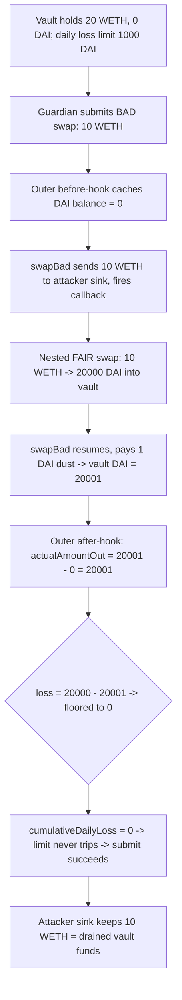
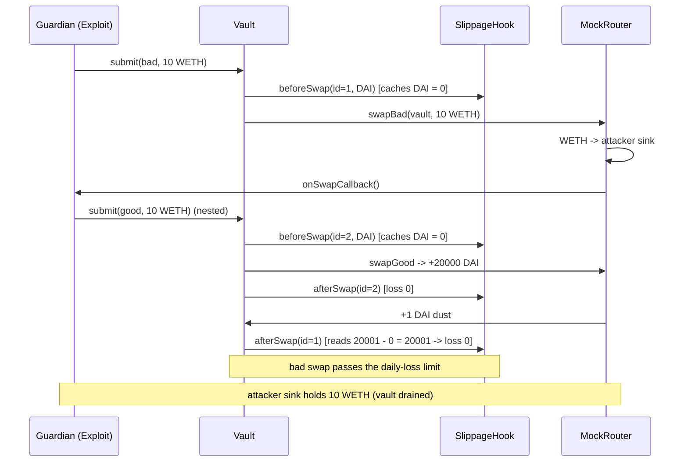

# Aera Contracts v3 — incorrect received-swap-amount calculation lets guardians bypass the daily loss limit

> **Vulnerability classes:** vuln/logic/fee-calculation · vuln/accounting/balance-delta-double-count · vuln/loss-of-funds/partial-drain

> **Reproduction:** a self-contained Foundry PoC that compiles & runs in an
> isolated project with **only `forge-std`** — no fork, no RPC, no `anvil_state`.
> Full trace: [output.txt](output.txt). PoC:
> [test/58289-incorrect-calculation-of-the-received-swap-amount-allows-gua_exp.sol](test/58289-incorrect-calculation-of-the-received-swap-amount-allows-gua_exp.sol).

<!-- non-defihacklabs -->
<!-- source-auditvault: https://github.com/Auditware/AuditVault/blob/main/findings/58289-incorrect-calculation-of-the-received-swap-amount-allows-gua.md -->
<!-- date: 2025-04 -->

**AuditVault taxonomy:** `severity/high` · `sector/dex` · `sector/oracle` · `sector/stable` · `sector/token` · `platform/spearbit` · `fee-accounting` · `access-roles` · `logic/fee-calculation` · `loss-of-funds/partial-drain` · `known-pattern` · `privileged-tx` · `fix-arithmetic` · `precondition/privileged-caller` · `misassumption/admin-is-honest` · `blast-radius/protocol-wide`

---

## Key info

| | |
|---|---|
| **Impact** | **HIGH** — a guardian bypasses the vault's per-day loss limit by submitting a near-worthless swap whose after-hook records ~zero loss; the swap's input tokens are siphoned to an attacker-controlled sink (socialized onto depositors) |
| **Protocol** | [Aera Contracts](https://aera.finance) v3 — programmable vault + guardian slippage hooks |
| **Vulnerable code** | `BaseSlippageHooks._handleAfterExactOutputSingle` / `_handleAfterExactInputSingle` — `actualAmountOut = IERC20(tokenOut).balanceOf(...) - balanceBefore` (BaseSlippageHooks.sol#L118-119, #L132-133) |
| **Bug class** | Balance-delta accounting: the amount "received" by a swap is measured as a shared token-balance delta, which a nested concurrent swap can inflate (double-count) |
| **Finding** | Spearbit / Gauntlet — Aera Contracts v3, April 2025 · #58289 · reporter **Slowfi** |
| **Report** | [Gauntlet-Spearbit-Security-Review-April-2025.pdf](https://github.com/spearbit/portfolio/blob/master/pdfs/Gauntlet-Spearbit-Security-Review-April-2025.pdf) |
| **Source** | [AuditVault](https://github.com/Auditware/AuditVault/blob/main/findings/58289-incorrect-calculation-of-the-received-swap-amount-allows-gua.md) |
| **Status** | Audit finding — caught in review (not exploited on-chain). Fixed in PR 319. Reproduced here as a standalone local PoC. |
| **Compiler** | `^0.8.24` (PoC) |

This is an **audit finding**, not a historical on-chain incident. The real Aera
slippage hooks integrate Uniswap V3 (`exactInput` / `exactInputSingle`); the PoC
keeps the vulnerable balance-delta calculation verbatim and models the mid-swap
callback so the double-count is a mechanically genuine token loss.

---

## TL;DR

1. Aera's slippage hook enforces a **daily loss limit** on guardian-directed
   swaps. To do so, its after-hook measures how much `tokenOut` the vault
   received as a **balance delta**: `balanceOf(vault) - balanceBefore`.
2. That delta is **not attributable to one swap**. If a *second* swap runs
   *during* the first (via a callback) and also increases the `tokenOut`
   balance, the first swap's after-hook **double-counts** that increase.
3. A guardian submits a **bad** swap — 10 WETH for ~0 DAI (a route through a
   low-liquidity attacker pool). Mid-swap, a callback nests a **fair** swap
   (10 WETH → 20 000 DAI) into the same vault.
4. The bad swap's after-hook reads `20 001 − 0 = 20 001 DAI` "received" for a
   10-WETH (≈20 000 DAI) input → **recorded loss = 0**. The daily-loss limit
   never trips, so the submit succeeds.
5. The bad swap's 10 WETH input was routed to the attacker's sink. Net: the
   vault is drained of ~10 WETH while its own loss accounting shows nothing —
   a bypass of the guardian's core risk guard. A control test proves the same
   bad swap **reverts** when it is *not* nested.

---

## The vulnerable code

The after-hook derives the received amount from a shared balance delta
(reduction; the blamed lines are `BaseSlippageHooks.sol#L118-119` and
`#L132-133`):

```solidity
// FIX: derive the received amount from the swap's own return value / input
//      parameters (e.g. params.amountOutMinimum) — never from a shared
//      balance delta that a nested swap can inflate.
uint256 actualAmountOut = IERC20(tokenOut).balanceOf(vault) - balanceBefore[vault][swapId]; // @> VULN
...
uint256 valueIn = amountIn * fairRate;
uint256 loss = valueIn > actualAmountOut ? valueIn - actualAmountOut : 0;
cumulativeDailyLoss[vault] += loss;
require(cumulativeDailyLoss[vault] <= dailyLossLimit, "ExceedsDailyLoss");
```

The malicious router that nests the second swap mid-execution:

```solidity
function swapBad(address vault, uint256 amountIn) external returns (uint256 out) {
    weth.transferFrom(vault, attackerSink, amountIn);   // input captured by attacker
    if (callbackArmed) {
        callbackArmed = false;
        ISwapCallback(swapCallback).onSwapCallback();    // nested fair swap inflates vault DAI
    }
    out = BAD_DAI_OUT;                                    // ~0 DAI back to the vault
    dai.transfer(vault, out);
}
```

---

## Root cause

The hook equates "amount received by *this* swap" with "increase in the vault's
`tokenOut` balance across *this* hook's before/after window". Those are only the
same when nothing else moves the balance in that window. A guardian can violate
that assumption at will: any callback that runs a second `tokenOut`-increasing
swap during the first swap makes the outer window capture *both* swaps' output,
so the outer after-hook attributes the inner swap's proceeds to the outer trade.
Because the loss guard is fed this inflated "received" number, a
near-total-loss trade reports zero loss and slips past the limit.

## Preconditions

- The actor is a **guardian** (a semi-trusted role permitted to direct swaps).
  Per the report's genome (`misassumption/admin-is-honest`), the guard exists
  precisely to bound a *misbehaving* guardian — so bypassing it is in scope.
- The swap path is only validated on its `tokenIn`/`tokenOut`, not end-to-end,
  so a route through an attacker-controlled pool is allowed.
- A callback fires during the swap (in the real system, the attacker's own ERC-20
  in the multi-hop path performs the callback on `transfer`).

## Attack walkthrough

From [output.txt](output.txt), with a vault holding 20 WETH and a 1000-DAI/day
loss limit (fair rate 1 WETH = 2000 DAI):

1. Guardian submits a **bad** swap of 10 WETH → DAI. Outer **before-hook** caches
   the vault's DAI balance = **0**.
2. `swapBad` sends the vault's 10 WETH to the attacker sink, then fires a callback.
3. The callback nests a **fair** swap of 10 WETH → **20 000 DAI** into the vault.
   Its own before/after hook records loss = 0 (a fair trade) and returns.
4. `swapBad` resumes and pays **1 DAI** dust to the vault (DAI balance now 20 001).
5. Outer **after-hook**: `actualAmountOut = 20 001 − 0 = 20 001 DAI` for a 10-WETH
   (≈20 000 DAI) input → **recorded loss = 0**, so `cumulativeDailyLoss` stays at
   0 and the 1000-DAI limit never trips.
6. **HARM:** the attacker sink now holds the vault's **10 WETH**; the vault is
   drained yet its loss accounting shows nothing. A control test confirms the
   *same* bad swap, run **without** the nested callback, records a ~19 999 DAI
   loss and reverts with `ExceedsDailyLoss` — proving the nesting is what
   bypasses the guard.

## Diagrams





## Impact

**Who loses what:** the vault's depositors. A guardian — the very role the daily
loss limit is meant to constrain — extracts the vault's input tokens (≈10 WETH in
the PoC) through an intentionally-worthless swap whose loss is recorded as zero.
The guard that is supposed to cap catastrophic guardian-directed losses is fully
bypassable, so the theoretical loss bound per day is meaningless. Because the
route can be repeated, the drain is bounded only by vault balance and swap
permissions — a protocol-wide risk (`blast-radius/protocol-wide`).

## Remediation

Do not measure the received amount as a token-balance delta. Value the loss from
the swap's **own input parameters** — for an exact-input swap, `value(amountIn) −
value(amountOutMinimum)` — and verify that against the max slippage and the daily
loss limit. This never reads a shared balance and cannot be inflated by a nested
swap. Aera adopted this in **PR 319** (and can then make part of the slippage
hooks before-only). The exact fix is out of scope for this reduced repro.

## How to reproduce

```bash
cd ~/RustroverProjects/audits/evm-hack-registry/58289-incorrect-calculation-of-the-received-swap-amount-allows-gua_exp
forge test -vvv
# Fully local — no fork, no RPC, no anvil_state required.
# Expected: both tests PASS:
#   test_directBadSwap_isCaughtByLimit          (control: un-nested bad swap reverts on the limit)
#   test_exploit_bypassesDailyLossLimit         (attack: nested double-count -> limit bypassed, 10 WETH drained)
```

PoC source: [test/58289-incorrect-calculation-of-the-received-swap-amount-allows-gua_exp.sol](test/58289-incorrect-calculation-of-the-received-swap-amount-allows-gua_exp.sol)
— the verbatim balance-delta calculation plus a faithful reduction of the
guardian vault, slippage hook, and mid-swap-callback router, with a control test.

> Note: the fair rate (1 WETH = 2000 DAI), the 1000-DAI daily limit, and the
> 1-DAI bad-swap output are reduced-model constants (real Aera integrates
> Uniswap V3 and an oracle registry, out of scope), so the exact +10 WETH / −0
> loss magnitudes validate the model; the bug class (received amount measured as
> a shared balance delta → nested-swap double-count → daily-loss bypass) and the
> verbatim vulnerable line are faithful.

---

## Sources

- **AuditVault finding:** [58289-incorrect-calculation-of-the-received-swap-amount-allows-gua.md](https://github.com/Auditware/AuditVault/blob/main/findings/58289-incorrect-calculation-of-the-received-swap-amount-allows-gua.md)
- **Original report:** [Gauntlet / Spearbit Security Review — Aera Contracts v3, April 2025](https://github.com/spearbit/portfolio/blob/master/pdfs/Gauntlet-Spearbit-Security-Review-April-2025.pdf) (finding #58289, reporter Slowfi)

*Reference: finding **#58289** in the [Gauntlet-Spearbit Aera Contracts v3 review (April 2025)](https://github.com/spearbit/portfolio/blob/master/pdfs/Gauntlet-Spearbit-Security-Review-April-2025.pdf) · curated by [AuditVault](https://github.com/Auditware/AuditVault/blob/main/findings/58289-incorrect-calculation-of-the-received-swap-amount-allows-gua.md)*
