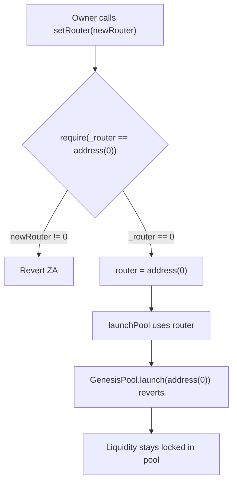

# Blackhole — inverted `setRouter` zero-address check bricks pool launches

> **Vulnerability classes:** vuln/access-control/broken-logic · vuln/logic/wrong-condition · vuln/liveness/admin-brick

> **Reproduction:** a self-contained Foundry PoC that compiles & runs in an
> isolated project with **only `forge-std`** — no fork, no RPC, no `anvil_state`.
> Full trace: [output.txt](output.txt). PoC:
> [test/58333-h-01-router-address-validation-logic-error-prevents-valid-ro_exp.sol](test/58333-h-01-router-address-validation-logic-error-prevents-valid-ro_exp.sol).

<!-- non-defihacklabs -->
<!-- source-auditvault: https://github.com/Auditware/AuditVault/blob/main/findings/58333-h-01-router-address-validation-logic-error-prevents-valid-ro.md -->
<!-- date: 2025-05 -->

**AuditVault taxonomy:** `severity/high` · `sector/dex` · `sector/governance` · `platform/code4rena` · `access-roles` · `proxy-initialization` · `logic/wrong-condition` · `data-corruption/state-manipulation` · `known-pattern` · `privileged-tx` · `add-check` · `blast-radius/single-pool`

---

## Key info

| | |
|---|---|
| **Impact** | **HIGH** — owner can only set the DEX router to `address(0)`, never a functional address; zero-router launches revert and lock GenesisPool liquidity |
| **Protocol** | Blackhole (Audit 507) — GenesisPoolManager |
| **Vulnerable code** | `GenesisPoolManager.setRouter` — `require(_router == address(0), "ZA")` (GenesisPoolManager.sol#L314) |
| **Bug class** | Inverted zero-address check (broken admin setter) |
| **Finding** | Code4rena 2025-05-blackhole · #58333 · reporter **AvantGard** |
| **Report** | [code4rena.com/reports/2025-05-blackhole](https://code4rena.com/reports/2025-05-blackhole) |
| **Source** | [AuditVault](https://github.com/Auditware/AuditVault/blob/main/findings/58333-h-01-router-address-validation-logic-error-prevents-valid-ro.md) |
| **Status** | Audit finding — mitigated in Blackhole mitigation contest. Reproduced as a standalone local PoC. |
| **Compiler** | `^0.8.24` (PoC) |

---

## TL;DR

1. `setRouter(address _router)` is meant to let the owner update the DEX router used when a GenesisPool launches and adds liquidity.
2. The require is inverted: `require(_router == address(0), "ZA")` — so the **only** accepted value is the zero address.
3. A valid non-zero router always reverts `"ZA"`. The owner can only *clear* the router.
4. `_launchPool` passes the stored `router` into `IGenesisPool.launch`. With `router == address(0)`, launch reverts and depositors' native/funding tokens stay locked in the pool.
5. Fix: `require(_router != address(0), "ZA")`.

---

## The vulnerable code

```solidity
function setRouter(address _router) external onlyOwner {
    require(_router == address(0), "ZA"); // @> VULN: inverted check
    // FIX: require(_router != address(0), "ZA");
    router = _router;
}
```

---

## Root cause

A classic inverted null-check. The developer almost certainly meant "reject the zero address" (`!=`) but wrote "require the zero address" (`==`). The setter becomes a one-way clear function with no path to assign a working router after deploy (or after a mistaken clear).

## Preconditions

- Caller is the `owner` (privileged setter — in scope for high because core launch path depends on it).
- A GenesisPool reaches the launch stage with liquidity already deposited.

## Attack walkthrough

1. GenesisPool is funded with 1 ETH of liquidity awaiting launch.
2. Owner tries `setRouter(newValidRouter)` → reverts `"ZA"`.
3. Owner calls `setRouter(address(0))` → succeeds; `router` is cleared.
4. Owner calls `launchPool` → pool.launch reverts `"Router is address(0)"`.
5. 1 ETH remains locked; pool never launches.

## Diagrams



## Impact

Admin cannot repair a misconfigured or upgraded router. Clearing the router (the only successful `setRouter` path) bricks every subsequent pool launch and can permanently lock depositors' funds until a contract upgrade fixes the setter.

## Sources

- [AuditVault finding #58333](https://github.com/Auditware/AuditVault/blob/main/findings/58333-h-01-router-address-validation-logic-error-prevents-valid-ro.md)
- [Code4rena report 2025-05-blackhole](https://code4rena.com/reports/2025-05-blackhole)
- Reduced source: [code-423n4/2025-05-blackhole @ 92fff84](https://github.com/code-423n4/2025-05-blackhole/blob/92fff849d3b266e609e6d63478c4164d9f608e91/contracts/GenesisPoolManager.sol#L314) — `GenesisPoolManager.setRouter`
