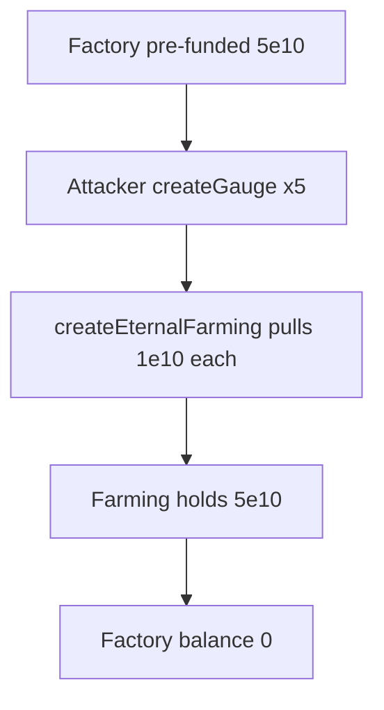

# Blackhole — Reward token in `GaugeFactoryCL` can be drained by anyone

> **Vulnerability classes:** reward-accounting · reward-theft · missing-authorization
>
> **Reproduction:** self-contained Foundry PoC with **only `forge-std`** — no fork.
> Full trace: [output.txt](output.txt).

<!-- non-defihacklabs -->
<!-- source-auditvault: https://github.com/Auditware/AuditVault/blob/main/findings/58334-h-02-reward-token-in-gaugefactorycl-can-be-drained-by-anyone.md -->
<!-- date: 2025-05 -->

---

## Key info

| | |
|---|---|
| **Impact** | **HIGH** — pre-funded reward inventory drained via permissionless `createGauge` |
| **Protocol** | Blackhole (Audit 507) — GaugeFactoryCL / Algebra CL gauges |
| **Vulnerable code** | `GaugeFactoryCL.createGauge` — no access control + 1e10 seed |
| **Finding** | Code4rena — 2025-05-blackhole · #58334 · [H-02] · reporter **bareli** |
| **Report** | [code4rena.com/reports/2025-05-blackhole](https://code4rena.com/reports/2025-05-blackhole) |
| **Source** | [AuditVault](https://github.com/Auditware/AuditVault/blob/main/findings/58334-h-02-reward-token-in-gaugefactorycl-can-be-drained-by-anyone.md) |
| **Compiler** | `^0.8.24` (PoC) |

## TL;DR

1. `createGauge` is `external` with no authorization.
2. Each call seeds Algebra eternal farming with a hardcoded `1e10` of `_rewardToken` pulled from the factory.
3. Anyone can spam the call and empty a pre-funded factory balance into attacker-chosen farms.

## The vulnerable code

```solidity
function createGauge(...) external returns (address) {
    createEternalFarming(...); // @> VULN: ungated seed of 1e10 reward
    last_gauge = address(new GaugeCL(...));
    ...
}
```

## Root cause

Factory seeding was designed as an admin/voter path but shipped without access control, while still pulling real reward tokens from the factory balance.

## Diagrams



## Impact

Full drain of reward tokens held by `GaugeFactoryCL` for legitimate gauge seeding; attacker-controlled farms receive the inventory.

## Sources

- AuditVault: https://github.com/Auditware/AuditVault/blob/main/findings/58334-h-02-reward-token-in-gaugefactorycl-can-be-drained-by-anyone.md
- Report: https://code4rena.com/reports/2025-05-blackhole
- Repo@commit: code-423n4/2025-05-blackhole@92fff849d3b266e609e6d63478c4164d9f608e91 `contracts/AlgebraCLVe33/GaugeFactoryCL.sol`

Taxonomy: `[[reward-theft]]` · `[[reward-accounting]]` · `severity/high` · `sector/farm`
