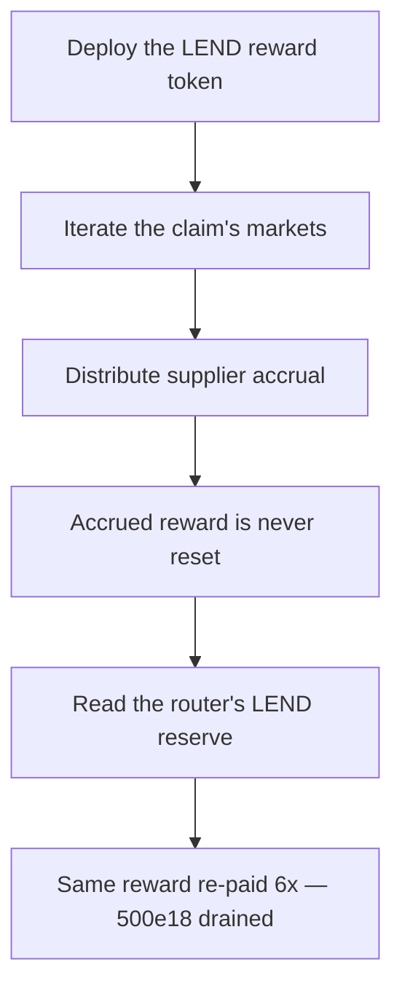

# LEND: `claimLend` never resets accrued rewards, draining LEND reserves

> **Vulnerability classes:** vuln/theft · vuln/logic
>
> **Reproduction:** a faithful minimal reproduction of the vulnerable finding — the `claimLend` reward-grant loop and `grantLendInternal` are reproduced **verbatim** (marked `@>`) with faithful minimal doubles; local deploy, no fork.

<!-- source-auditvault: https://github.com/sherlock-audit/2025-05-lend-audit-contest-judging/issues/148 -->

## Root cause

In [`Lend-V2/src/LayerZero/CoreRouter.sol`](https://github.com/sherlock-audit/2025-05-lend-audit-contest/blob/main/Lend-V2/src/LayerZero/CoreRouter.sol#L402)'s `claimLend()`, the final loop grants each holder their accrued LEND via `grantLendInternal()` but ignores its return value and never resets `lendStorage.lendAccrued`. Because the accrued balance survives the payout, a user can call `claimLend()` again and again and re-collect the same reward every time. The vulnerable lines, reproduced verbatim:

```solidity
for (uint256 j = 0; j < holders.length;) {
    uint256 accrued = lendStorage.lendAccrued(holders[j]);
    if (accrued > 0) {
@>      grantLendInternal(holders[j], accrued);
    }
    unchecked {
        ++j;
    }
}
```

`grantLendInternal()` transfers the LEND and returns the un-granted remainder (0 on success), but the caller discards it. Compound's correct implementation writes that remainder back — `lendAccrued[holders[j]] = grantLendInternal(holders[j], lendAccrued[holders[j]]);` — zeroing the balance so a reward is paid exactly once. Here the balance is left untouched.

## Why it's exploitable here

Following the synthetic reproduction:

1. The attacker legitimately accrues `100e18` LEND exactly once. The router holds `1000e18` of LEND reserves funded for all other users.
2. The attacker calls `claimLend([attacker], …)`. `grantLendInternal` transfers `100e18` but leaves `lendStorage.lendAccrued[attacker] == 100e18`.
3. The attacker calls `claimLend` again — the same `100e18` is paid out. Five repeats pay `500e18` more.
4. After 6 calls the attacker holds `600e18` for a single `100e18` entitlement — `500e18` drained straight out of other users' reserves.

## Attack path



## Marked-line walkthrough (Playground)

The EVM Playground pins each step to the exact executed source line in `0xbd4fd5a3…`:

1. **L42** — Deploy the LEND reward token: Setup: the LEND reward token is deployed and minted into the router as the shared reserve that backs every user's accrued rewards.
2. **L115** — Iterate the claim's markets: claimLend walks the caller-supplied markets, running the accrual bookkeeping before it reaches the final reward-granting loop.
3. **L127** — Distribute supplier accrual: For each holder, claimLend triggers supplier LEND distribution to bring the accrued reward up to date before it is paid out.
4. **L133** — Accrued reward is never reset: Root cause: the grant loop pays out lendStorage.lendAccrued via grantLendInternal but never resets it, so the same reward is re-claimable every call.
5. **L156** — Read the router's LEND reserve: grantLendInternal reads the router's LEND balance, the shared reserve, to confirm it can still cover the unchanged accrued amount.
6. **L158** — Pay the same reward again: While the reserve still covers the accrued amount the router transfers it once more, so each repeated claim re-pays the same reward until reserves drain.

## PoC

Registry (Foundry, local deploy — verbatim vulnerable source + harm-asserting test):

```bash
cd 58370-lend-repeated-claims-of-the-same-rewards-drain-lend-reserves_exp && forge test -vvv
```

The browser Playground replays the same synthetic opcode-for-opcode and measures the harm: **accrue 100e18 once, call `claimLend` 6x to receive 600e18, draining 500e18 of other users' LEND reserves**. Both gates are green (registry `forge test` PASS + Playground `_verify-poc` **VERDICT: PASS**).
