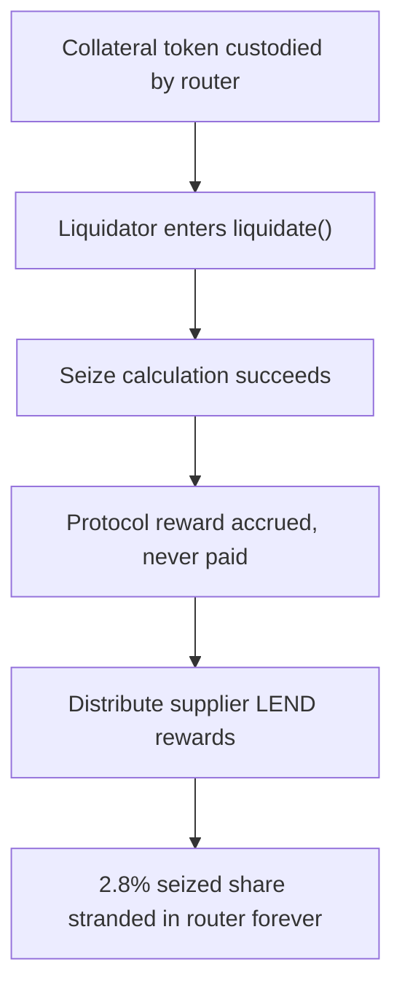

# Lend: liquidation `protocolReward` is permanently stuck

> **Vulnerability classes:** vuln/frozen-funds · vuln/logic
>
> **Reproduction:** a faithful minimal reproduction of the vulnerable finding — the vulnerable `liquidateSeizeUpdate` reward accrual is reproduced **verbatim** (marked `@>`) with faithful minimal doubles; local deploy, no fork.

<!-- source-auditvault: https://github.com/sherlock-audit/2025-05-lend-audit-contest-judging/issues/184 -->

## Root cause

In [`Lend-V2/src/LayerZero/CoreRouter.sol`](https://github.com/sherlock-audit/2025-05-lend-audit-contest/blob/main/Lend-V2/src/LayerZero/CoreRouter.sol#L300), every liquidation carves out `PROTOCOL_SEIZE_SHARE_MANTISSA` (2.8%) of the seized collateral and records it in `protocolReward` via `updateProtocolReward`. That mapping is only ever incremented — no function in `LendStorage.sol`, `CoreRouter.sol`, or `CrossChainRouter.sol` ever redeems, transfers, or decrements it. The vulnerable lines, reproduced verbatim:

```solidity
uint256 currentReward = mul_(seizeTokens, Exp({mantissa: lendStorage.PROTOCOL_SEIZE_SHARE_MANTISSA()}));
@>  lendStorage.updateProtocolReward(lTokenCollateral, lendStorage.protocolReward(lTokenCollateral) + currentReward);
```

`updateProtocolReward` can only raise the balance; the 2.8% share's backing collateral is left in the router with no owner and no withdrawal path. The borrower is debited the full `seizeTokens`, the liquidator is credited `seizeTokens - currentReward`, and the protocol's cut is stranded forever.

## Why it's exploitable here

Following the finding with a single 1000e18 liquidation:

1. The router custodies `1000e18` collateral backing the borrower's position; the borrower's `totalInvestment` is `1000e18`.
2. A liquidator seizes the full `1000e18`. The protocol books `currentReward = 1000e18 * 0.028 = 28e18` into `protocolReward` and credits the liquidator `972e18`.
3. The liquidator redeems its full `972e18` via `redeem`, which is keyed on `totalInvestment`.
4. The borrower's `totalInvestment` is now `0` and nobody holds a claim on the `28e18`. That collateral sits in the router with no function able to move it — a permanent loss of protocol revenue on every liquidation.

## Attack path



## Marked-line walkthrough (Playground)

The EVM Playground pins each step to the exact executed source line in `0xe3a787a4…`:

1. **L55** — Collateral token custodied by router: Setup: the ERC20 collateral double the router holds for suppliers, and where the seized 2.8% protocol share ends up stranded.
2. **L133** — Liquidator enters liquidate(): The liquidator calls the thin external entrypoint, which forwards straight into the verbatim internal liquidateSeizeUpdate on the position.
3. **L148** — Seize calculation succeeds: The Lendtroller returns seizeTokens (1000e18) for the liquidation and the error-code guard passes, so reward accrual proceeds.
4. **L161** — Protocol reward accrued, never paid: Root cause: 2.8% of the seized collateral is added to protocolReward, a mapping only ever incremented with no function anywhere that pays it out.
5. **L164** — Distribute supplier LEND rewards: LEND rewards flow to liquidator and borrower, but the 2.8% collateral share just booked is left untouched by any distribution.
6. **L184** — Only redeem path ignores reward: The sole collateral exit, redeem, is keyed on the caller's totalInvestment; nothing reads protocolReward, so the seized share stays stranded forever.

## PoC

Registry (Foundry, local deploy — verbatim vulnerable source + harm-asserting test):

```bash
cd 58371-lend-protocol-reward-tokens-are-permanently-stuck_exp && forge test -vvv
```

The browser Playground replays the same synthetic opcode-for-opcode and measures the harm: **seize 1000e18, credit the liquidator 972e18 and let it redeem, and prove the protocol's 28e18 (2.8%) is stranded in the router with no withdrawal path**. Both gates are green (registry `forge test` PASS + Playground `_verify-poc` **VERDICT: PASS**).
