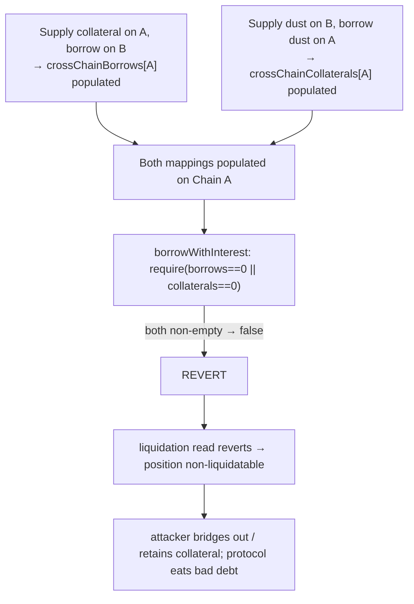

# LEND H-3: both cross-chain mappings populated bricks `borrowWithInterest` (liquidation evasion)

> **Vulnerability classes:** cross-chain · broken-invariant · liquidation-DoS · bad-debt
>
> **Reproduction:** a faithful minimal reproduction of `LendStorage.borrowWithInterest`
> (Sherlock `2025-05-lend-audit-contest`, LendStorage.sol L478-486 @ `713372a1`) — the
> reverting both-populated invariant is reproduced **verbatim** (marked `@>`). The
> lToken index and the liquidation gate are faithful minimal doubles. Local deploy,
> no fork.

<!-- source-auditvault: https://github.com/Auditware/AuditVault/blob/main/findings/58372-h-3-user-can-evade-liquidation-and-bridge-funds-by-exploitin.md -->
<!-- date: 2025-05 -->

## Root cause

`borrowWithInterest` assumes that, for a given user and asset on a chain, only ONE of
`crossChainBorrows` / `crossChainCollaterals` is ever populated, and enforces it with
a hard `require`:

```solidity
Borrow[] memory borrows = crossChainBorrows[borrower][_token];
Borrow[] memory collaterals = crossChainCollaterals[borrower][_token];

require(borrows.length == 0 || collaterals.length == 0, "Invariant violated: both mappings populated"); // @>
```

That invariant is not actually enforced elsewhere. A user can populate **both**
mappings for the same asset on the same chain by opening cross-chain borrows in
**both directions**:

1. Supply (nearly all) collateral on Chain A, borrow on Chain B → `crossChainBorrows`
   populated on A.
2. Supply a **dust** amount on Chain B, borrow a **dust** amount on Chain A →
   `crossChainCollaterals` populated on A.

Now both arrays are non-empty on Chain A, so the `require` **reverts** on every call.

## Impact

- **Position becomes uncloseable and non-liquidatable.** Every function that reads the
  borrow balance — crucially the liquidation path — calls `borrowWithInterest`, which
  now reverts. The underwater position can never be liquidated.
- **Collateral bridged out; protocol eats bad debt.** The user withdraws/bridges out
  nearly all their collateral while the outstanding borrow can never be repaid or
  seized — a direct solvency threat.
- In the PoC, the liquidation attempt is bricked and the attacker retains the full
  1,000-token collateral it should have lost.

## Attack walkthrough



## PoC

Registry (Foundry, local deploy — exploit path + a redesigned-tracking control):

```bash
cd 58372-h-3-user-can-evade-liquidation-and-bridge-funds-by-exploit_exp
forge test -vv
```

Expected: `test_attacker_bricksLiquidationViaBothMappings` PASS (`borrowWithInterest`
reverts with "Invariant violated: both mappings populated"; attacker retains the full
1,000-token collateral) and `test_control_fixedDoesNotRevert` PASS (the redesigned
read returns the real debt without reverting even with both mappings populated). The
browser EVM Playground is served at
`/hacks/58372-h-3-user-can-evade-liquidation-and-bridge-funds-by-exploit/`.

## Remediation

Redesign the cross-chain borrow/collateral tracking so both mappings cannot be
populated for the same user and asset on the same chain (or compute the borrow
balance without a reverting invariant that a user can trigger at will).

## References

- Sherlock 2025-05-lend-audit-contest, issue #224: https://github.com/sherlock-audit/2025-05-lend-audit-contest-judging/issues/224
- Vulnerable code: https://github.com/sherlock-audit/2025-05-lend-audit-contest/blob/713372a1ccd8090ead836ca6b1acf92e97de4679/Lend-V2/src/LayerZero/LendStorage.sol#L478-L486
