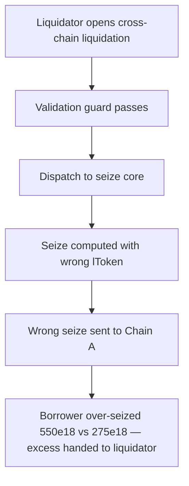

# Lend V2: wrong lToken seize amount in cross-chain liquidation

> **Vulnerability classes:** vuln/theft · vuln/logic
>
> **Reproduction:** a faithful minimal reproduction of the vulnerable finding — the `liquidateCalculateSeizeTokens` call site and the Compound-style seize math are reproduced **verbatim** (marked `@>`) with faithful minimal doubles; local deploy, no fork.

<!-- source-auditvault: https://github.com/sherlock-audit/2025-05-lend-audit-contest-judging/issues/321 -->

## Root cause

Cross-chain liquidation executes on Chain B (where the debt lives), but the number of collateral lTokens to seize is computed from `params.lTokenToSeize` — the **Chain B** twin of the collateral lToken. `liquidateCalculateSeizeTokens` divides by that lToken's `exchangeRateStored()`, i.e. Chain B's exchange rate, even though the seize is later applied on **Chain A** against a collateral lToken whose exchange rate is different. The vulnerable call, reproduced verbatim:

```solidity
        (uint256 amountSeizeError, uint256 seizeTokens) = LendtrollerInterfaceV2(lendtroller)
@>          .liquidateCalculateSeizeTokens(borrowedlToken, params.lTokenToSeize, params.repayAmount);
```

`seizeTokens` therefore represents a count of *Chain B* collateral lTokens, but it is shipped to Chain A and seized against *Chain A* collateral lTokens one-for-one. Because the two chains' exchange rates diverge, the borrower is seized the wrong amount.

## Why it's exploitable here

The synthetic follows the finding with equal prices on both chains, a 10% liquidation incentive, and diverging collateral exchange rates: Chain B = 0.2, Chain A = 0.4.

1. A liquidator repays `100e18` of the borrower's Chain B debt and passes the Chain B collateral lToken (`lCOL-B`) as `lTokenToSeize`.
2. `seizeTokens = repayAmount * incentive * priceBorrowed / (priceCollateral * exchangeRate)` = `110e18 / 0.2` = **550e18**.
3. Computed correctly against the Chain A collateral lToken (rate 0.4) the seize should be `110e18 / 0.4` = **275e18**.
4. Chain A seizes the full `550e18` from the borrower and credits it to the liquidator — the borrower is robbed of an **extra 275e18** collateral lTokens (2× the correct amount).

Whenever the Chain A rate is higher than Chain B's the borrower is over-seized; whenever it is lower the seize is too small and the liquidation can revert or leave bad debt.

## Attack path



## Marked-line walkthrough (Playground)

The EVM Playground pins each step to the exact executed source line in `0xaf38a9c5…`:

1. **L293** — Liquidator opens cross-chain liquidation: The liquidator calls liquidateCrossChain and records repayAmount into the params, targeting a cross-chain borrower whose collateral sits on Chain A.
2. **L309** — Validation guard passes: `_validateAndPrepareLiquidation` only checks the liquidator isn't the borrower and repayAmount > 0, so the malformed cross-chain seize proceeds.
3. **L317** — Dispatch to seize core: `_executeLiquidation` forwards the params into `_executeLiquidationCore`, where the number of collateral lTokens to seize is computed.
4. **L325** — Seize computed with wrong lToken: Root cause: seizeTokens is computed from `params.lTokenToSeize`, the Chain B collateral lToken, whose exchange rate differs from Chain A's, so the count is wrong.
5. **L333** — Wrong seize sent to Chain A: The router sends the miscomputed seizeTokens over LayerZero to Chain A to execute the seize against the borrower's real collateral position.
6. **L352** — Chain A collateral is the target: On Chain A, `_destlToken` is the collateral lToken with the different exchange rate that is actually seized from the borrower.
7. **L374** — Chain B twin has divergent rate: `collateralLTokenB` is the Chain B twin lToken at exchange rate 0.2 versus Chain A's 0.4 — the mismatch the seize calc wrongly reads.

## PoC

Registry (Foundry, local deploy — verbatim vulnerable source + harm-asserting test):

```bash
cd 58374-lend-wrong-l-token-seize-amount-in-liquidatecrosschain_exp && forge test -vvv
```

The browser Playground replays the same synthetic opcode-for-opcode and measures the harm: **repay 100e18, seize 550e18 collateral lTokens against the borrower when the correct amount is 275e18 — the borrower is robbed of an extra 275e18 and the liquidator pockets it**. Both gates are green (registry `forge test` PASS + Playground `_verify-poc` **VERDICT: PASS**).
