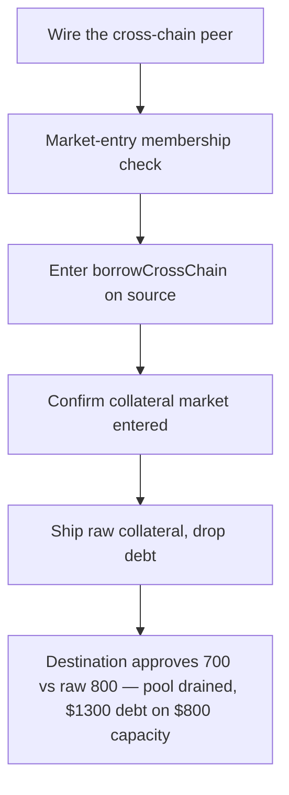

# LEND: Cross-chain borrow ignores existing debt in collateral validation

> **Vulnerability classes:** vuln/logic · vuln/theft · vuln/cross-chain
>
> **Reproduction:** a faithful minimal reproduction of the vulnerable finding — the source-chain `borrowCrossChain` collateral read is reproduced **verbatim** (marked `@>`) alongside the destination-chain `_handleBorrowCrossChainRequest` check, with faithful minimal doubles for LayerZero transport, LendStorage, and the token; local deploy, no fork.

<!-- source-auditvault: https://github.com/sherlock-audit/2025-05-lend-audit-contest-judging/issues/341 -->

## Root cause

In [`borrowCrossChain()`](https://github.com/sherlock-audit/2025-05-lend-audit-contest/blob/main/Lend-V2/src/LayerZero/CrossChainRouter.sol#L139), the collateral read destructures `getHypotheticalAccountLiquidityCollateral`, which returns `(totalBorrowed, totalCollateral)`, but keeps **only** the collateral value and discards `totalBorrowed`. The raw collateral — with no deduction for the user's existing debt — is then shipped to the destination chain as the sole liquidity check. The vulnerable lines, reproduced verbatim:

```solidity
@>  (, uint256 collateral) =
        lendStorage.getHypotheticalAccountLiquidityCollateral(msg.sender, LToken(_lToken), 0, 0);
```

The destination chain validates the inbound borrow only against this raw value:

```solidity
require(payload.collateral >= totalBorrowed, "Insufficient collateral");
```

where `totalBorrowed` is only the *destination-chain* debt plus the new borrow. Because the source chain's existing debt was never subtracted, a user already borrowed near their limit on chain A can borrow again on chain B against the same collateral.

## Why it's exploitable here

Following the finding's worked example ($1 stablecoins, 80% collateral factor):

1. The attacker supplies **1000 USDC** on chain A → $800 borrowing capacity.
2. The attacker borrows **600 USDT** on chain A — an honest same-chain borrow, leaving only **$200** of capacity.
3. The attacker calls `borrowCrossChain(700, USDT, chainB)`. The source reads collateral as the raw **$800** and ships that value — the $600 debt is dropped.
4. Chain B receives `collateral = 800`, computes its own `totalBorrowed = 0 + 700`, and checks `require(800 >= 700)` → **passes**.
5. `CoreRouter.borrowForCrossChain` pays out the full **700 USDT** from honest depositors' destination liquidity.

Total exposure is now **$1300 against $800 capacity** (162.5% utilization). A correct check would have compared the borrow against the **$200** of available capacity and reverted. The reproduction asserts the concrete harm: `crossChainReceived == 700e18`, `dstPoolDrained == 700e18`, while `availableCapacity == 200e18`.

## Attack path



## Marked-line walkthrough (Playground)

The EVM Playground pins each step to the exact executed source line in `0x8f111d8b…`:

1. **L254** — Wire the cross-chain peer: Setup: `setPeer` stores the counterpart router as `peer`, the faithful LayerZero link the source chain uses to deliver its borrow messages.
2. **L279** — Market-entry membership check: `isMarketEntered` scans the user's supplied assets to confirm the collateral lToken is an entered market before the cross-chain borrow proceeds.
3. **L293** — Enter borrowCrossChain on source: The attacker calls `borrowCrossChain` on chain A to borrow 700 USDT on chain B, having already borrowed 600 against the same 1000 USDC collateral.
4. **L312** — Confirm collateral market entered: `borrowCrossChain` checks whether the source collateral lToken is an entered market, entering it if needed, before computing the value to ship.
5. **L319** — Ship raw collateral, drop debt: Root cause: the call returns `(totalBorrowed, collateral)` but only `collateral` is kept — raw $800 is shipped while the existing $600 debt is ignored.
6. **L323** — Send message to destination chain: `_send` packs the payload — amount 700 and the inflated $800 `collateral` — and hands it to the faithful LayerZero transport bound for chain B.
7. **L344** — Deliver payload across LayerZero hop: `_send` forwards the payload (sender, dest lToken, null liquidator, source token) to the peer router, delivering the inflated $800 collateral to chain B's check.

## PoC

Registry (Foundry, local deploy — verbatim vulnerable source + harm-asserting test):

```bash
cd 58375-lend-cross-chain-borrow-ignores-existing-debt-in-collateral-validation_exp && forge test -vvv
```

The browser Playground replays the same synthetic opcode-for-opcode and measures the harm: **supply 1000 USDC, borrow 600 on chain A, then cross-chain borrow 700 on chain B against the same collateral — draining the destination pool for a debt that should have been rejected**. Both gates are green (registry `forge test` PASS + Playground `_verify-poc` **VERDICT: PASS**).
