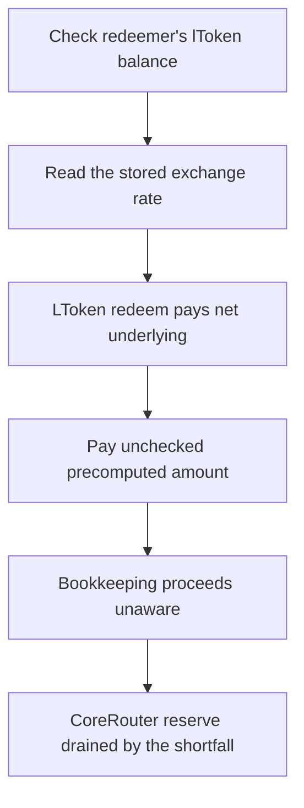

# LEND: `CoreRouter.redeem` overpays a precomputed amount, draining its reserve

> **Vulnerability classes:** vuln/theft · vuln/logic
>
> **Reproduction:** a faithful minimal reproduction of the vulnerable finding — the vulnerable `redeem` payout of `CoreRouter` is reproduced **verbatim** (marked `@>`) with faithful minimal doubles; local deploy, no fork.

<!-- source-auditvault: https://github.com/sherlock-audit/2025-05-lend-audit-contest-judging/issues/464 -->

## Root cause

`CoreRouter.redeem` computes `expectedUnderlying` from `exchangeRateStored()` **before** the redeem, then pays the user that fixed amount. It never checks how much underlying `LToken.redeem()` actually transferred back — so when the LToken returns less (a redemption fee, or a rate not reflected in the stored value), CoreRouter pays out more than it received. The vulnerable lines, reproduced verbatim:

```solidity
// Get exchange rate before redeem
uint256 exchangeRateBefore = LTokenInterface(_lToken).exchangeRateStored();

// Calculate expected underlying tokens
uint256 expectedUnderlying = (_amount * exchangeRateBefore) / 1e18;

// Perform redeem
require(LErc20Interface(_lToken).redeem(_amount) == 0, "Redeem failed");

// Transfer underlying tokens to the user
@>  IERC20(_token).transfer(msg.sender, expectedUnderlying); // pays precomputed amount, never checks actual received
```

`expectedUnderlying` is fixed from the stored rate and used verbatim for the payout, while the amount `LToken.redeem()` actually delivered to CoreRouter is discarded — the two are never reconciled.

## Why it's exploitable here

Following the finding's discrepancy with a stored rate of `2e18` and a `10%` LToken redemption fee that is **not** reflected in `exchangeRateStored()`:

1. A user holding `100e18` lTokens calls `CoreRouter.redeem(100e18, lToken)`. CoreRouter reads `exchangeRateBefore = 2e18` and computes `expectedUnderlying = 100e18 * 2e18 / 1e18 = 200e18`.
2. `LToken.redeem(100e18)` computes gross `200e18`, retains the `10%` fee (`20e18`), and transfers only `net = 180e18` to CoreRouter.
3. CoreRouter transfers the full precomputed `200e18` to the user — `20e18` more than it just received.
4. That `20e18` shortfall is eaten from CoreRouter's `1000e18` reserve of other depositors' funds. Every redemption under this discrepancy drains the reserve by exactly the shortfall.

## Attack path



## Marked-line walkthrough (Playground)

The EVM Playground pins each step to the exact executed source line in `0xbd4fd5a3…`:

1. **L167** — Check redeemer's lToken balance: CoreRouter requires the redeemer already holds at least `_amount` lTokens, so the redeem path proceeds for a legitimately funded position.
2. **L175** — Read the stored exchange rate: Reads `exchangeRateStored()` before redeeming — a value that ignores the redemption fee the LToken will actually charge on the way out.
3. **L181** — LToken redeem pays net underlying: Calls `LToken.redeem`, which sends CoreRouter only the post-fee net underlying; the return value is checked for success but the amount is ignored.
4. **L184** — Pay unchecked precomputed amount: Root cause: pays the user the pre-computed `expectedUnderlying` and never checks the smaller amount LToken actually sent, so CoreRouter overpays from its reserve.
5. **L187** — Bookkeeping proceeds unaware: Distributes rewards and updates the position as if the payout matched receipts, so the reserve shortfall is never recorded or corrected.
6. **L195** — Emit success hiding the shortfall: Emits `RedeemSuccess` reporting the inflated `expectedUnderlying`, so off-chain monitors see a clean redeem despite the drained reserve.
7. **L207** — Declare the drained underlying token: Setup: declares the underlying token whose CoreRouter reserve of other depositors' funds is overpaid away by exactly the fee shortfall.

## PoC

Registry (Foundry, local deploy — verbatim vulnerable source + harm-asserting test):

```bash
cd 58376-lend-corerouter-redemption-payout-is-miscalculated_exp && forge test -vvv
```

The browser Playground replays the same synthetic opcode-for-opcode and measures the harm: **redeem `100e18` lTokens, CoreRouter receives `180e18` net but pays the user the full `200e18`, draining `20e18` from its reserve of other depositors' funds**. Both gates are green (registry `forge test` PASS + Playground `_verify-poc` **VERDICT: PASS**).
