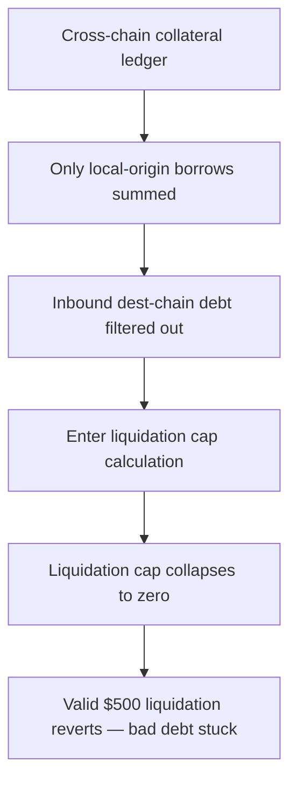

# LEND V2: cross-chain liquidation computes `maxLiquidatable` incorrectly

> **Vulnerability classes:** vuln/logic · vuln/dos · sector/cross-chain
>
> **Reproduction:** a faithful minimal reproduction of the vulnerable finding — `getMaxLiquidationRepayAmount` and the `borrowWithInterest` helper it calls are reproduced **verbatim** (the vulnerable line marked `@>`) with faithful minimal doubles; local deploy, no fork.

<!-- source-auditvault: https://github.com/sherlock-audit/2025-05-lend-audit-contest-judging/issues/578 -->

## Root cause

In [`Lend-V2/src/LayerZero/LendStorage.sol`](https://github.com/sherlock-audit/2025-05-lend-audit-contest/blob/main/Lend-V2/src/LayerZero/LendStorage.sol#L573-L591), `getMaxLiquidationRepayAmount` sizes the cross-chain liquidation cap with `borrowWithInterest()`. That helper only sums cross-chain borrows that **originated from** the current chain; it never includes borrows whose **destination** is the current chain. So for a genuine inbound cross-chain debt the cap resolves to `0`. The vulnerable function, reproduced verbatim from the finding:

```solidity
function getMaxLiquidationRepayAmount(address borrower, address lToken, bool isSameChain)
    external
    view
    returns (uint256)
{
    uint256 currentBorrow = 0;

    currentBorrow += isSameChain
        ? borrowWithInterestSame(borrower, lToken)
@>      : borrowWithInterest(borrower, lToken);

    uint256 closeFactorMantissa = LendtrollerInterfaceV2(lendtroller).closeFactorMantissa();
    uint256 maxRepay = (currentBorrow * closeFactorMantissa) / 1e18;

    return maxRepay;
}
```

`borrowWithInterest()` iterates `crossChainCollaterals` but only accumulates an entry when `collaterals[i].destEid == currentEid && collaterals[i].srcEid == currentEid`. A cross-chain borrow whose destination is this chain has `srcEid != currentEid`, so it is filtered out, `currentBorrow` stays `0`, and `maxRepay = (0 * closeFactor) / 1e18 = 0`.

## Why it's exploitable here

Following the finding's worked example, with a 50% (`0.5e18`) close factor:

1. Alice has a real **$1,000** cross-chain borrow whose destination chain is Chain B (this chain); it **originated** on Chain A, so `srcEid = ChainA != currentEid`.
2. The position is underwater and should be liquidatable. A liquidator submits a valid **$500** repay on Chain B — exactly the 50% close-factor cap of the $1,000 debt.
3. `getMaxLiquidationRepayAmount(Alice, lToken, false)` calls `borrowWithInterest()`, which skips Alice's debt (its `srcEid` is not the current chain), so `currentBorrow = 0` and `maxLiquidationAmount = 0`.
4. The destination-chain cap check `require(repayAmount <= maxLiquidationAmount)` compares `500e18 <= 0` and reverts. The valid liquidation is permanently blocked and the bad debt cannot be cleared.

## Attack path



## Marked-line walkthrough (Playground)

The EVM Playground pins each step to the exact executed source line in `0xce01759b…`:

1. **L88** — Cross-chain collateral ledger: Setup: crossChainCollaterals records borrows whose destination is this chain, the inbound debt the liquidation cap must count but never will.
2. **L117** — Only local-origin borrows summed: borrowWithInterest's first branch sums a borrow only when its source chain equals the current chain, already biased toward locally-originated debt.
3. **L125** — Inbound dest-chain debt filtered out: The collateral branch counts a borrow only if it both started and ends on this chain, so an inbound cross-chain debt (srcEid != currentEid) is skipped.
4. **L141** — Enter liquidation cap calculation: The router enters getMaxLiquidationRepayAmount with isSameChain=false to size the cross-chain liquidation cap for the underwater borrower.
5. **L149** — Liquidation cap collapses to zero: Root cause: borrowWithInterest returns 0 for a cross-chain (dest-chain) borrow, so currentBorrow stays 0 and the whole liquidation cap collapses to zero.
6. **L153** — Close factor multiplies zero: closeFactorMantissa (50%) is read, but maxRepay = currentBorrow * closeFactor / 1e18 multiplies zero, so the cap stays 0.
7. **L164** — Router reverts valid liquidation: The router's require(repayAmount <= maxLiquidationAmount) checks 500e18 against 0 and reverts, permanently blocking a valid liquidation of real debt.

## PoC

Registry (Foundry, local deploy — verbatim vulnerable source + harm-asserting test):

```bash
cd 58377-lend-cross-chain-liquidation-computes-maxliquidatable-incorrectly_exp && forge test -vvv
```

The browser Playground replays the same synthetic opcode-for-opcode and measures the harm: **a real $1,000 cross-chain debt whose destination is this chain yields `maxLiquidationAmount = 0`, so a valid $500 liquidation reverts and the underwater position stays un-liquidatable**. Both gates are green (registry `forge test` PASS + Playground `_verify-poc` **VERDICT: PASS**).
