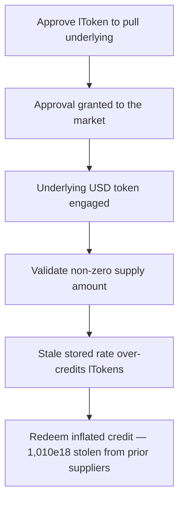

# LEND: `CoreRouter.supply` credits lTokens with a stale exchange rate

> **Vulnerability classes:** vuln/oracle/stale-price · vuln/logic
>
> **Reproduction:** a faithful minimal reproduction of the vulnerable finding — the vulnerable `supply` body of `CoreRouter` is reproduced **verbatim** (marked `@>`) against a faithful Compound-style lToken double; local deploy, no fork.

<!-- source-auditvault: https://github.com/sherlock-audit/2025-05-lend-audit-contest-judging/issues/628 -->

## Root cause

In [`Lend-V2/src/LayerZero/CoreRouter.sol`](https://github.com/sherlock-audit/2025-05-lend-audit-contest/blob/main/Lend-V2/src/LayerZero/CoreRouter.sol#L74), `supply` reads the market's exchange rate with `exchangeRateStored()` *before* calling `mint()`. `mint()` internally accrues interest first, so the market mints lTokens at the current (higher) rate — but `CoreRouter` credits the supplier using the lower **stale** rate, over-crediting them. The vulnerable body, reproduced verbatim:

```solidity
    function supply(uint256 _amount, address _token) external {
        address _lToken = lendStorage.underlyingTolToken(_token);

        require(_lToken != address(0), "Unsupported Token");

        require(_amount > 0, "Zero supply amount");

        // Transfer tokens from the user to the contract
        IERC20(_token).safeTransferFrom(msg.sender, address(this), _amount);

        _approveToken(_token, _lToken, _amount);

        // Get exchange rate before mint
@>      uint256 exchangeRateBefore = LTokenInterface(_lToken).exchangeRateStored();

        // Mint lTokens
        require(LErc20Interface(_lToken).mint(_amount) == 0, "Mint failed");

        // Calculate actual minted tokens using exchangeRate from before mint
        uint256 mintTokens = (_amount * 1e18) / exchangeRateBefore;

        lendStorage.addUserSuppliedAsset(msg.sender, _lToken);

        lendStorage.distributeSupplierLend(_lToken, msg.sender);

        // Update total investment using calculated mintTokens
        lendStorage.updateTotalInvestment(
            msg.sender, _lToken, lendStorage.totalInvestment(msg.sender, _lToken) + mintTokens
        );

        emit SupplySuccess(msg.sender, _lToken, _amount, mintTokens);
    }
```

`exchangeRateStored()` computes `(totalCash + totalBorrows - totalReserves) / totalSupply` from committed storage only — it ignores any interest that has accrued in time but not yet been folded into `totalBorrows`. `mint()` accrues that interest first, so it mints `_amount / rateCurrent` lTokens while `CoreRouter` records `_amount * 1e18 / rateStored` lTokens. Because `rateStored < rateCurrent`, the credited amount exceeds what was actually minted.

## Why it's exploitable here

Following the finding's worked example (stored rate `1.00e18`, current rate `1.01e18` with 1% pending interest):

1. A prior honest supplier (Alice) already holds `1,000,000e18` lTokens backed by `900,000e18` cash + `100,000e18` borrows, with `10,000e18` of interest accrued-in-time but not yet written to storage.
2. The attacker calls `supply(101,000e18)` while that interest is un-accrued. `mint()` accrues first and mints `101,000e18 / 1.01 = 100,000e18` lTokens to the router.
3. But `CoreRouter` read the stale `1.00e18` rate on the `@>` line, so it credits the attacker `101,000e18 / 1.00 = 101,000e18` lTokens — `1,000e18` more than the market minted.
4. The attacker redeems the full inflated `101,000e18` credit, extracting `102,010e18` underlying for a `101,000e18` deposit — a `1,010e18` theft of Alice's pending interest — and leaving the market short `1,000e18` lTokens of backing, so Alice can no longer fully redeem.

## Attack path



## Marked-line walkthrough (Playground)

The EVM Playground pins each step to the exact executed source line in `0xbd4fd5a3…`:

1. **L49** — Approve lToken to pull underlying: Setup: CoreRouter.supply enters safeApprove so the lToken market can pull the attacker's supplied underlying during mint().
2. **L50** — Approval granted to the market: Setup: the underlying's approve() succeeds, letting the lToken transferFrom the router when mint() moves the deposit in.
3. **L57** — Underlying USD token engaged: Setup: the supplied USD underlying is the same asset backing prior suppliers' cash and their un-accrued pending interest.
4. **L260** — Validate non-zero supply amount: Setup: supply() requires the deposit be non-zero, then pulls it in and mints lTokens to credit the attacker.
5. **L262** — Stale stored rate over-credits lTokens: Root cause: supply reads exchangeRateStored() — ignoring pending interest — before mint(), crediting more lTokens than the market actually mints.
6. **L297** — Redeem inflated credit, drain reserves: The liquidity check passes, so the attacker redeems the over-credited lTokens and extracts 1,010e18 underlying stolen from prior suppliers.

## PoC

Registry (Foundry, local deploy — verbatim vulnerable source + harm-asserting test):

```bash
cd 58378-lend-supplying-uses-an-outdated-exchange-rate_exp && forge test -vvv
```

The browser Playground replays the same synthetic opcode-for-opcode and measures the harm: **supply 101,000e18 during pending interest, get credited 101,000e18 lTokens while the market mints only 100,000e18, then redeem the inflated credit to extract 1,010e18 of prior suppliers' interest**. Both gates are green (registry `forge test` PASS + Playground `_verify-poc` **VERDICT: PASS**).
