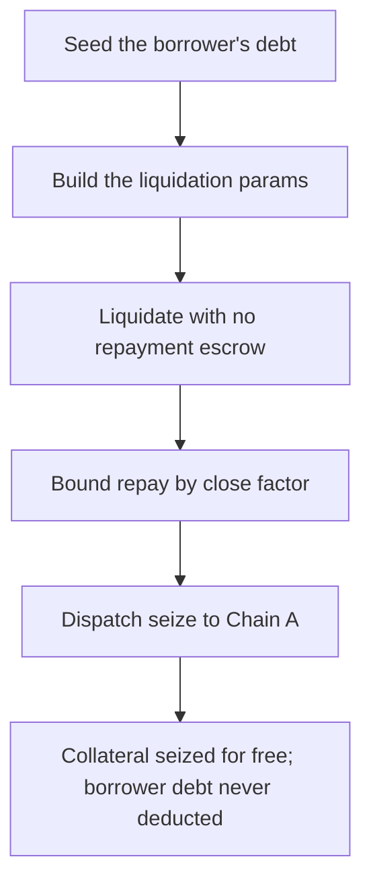

# LEND (Lend-V2): cross-chain liquidator seizes collateral without providing repayment

> **Vulnerability classes:** vuln/theft · vuln/logic · vuln/cross-chain
>
> **Reproduction:** a faithful minimal reproduction of the vulnerable finding — the Chain-B cross-chain liquidation entry-point and its internal helpers are reproduced **verbatim** (marked `@>`) with faithful minimal doubles for LendStorage, the Lendtroller seize math, the Chain-A seize handler and the LayerZero transport; local deploy, no fork.

<!-- source-auditvault: https://github.com/sherlock-audit/2025-05-lend-audit-contest-judging/issues/636 -->

## Root cause

In [`Lend-V2/src/LayerZero/CrossChainRouter.sol`](https://github.com/sherlock-audit/2025-05-lend-audit-contest/blob/main/Lend-V2/src/LayerZero/CrossChainRouter.sol#L172-L192), the Chain-B (debt chain) liquidation entry-point validates the borrower's position and immediately calls `_executeLiquidation`, which dispatches a collateral-seize message to Chain A — but it never transfers or escrows the repayment token from the liquidator. The vulnerable lines, reproduced verbatim:

```solidity
    function liquidateCrossChain(
        ...
    ) external {
        LendStorage.LiquidationParams memory params = LendStorage.LiquidationParams({
            ...
        });

        _validateAndPrepareLiquidation(params);
@>      _executeLiquidation(params);
    }
```

The seize on Chain A executes as an **independent** LayerZero message and hands the borrower's collateral to the liquidator. The return `LiquidationSuccess` message then tries to pull the repayment from the liquidator on Chain B via `transferFrom` — if the liquidator never approved, that message reverts forever while the Chain-A seize is already committed. Net effect: the liquidator receives the liquidatee's collateral for free and the borrower's debt is never deducted.

## Why it's exploitable here

Following the finding's flow with the reproduction's concrete values:

1. A borrower has `100e18` of outstanding cross-chain debt on Chain B, with `50e18` of collateral seizable on Chain A. The 50% close factor bounds a single liquidation to `repayAmount = 50e18`.
2. The malicious liquidator holds **no** borrow token and grants **no** approval, then calls the verbatim `liquidateCrossChain(borrower, 50e18, ...)`. Validation passes; `_executeLiquidation` dispatches the seize to Chain A without escrowing anything.
3. Chain A seizes the collateral, withholds the 2.8% protocol share, and transfers the `48.6e18` liquidator share to the liquidator.
4. The returning `LiquidationSuccess` repayment `transferFrom` reverts (no approval), so that independent Chain-B message is stuck forever — the borrower's `100e18` debt is never deducted.
5. The liquidator walks away with `48.6e18` of the liquidatee's collateral, paid `0`, and the position remains fully indebted — a direct drain.

## Attack path



## Marked-line walkthrough (Playground)

The EVM Playground pins each step to the exact executed source line in `0xaf38a9c5…`:

1. **L55** — 18-decimal collateral and debt tokens: Setup: MiniToken declares the 18-decimal collateral and borrowed-underlying doubles used across both chains for the seize and the repayment.
2. **L246** — Seed the borrower's debt: Setup: the harness seeds the borrower's 100e18 outstanding debt into Chain B's debt book, the amount an honest liquidation would deduct.
3. **L266** — Build the liquidation params: The verbatim liquidateCrossChain packs borrower, repayAmount and collateral into LiquidationParams, with borrowedlToken resolved during validation.
4. **L270** — Liquidate with no repayment escrow: Root cause: _executeLiquidation dispatches the collateral seize to the source chain without ever transferring or escrowing the repayment token from the liquidator.
5. **L324** — Bound repay by close factor: _prepareLiquidationValues accrues interest and applies the 50% close factor to bound repayAmount, still pulling no repayment from the liquidator.
6. **L371** — Dispatch seize to Chain A: _send encodes the seize payload and forwards it to Chain A as an independent message, so the collateral is seized while the liquidator escrows nothing.

## PoC

Registry (Foundry, local deploy — verbatim vulnerable source + harm-asserting test):

```bash
cd 58379-lend-malicious-liquidator-can-liquidate-without-providing-collateral_exp && forge test -vvv
```

The browser Playground replays the same synthetic opcode-for-opcode and measures the harm: **liquidate with no approval, receive 48.6e18 of the liquidatee's collateral for free while the borrower's 100e18 debt is never deducted**. Both gates are green (registry `forge test` PASS + Playground `_verify-poc` **VERDICT: PASS**).
