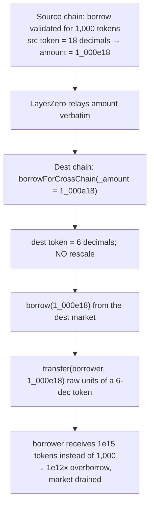

# LEND H-11: cross-chain borrow ignores per-chain token decimals (~1e12× overborrow)

> **Vulnerability classes:** cross-chain · token-decimal-normalization · decimal-mismatch · overborrow
>
> **Reproduction:** a faithful minimal reproduction of `CoreRouter.borrowForCrossChain`
> (Sherlock `2025-05-lend-audit-contest`, commit `713372a1`). The vulnerable
> function is reproduced **verbatim** (marked `@>`); the destination lToken market
> and underlying token are faithful minimal doubles. Local deploy, no fork (this is
> an audit finding — there is no historical exploit tx).

<!-- source-auditvault: https://github.com/Auditware/AuditVault/blob/main/findings/58380-h-11-users-will-lose-funds-due-to-token-decimal-mismatches-a.md -->
<!-- date: 2025-05 -->

## Root cause

LEND is a cross-chain money market. A borrow is validated on the **source** chain
against the user's collateral, then the amount is relayed over LayerZero to the
**destination** chain, where `CoreRouter.borrowForCrossChain` pays it out:

```solidity
function borrowForCrossChain(address _borrower, uint256 _amount, address _destlToken, address _destUnderlying)
    external
{
    require(crossChainRouter != address(0), "CrossChainRouter not set");
    require(msg.sender == crossChainRouter, "Access Denied");
    require(LErc20Interface(_destlToken).borrow(_amount) == 0, "Borrow failed"); // @> raw source amount
    IERC20(_destUnderlying).transfer(_borrower, _amount);                        // @> unadjusted for dest decimals
}
```

`_amount` is expressed in the **source** token's decimals, but it is used to borrow
and transfer the **destination** token with **no re-scaling**. The same logical
asset can have different decimals per chain (USDC is 6 decimals on Ethereum, but a
bridged/native variant can be 18 on another chain). When the source has *more*
decimals than the destination, the destination transfer over-pays by
`10^(srcDecimals − destDecimals)`.

## Attack walkthrough



## Impact

- **~1e12× overborrow** when the source token has 18 decimals and the destination
  has 6: a borrow validated as `1_000e18` delivers `1_000e18` raw units of a 6-dec
  token = **1,000,000,000,000,000** tokens where **1,000** were owed. The borrower
  drains the entire destination market against tiny source collateral.
- The mirror case (source 6-dec, destination 18-dec) delivers `1_000e6` raw units of
  an 18-dec token ≈ **0.000000001** token — a tiny underborrow that strands the
  user's collateral for nothing.
- No special setup; triggers on any cross-chain borrow where the asset's decimals
  differ between the two chains.

## PoC

Registry (Foundry, local deploy — exploit path + a decimal-normalizing control):

```bash
cd 58380-h-11-users-will-lose-funds-due-to-token-decimal-mismatches_exp
forge test -vv
```

Expected: `test_attacker_overborrowsViaDecimalMismatch` PASS (delivered `1_000e18`
raw units, overborrow factor **1e12**) and `test_control_fixedNormalizesDecimals`
PASS (fixed router delivers exactly `1_000e6` = 1,000 USDC). The browser EVM
Playground (opcode-level replay + marked source lines) is served at
`/hacks/58380-h-11-users-will-lose-funds-due-to-token-decimal-mismatches/`.

## Remediation

Normalize the amount from the source token's decimals to the destination token's
decimals before borrowing/transferring on the destination chain:

```solidity
uint256 scaled = _amount;
if (srcDecimals > destDecimals) scaled = _amount / (10 ** (srcDecimals - destDecimals));
else if (destDecimals > srcDecimals) scaled = _amount * (10 ** (destDecimals - srcDecimals));
require(LErc20Interface(_destlToken).borrow(scaled) == 0, "Borrow failed");
IERC20(_destUnderlying).transfer(_borrower, scaled);
```

## References

- Sherlock 2025-05-lend-audit-contest, issue #665: https://github.com/sherlock-audit/2025-05-lend-audit-contest-judging/issues/665
- Vulnerable code: https://github.com/sherlock-audit/2025-05-lend-audit-contest/blob/713372a1ccd8090ead836ca6b1acf92e97de4679/Lend-V2/src/LayerZero/CoreRouter.sol#L195-L205
