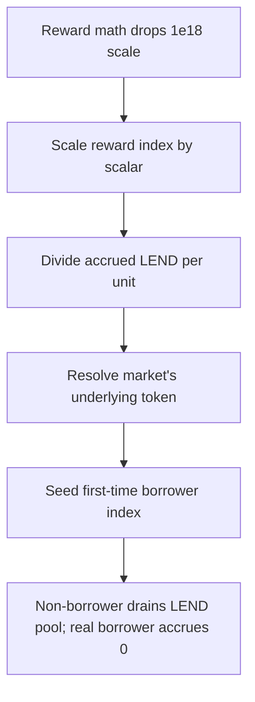

# Lend V2: incorrect LEND reward distribution for cross-chain borrows

> **Vulnerability classes:** vuln/theft · vuln/logic · vuln/reward-accounting
>
> **Reproduction:** a faithful minimal reproduction of the vulnerable finding — the reward-sizing calc of `distributeBorrowerLend` plus `borrowWithInterest` / `borrowWithInterestSame` are reproduced **verbatim** (marked `@>`) with faithful minimal doubles; local deploy, no fork.

<!-- source-auditvault: https://github.com/sherlock-audit/2025-05-lend-audit-contest-judging/issues/669 -->

## Root cause

In [`Lend-V2/src/LayerZero/LendStorage.sol`](https://github.com/sherlock-audit/2025-05-lend-audit-contest/blob/main/Lend-V2/src/LayerZero/LendStorage.sol#L365-L368), `distributeBorrowerLend()` sizes each borrower's LEND reward with `borrowWithInterest()`, which sums `crossChainBorrows` — debt that *originated* on this chain but was executed elsewhere — instead of `crossChainCollaterals`, the borrows actually *executed* on this chain. The vulnerable calculation, reproduced verbatim:

```solidity
uint256 borrowerAmount = div_(
    add_(
@>      borrowWithInterest(borrower, lToken),
        borrowWithInterestSame(borrower, lToken)
    ),
    Exp({ mantissa: LTokenInterface(lToken).borrowIndex() })
);
```

`borrowWithInterest()` returns the sum of the user's `crossChainBorrows` for the token — borrows that were *initiated* here but drew liquidity on another chain. The value the reward should track is the borrower's debt *executed on this chain*, recorded in `crossChainCollaterals`. Worse, `borrowWithInterest()`'s collateral branch only credits an entry when `destEid == currentEid && srcEid == currentEid`, which is impossible for a genuine cross-chain borrow (`srcEid != destEid`). So a real on-chain borrower is sized at 0 and accrues no LEND, while a user who merely originated a borrow here — and executed it elsewhere — is credited the full amount.

## Why it's exploitable here

Following the finding with the synthetic's numbers (borrow-state index advanced `1e36 → 2e36`, i.e. one LEND per borrowed token; `20,000` LEND in the pool):

1. **Alice** is a genuine borrower whose loan was *executed on this chain* using cross-chain collateral — recorded in `crossChainCollaterals` (`srcEid = 2`, `destEid = 1`, `principle = 10,000`).
2. **Bob** only *originated* a borrow here that was executed on the other chain — recorded in `crossChainBorrows` (`srcEid = 1`, `destEid = 2`, `principle = 10,000`).
3. `distributeBorrowerLend(Alice)`: `borrowWithInterest` walks her collaterals but only counts an entry when `destEid == currentEid && srcEid == currentEid` — impossible for a real cross-chain borrow — so it returns `0` and Alice accrues **0 LEND**.
4. `distributeBorrowerLend(Bob)`: `borrowWithInterest` walks his `crossChainBorrows`, matches `srcEid == currentEid`, and returns his full `10,000` → Bob accrues **10,000 LEND**.
5. Bob claims `10,000` LEND he never earned on this chain; Alice, the real borrower, claims nothing. The reward pool is siphoned to the wrong party.

## Attack path



## Marked-line walkthrough (Playground)

The EVM Playground pins each step to the exact executed source line in `0xbd4fd5a3…`:

1. **L51** — Reward math drops 1e18 scale: The verbatim ExponentialNoError math the LEND distribution relies on truncates a fixed-point value by dividing out the 1e18 scale.
2. **L97** — Scale reward index by scalar: mul_ multiplies a fixed-point Exp by a raw scalar, one of the verbatim Compound helpers the LEND reward index arithmetic is built from.
3. **L138** — Divide accrued LEND per unit: div_ scales a Double index down by a scalar, producing the per-unit LEND accrued that distributeBorrowerLend multiplies by each borrow.
4. **L229** — Resolve market's underlying token: borrowWithInterest reads lTokenToUnderlying to get the token key it uses to look up the borrower's cross-chain borrow and collateral records.
5. **L274** — Seed first-time borrower index: On a borrower's first distribution the index is seeded to LEND_INITIAL_INDEX, so the full accrued LEND delta applies to whatever borrow amount is computed.
6. **L286** — Reward sized from wrong borrows: Root cause: borrowWithInterest sizes the reward from crossChainBorrows (debt originated here, executed elsewhere), not those executed here, so real borrowers accrue 0.
7. **L311** — Loop credits the non-borrower: borrowWithInterest loops Bob's crossChainBorrows, matches srcEid to this chain, and returns his full 10,000-token borrow, so the non-borrower is rewarded.

## PoC

Registry (Foundry, local deploy — verbatim vulnerable source + harm-asserting test):

```bash
cd 58381-lend-incorrect-lend-reward-distribution-for-cross-chain-borrows_exp
forge test -vvv
```

The browser Playground replays the same synthetic opcode-for-opcode and measures the harm: **the real on-chain borrower (Alice) accrues 0 LEND while the non-borrower (Bob) is credited the full 10,000 and drains the reward pool**. Both gates are green (registry `forge test` PASS + Playground `_verify-poc` **VERDICT: PASS**).
