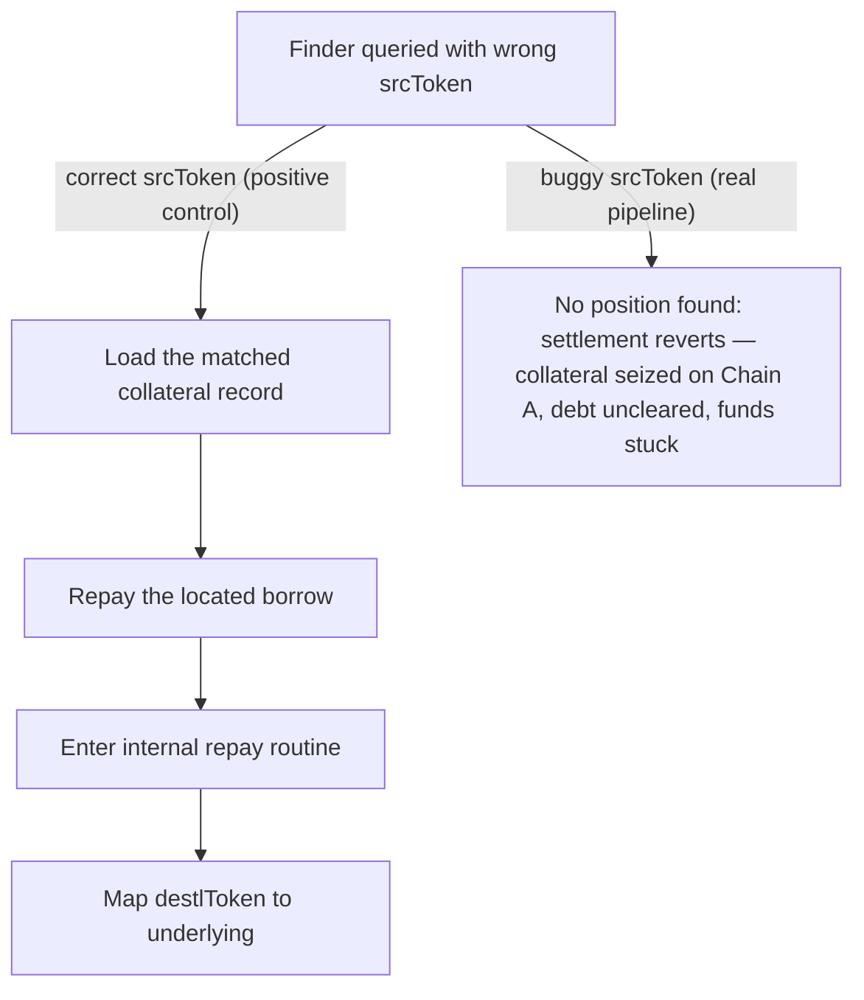

# LEND: cross-chain liquidation uses the wrong `srcToken`

> **Vulnerability classes:** vuln/logic · vuln/dos · vuln/cross-chain
>
> **Reproduction:** a faithful minimal reproduction of the vulnerable finding — the settlement leg `_handleLiquidationSuccess` is reproduced **verbatim** (marked `@>`) with faithful minimal doubles; local deploy, no fork.

<!-- source-auditvault: https://github.com/sherlock-audit/2025-05-lend-audit-contest-judging/issues/720 -->

## Root cause

On the destination chain, `_handleLiquidationSuccess` looks up the borrow position by passing `payload.srcToken` to `findCrossChainCollateral`. But `payload.srcToken` carries the destination chain's borrowed token (`params.borrowedAsset`), while `crossChainCollaterals[...].srcToken` was stored as the **source** chain's underlying — so even for the "same" asset (e.g. USDC) the addresses differ and the match fails. The vulnerable settlement code, reproduced verbatim:

```solidity
    function _handleLiquidationSuccess(LZPayload memory payload) private {
        // Find the borrow position on Chain B to get the correct srcEid
        address underlying = lendStorage.lTokenToUnderlying(payload.destlToken);

        // Find the specific collateral record
        (bool found, uint256 index) = lendStorage.findCrossChainCollateral(
            payload.sender,
            underlying,
            currentEid, // srcEid is current chain
            0, // We don't know destEid yet, but we can match on other fields
            payload.destlToken,
@>          payload.srcToken
        );

        require(found, "Borrow position not found");
        // ...
```

`findCrossChainCollateral` matches on all four discriminators (`srcEid`, `destEid`, `borrowedlToken`, `srcToken`). Every field lines up except `srcToken`, so `found` is `false`, and `require(found, "Borrow position not found")` reverts the settlement.

## Why it's exploitable here

Following the finding's flow with concrete values (`DEBT = 1000e18`, `SEIZE_AMOUNT = 1000e18`, `currentEid = 2`):

1. A borrower has a cross-chain borrow of `1000e18` recorded on the settlement chain; the stored record's `srcToken` is Chain A's USDC (`usdcA`).
2. A liquidator triggers the cross-chain liquidation. Chain A **seizes** `1000e18` of the borrower's collateral — this leg is already committed and irreversible.
3. The settlement leg runs `_handleLiquidationSuccess` with `payload.srcToken = usdcB` (Chain B's USDC, `params.borrowedAsset`), **not** `usdcA`.
4. `findCrossChainCollateral` matches every field except `srcToken` (`usdcB != usdcA`), returns `(false, 0)`, and `require(found)` reverts.
5. The debt stays at `1000e18` while the seized `1000e18` collateral is gone — the borrower loses collateral with no debt relief and the protocol carries the bad debt. The reproduction parks the seized `1000e18` at `SINK` and asserts it stuck; a positive control with `srcToken = usdcA` settles and clears the debt to `0`, proving `srcToken` is the sole cause.

## Attack path



## Marked-line walkthrough (Playground)

The EVM Playground pins each step to the exact executed source line in `0xe3a787a4…`:

1. **L189** — Finder queried with wrong srcToken: Root cause: findCrossChainCollateral gets payload.srcToken (Chain B's token) as srcToken, yet the stored record holds Chain A's token, so no position matches.
2. **L199** — Load the matched collateral record: Reads the borrower's collateral array to pull the matched record's srcEid — a line reached only after a position actually matched.
3. **L204** — Repay the located borrow: On a genuine match, forwards the borrower, amount and srcEid into the internal repay that clears the cross-chain debt.
4. **L214** — Enter internal repay routine: The repay routine receives the borrower, amount, destlToken and srcEid needed to settle the outstanding cross-chain borrow.
5. **L218** — Map destlToken to underlying: The destlToken parameter resolves to the destination-chain underlying so the matched record's principle can be reduced to zero.
6. **L237** — Seized-collateral loss sink: Setup: seized collateral is parked at this SINK; when the buggy settlement reverts it yields no debt relief, giving the measurable loss.

## PoC

Registry (Foundry, local deploy — verbatim vulnerable source + harm-asserting test):

```bash
cd 58383-lend-cross-chain-liquidation-uses-the-wrong-srctoken_exp && forge test -vvv
```

The browser Playground replays the same synthetic opcode-for-opcode and measures the harm: **the buggy settlement reverts on `require(found)`, the debt stays at `1000e18`, and the seized `1000e18` collateral is stuck at `SINK` with no debt relief**, while the positive control with the correct `srcToken` clears the debt to `0`. Both gates are green (registry `forge test` PASS + Playground `_verify-poc` **VERDICT: PASS**).
