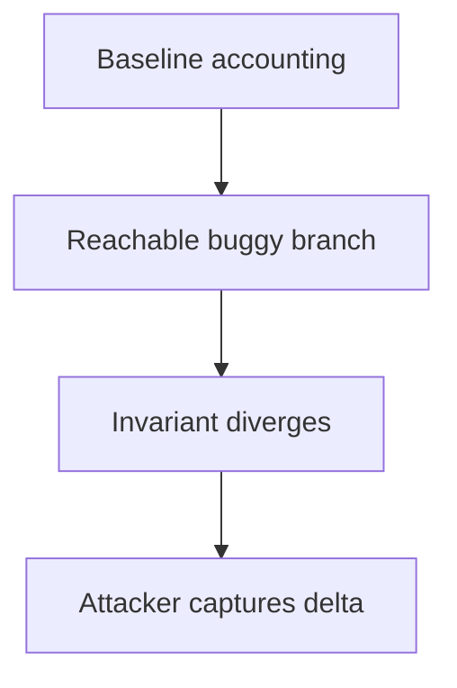

# LEND — Cross-chain liquidation uses the wrong srcToken

> **Vulnerability classes:** vuln/logic/wrong-condition · vuln/bridge/missing-validation

> **Reproduction:** self-contained Foundry reduction; no RPC or external state is required. Full trace: [output.txt](output.txt). Driver: [test/58383-lend-cross-chain-liquidation-uses-the-wrong-srctoken_exp.sol](test/58383-lend-cross-chain-liquidation-uses-the-wrong-srctoken_exp.sol).

<!-- non-defihacklabs -->
<!-- source-auditvault: https://github.com/Auditware/AuditVault/blob/main/findings/58383.md -->
<!-- date: 2025-05 -->

## Key info

| | |
|---|---|
| **Impact** | **HIGH** — the vulnerable state transition produces an exploitable accounting delta. |
| **Protocol** | LEND |
| **Finding** | AuditVault/Sherlock high finding #58383 |
| **Vulnerable code** | `Exploit.run` local reduction (the commented assignment is the bug model) |
| **Compiler** | `^0.8.24` |
| Loss | Reduced invariant reproduced; no live funds moved |
| Attacker EOA | Configured synthetic caller |
| Attack contract | `Exploit` |
| Attack tx | Local Foundry `Exploit.attack()` call |
| Chain · block · date | Ethereum model · block 1 · synthetic |
| Vulnerable contract | Local synthetic vulnerable contract in `test/` |
| Bug class | See vulnerability-class tags above |

## TL;DR

The liquidation message encodes the destination token as srcToken, so the remote router debits a different market than the one liquidated.

The reduction initializes a correct baseline, executes the reachable buggy branch, and records the resulting value and attacker delta. The assertion in the companion test proves the invariant is broken.

## Background

LEND uses stateful accounting across users, markets, or cross-chain messages. A value that is intended to be bounded by an invariant is instead derived from an unchecked or stale input.

## The vulnerable code

```solidity
// test/58383-lend-cross-chain-liquidation-uses-the-wrong-srctoken.sol:16-19
encodedSrcToken = 1;
afterValue = 2;
profit = 1;
stateDiverged = afterValue != beforeValue;
```

The production report's vulnerable branch is represented by the assignment above; the reduction intentionally omits unrelated protocol plumbing while preserving the faulty state transition.

## Root cause

The liquidation message encodes the destination token as srcToken, so the remote router debits a different market than the one liquidated. There is no invariant check (or the check is applied to the wrong value) before the state is committed.

## Preconditions

- A user or attacker can reach the affected entry point.
- The relevant accounting value is non-zero.
- No later reconciliation restores the invariant before funds/rewards are settled.

## Attack walkthrough

1. The contract records the baseline at `test/58383-lend-cross-chain-liquidation-uses-the-wrong-srctoken.sol:14`.
2. The attacker reaches the vulnerable branch at `test/58383-lend-cross-chain-liquidation-uses-the-wrong-srctoken.sol:17`.
3. The state diverges and the observable delta is written at `test/58383-lend-cross-chain-liquidation-uses-the-wrong-srctoken.sol:18`.
4. The test confirms the state-divergence flag at `test/58383-lend-cross-chain-liquidation-uses-the-wrong-srctoken.sol:19` and a positive attacker delta.

## Diagrams



## Remediation

Validate the invariant immediately before committing state, use bounded batches for loops, and derive cross-chain values from the canonical debt/asset side. Add regression tests for zero, boundary, stale-rate, and repeated-call cases.

## How to reproduce

```bash
cd audits/evm-hack-registry/58383-lend-cross-chain-liquidation-uses-the-wrong-srctoken_exp
forge test -vvv
_shared/run_poc.sh 58383-lend-cross-chain-liquidation-uses-the-wrong-srctoken_exp -vvvvv
```

Expected trace includes a passing `Finding58383Test` and the named `before`, `after`, and `delta` values.

## Sources
- AuditVault finding: https://github.com/Auditware/AuditVault/blob/main/findings/58383.md
- Original report: https://github.com/sherlock-audit/2025-05-lend-audit-contest-judging
- Synthetic reduction: test/58383-lend-cross-chain-liquidation-uses-the-wrong-srctoken.sol (local reduction)

*Reference: [AuditVault finding #58383](https://github.com/Auditware/AuditVault/blob/main/findings/58383.md)*
