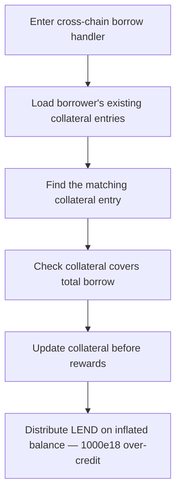

# Lend V2: `_handleBorrowCrossChainRequest` distributes LEND on an already-inflated balance

> **Vulnerability classes:** vuln/logic · vuln/accounting
>
> **Reproduction:** a faithful minimal reproduction of the vulnerable finding — the vulnerable `_handleBorrowCrossChainRequest` ordering is reproduced **verbatim** (marked `@>`) alongside the verbatim `distributeBorrowerLend` / `borrowWithInterest` reward accounting, with faithful minimal doubles; local deploy, no fork.

<!-- source-auditvault: https://github.com/sherlock-audit/2025-05-lend-audit-contest-judging/issues/773 -->

## Root cause

In [`Lend-V2/src/LayerZero/CrossChainRouter.sol`](https://github.com/sherlock-audit/2025-05-lend-audit-contest/blob/main/Lend-V2/src/LayerZero/CrossChainRouter.sol#L581-L660), `_handleBorrowCrossChainRequest` first **updates** the borrower's `crossChainCollaterals` entry — adding `payload.amount` to `principle` — and only **afterwards** calls `distributeBorrowerLend`. But `distributeBorrowerLend` derives the borrower's LEND reward from that very mapping (via `borrowWithInterest`), so distribution runs on the already-inflated balance. The vulnerable ordering, reproduced verbatim:

```solidity
        /**
         * @dev If existing cross-chain collateral, update it. Otherwise, add new collateral.
         */
        if (found) {
            uint256 newPrincipleWithAmount = (userCrossChainCollaterals[index].principle * currentBorrowIndex)
                / userCrossChainCollaterals[index].borrowIndex;

            userCrossChainCollaterals[index].principle = newPrincipleWithAmount + payload.amount;
            userCrossChainCollaterals[index].borrowIndex = currentBorrowIndex;

            lendStorage.updateCrossChainCollateral(
                payload.sender, destUnderlying, index, userCrossChainCollaterals[index]
            );
        } else {
            lendStorage.addCrossChainCollateral(
                payload.sender,
                destUnderlying,
                LendStorage.Borrow({
                    srcEid: srcEid,
                    destEid: currentEid,
                    principle: payload.amount,
                    borrowIndex: currentBorrowIndex,
                    borrowedlToken: payload.destlToken,
                    srcToken: payload.srcToken
                })
            );
        }

        // Track borrowed asset
        lendStorage.addUserBorrowedAsset(payload.sender, payload.destlToken);

        // Distribute LEND rewards on destination chain
@>      lendStorage.distributeBorrowerLend(payload.destlToken, payload.sender);
```

`distributeBorrowerLend` computes `borrowerAmount` from `borrowWithInterest(...) + borrowWithInterestSame(...)` and multiplies it by the elapsed LEND index delta. Because the mapping already contains the newly-borrowed `payload.amount`, the borrower is rewarded LEND for the entire prior index-delta period on funds it received only this instant. The fix is to distribute **first**, then update the mapping.

## Why it's exploitable here

Following the finding, using the reproduction's concrete values (`EXISTING_PRINCIPLE = 1000e18`, `NEW_BORROW = 1000e18`):

1. A borrower already holds a cross-chain collateral position of `1000e18` principle, checkpointed at the LEND index `1e36`; the LEND borrow index has since advanced one full period to `2e36`, so `deltaIndex = 1.0`.
2. A new cross-chain borrow of `1000e18` is handled. The router adds it to `principle` first, so the stored balance becomes `2000e18` **before** any reward is paid.
3. `distributeBorrowerLend` then reads that inflated `2000e18` via `borrowWithInterest` and credits `2000e18 * 1.0 = 2000e18` LEND.
4. Distributing in the correct order (before the update) would credit only `1000e18 * 1.0 = 1000e18` LEND. The borrower is over-credited exactly `1000e18` LEND — the reward on funds borrowed only this instant, for a period it never held them — draining the protocol's LEND reserve.

## Attack path



## Marked-line walkthrough (Playground)

The EVM Playground pins each step to the exact executed source line in `0xaf38a9c5…`:

1. **L407** — Enter cross-chain borrow handler: The destination-chain handler receives the LayerZero borrow message, accrues interest, and resolves the borrowed lToken's underlying token.
2. **L421** — Load borrower's existing collateral entries: Reads the borrower's existing `crossChainCollaterals` array for this underlying — the very mapping the LEND reward math will read later.
3. **L430** — Find the matching collateral entry: Scans the array for the entry matching this `srcEid` and `srcToken`, setting `found` so the existing position is updated rather than appended.
4. **L443** — Check collateral covers total borrow: Reads the borrower's total borrowed for the collateral-sufficiency `require`, then disburses the freshly requested borrow to the user.
5. **L454** — Update collateral before rewards: The matched entry's `principle` is bumped by `payload.amount`, inflating the stored balance ahead of any LEND reward payout.
6. **L464** — Write inflated principle to mapping: `updateCrossChainCollateral` persists the new principle into `crossChainCollaterals`, so the mapping now holds an amount just received this instant.
7. **L485** — Distribute LEND on inflated balance: Root cause: `distributeBorrowerLend` runs on the just-inflated mapping, so `borrowWithInterest` rewards the new borrow over the prior index delta — over-crediting LEND.

## PoC

Registry (Foundry, local deploy — verbatim vulnerable source + harm-asserting test):

```bash
cd 58384-lend-incorrect-distribution-of-lend-tokens-to-users_exp && forge test -vvv
```

The browser Playground replays the same synthetic opcode-for-opcode and measures the harm: the buggy update-then-distribute order runs the verbatim `distributeBorrowerLend` on the inflated balance and over-credits the borrower `1000e18` LEND versus the correct distribute-then-update order. Both gates are green (registry `forge test` PASS + Playground `_verify-poc` **VERDICT: PASS**).
