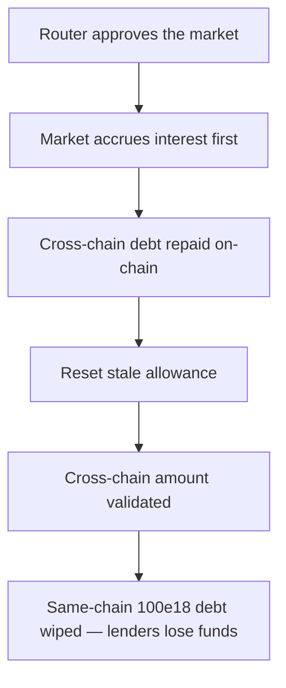

# LEND: cross-chain repayment wipes the borrower's same-chain debt

> **Vulnerability classes:** vuln/theft · vuln/logic
>
> **Reproduction:** a faithful minimal reproduction of the vulnerable finding — `repayBorrowInternal` and the `LendStorage` accounting helpers it touches are reproduced **verbatim** (the vulnerable line marked `@>`) with faithful minimal doubles; local deploy, no fork.

<!-- source-auditvault: https://github.com/sherlock-audit/2025-05-lend-audit-contest-judging/issues/782 -->

## Root cause

In [`Lend-V2/src/LayerZero/CoreRouter.sol`](https://github.com/sherlock-audit/2025-05-lend-audit-contest/blob/main/Lend-V2/src/LayerZero/CoreRouter.sol#L459-L504), `repayBorrowInternal` runs its `// Update same-chain borrow balances` block unconditionally — there is no `if (_isSameChain)` guard. When a cross-chain debt is repaid (`_isSameChain == false`), `borrowedAmount` is the cross-chain balance, yet the block still calls `removeBorrowBalance(borrower, _lToken)`, deleting the borrower's unrelated same-chain `borrowBalance` record for the same lToken. The vulnerable lines, reproduced verbatim:

```solidity
// Update same-chain borrow balances
if (repayAmountFinal == borrowedAmount) {
@>  lendStorage.removeBorrowBalance(borrower, _lToken);
    lendStorage.removeUserBorrowedAsset(borrower, _lToken);
} else {
    lendStorage.updateBorrowBalance(
        borrower, _lToken,
        borrowedAmount - repayAmountFinal,
        LTokenInterface(_lToken).borrowIndex()
    );
}
```

The same-chain loan and the cross-chain loan live in separate storage slots, but this block only ever addresses the same-chain `borrowBalance` mapping. So paying off the cross-chain leg silently erases the same-chain leg, and the same-chain lenders who funded it lose their money.

## Why it's exploitable here

Following the finding's vulnerability path with concrete numbers:

1. Alice owes a `100e18` same-chain loan (recorded in `borrowBalance[Alice][lToken]`) **and** a separate `30e18` cross-chain loan of the same lToken (recorded in the cross-chain records). The two debts occupy independent storage slots.
2. Alice (or a liquidator) calls `repayBorrow(..., _isSameChain = false)` to repay exactly the `30e18` cross-chain debt. Because `_isSameChain` is false, `borrowedAmount = borrowWithInterest() = 30e18`.
3. `LErc20Interface(_lToken).repayBorrow(30e18)` correctly reduces the on-chain borrows for the cross-chain loan — that part is fine.
4. Then, because `repayAmountFinal (30e18) == borrowedAmount (30e18)`, the unconditional block calls `removeBorrowBalance(Alice, lToken)`, deleting the untouched `100e18` same-chain record.
5. Alice paid `30e18` and had her `100e18` same-chain debt erased for free — a direct `100e18` loss to the same-chain lenders.

## Attack path



## Marked-line walkthrough (Playground)

The EVM Playground pins each step to the exact executed source line in `0xbd4fd5a3…`:

1. **L49** — Router approves the market: The router's safeApprove grants the lToken market an allowance so it can pull the repay underlying from the caller.
2. **L54** — Market accrues interest first: repayBorrowInternal first calls accrueInterest on the lToken so the debt is measured against the current borrow index.
3. **L58** — Cross-chain debt repaid on-chain: The router calls repayBorrow on the market, transferring 30e18 and correctly reducing the on-chain borrows for the cross-chain loan.
4. **L253** — Reset stale allowance: Inside _approveToken, any existing nonzero allowance is first reset to zero before the router re-approves the repay amount.
5. **L280** — Cross-chain amount validated: With _isSameChain false, borrowedAmount is the 30e18 cross-chain debt from borrowWithInterest, so this nonzero check passes.
6. **L296** — Same-chain debt wiped unconditionally: Root cause: with no if(_isSameChain) guard, this cross-chain repay calls removeBorrowBalance and deletes Alice's untouched 100e18 same-chain debt for free.

## PoC

Registry (Foundry, local deploy — verbatim vulnerable source + harm-asserting test):

```bash
cd 58385-lend-cross-chain-repayment-updates-same-chain-borrow-balances_exp && forge test -vvv
```

The browser Playground replays the same synthetic opcode-for-opcode and measures the harm: **repay only the 30e18 cross-chain debt and watch Alice's untouched 100e18 same-chain debt get wiped, so the same-chain lenders lose 100e18**. Both gates are green (registry `forge test` PASS + Playground `_verify-poc` **VERDICT: PASS**).
