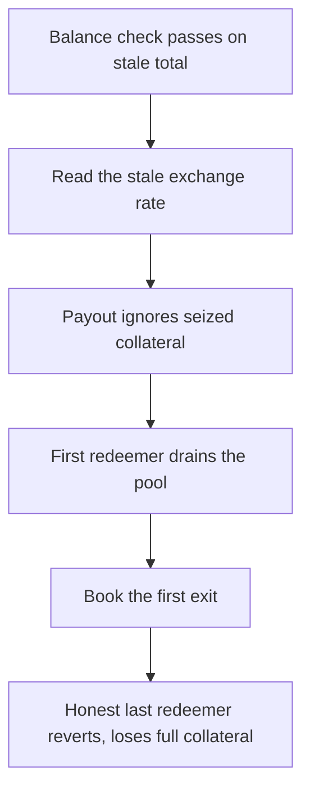

# Lend V2: a liquidated CoreRouter overpays early redeemers and strands the last

> **Vulnerability classes:** vuln/logic · vuln/loss-of-funds
>
> **Reproduction:** a faithful minimal reproduction of the vulnerable finding — the vulnerable `redeem` branch of `CoreRouter` is reproduced **verbatim** (marked `@>`) with faithful minimal doubles; local deploy, no fork.

<!-- source-auditvault: https://github.com/sherlock-audit/2025-05-lend-audit-contest-judging/issues/824 -->

## Root cause

In [`Lend-V2/src/LayerZero/CoreRouter.sol`](https://github.com/sherlock-audit/2025-05-lend-audit-contest/blob/main/Lend-V2/src/LayerZero/CoreRouter.sol#L117-L118), `redeem` computes each user's payout as `_amount * exchangeRateBefore`, derived purely from the LToken exchange rate. Because CoreRouter is a single pooled account that is both supplier and borrower in the LToken market, it can be liquidated there — but the payout never consults CoreRouter's actual remaining collateral, so early redeemers are paid in full while the last redeemer is stranded. The vulnerable line, reproduced verbatim:

```solidity
        // Calculate expected underlying tokens
@>      uint256 expectedUnderlying = (_amount * exchangeRateBefore) / 1e18;
```

`exchangeRateBefore` is unchanged by the liquidation, so the arithmetic keeps paying out full value even after CoreRouter's share balance has been reduced below the total the pooled users are recorded to be owed.

## Why it's exploitable here

Two honest users each supply `1000` — the pool holds `2000` underlying and CoreRouter holds `2000` LToken shares, with per-user totals recorded in `LendStorage`:

1. **External event:** CoreRouter is liquidated in the LToken market. `500` of its shares are seized, so it now backs only `1500` of the `2000` recorded.
2. **First redeemer** redeems `1000`. Line 197 computes `1000 * 1e18 / 1e18 = 1000` at the stale rate; `LToken.redeem` burns `1000` of CoreRouter's `1500` shares and transfers `1000` underlying. The pool now holds `1000` underlying and CoreRouter `500` shares.
3. **Honest second supplier** redeems `1000`. CoreRouter holds only `500` shares, so `LToken.redeem` returns the Compound-style non-zero error code, the `require` reverts, and the redeem fails.
4. The second user recovers nothing and loses their entire `1000` collateral — the whole liquidation shortfall is concentrated on the last redeemer instead of being shared pro-rata.

## Attack path



## Marked-line walkthrough (Playground)

The EVM Playground pins each step to the exact executed source line in `0xbd4fd5a3…`:

1. **L186** — Balance check passes on stale total: CoreRouter checks the redeemer's recorded per-user investment still covers the amount; the liquidation never touched that mirror, so the guard passes.
2. **L194** — Read the stale exchange rate: CoreRouter reads the LToken exchange rate, which the liquidation left unchanged, still valuing each share at its full pre-seizure price.
3. **L197** — Payout ignores seized collateral: Root cause: `expectedUnderlying = _amount * exchangeRateBefore / 1e18` uses only the rate, never CoreRouter's actual remaining LToken collateral after liquidation.
4. **L200** — First redeemer drains the pool: `LToken.redeem` burns CoreRouter's remaining shares and pays the first user 1000 in full at the stale rate, emptying the shared underlying reserve.
5. **L206** — Book the first exit: CoreRouter distributes rewards and decrements the first redeemer's recorded investment, finalizing a withdrawal the pool can no longer fully back.
6. **L214** — First redemption succeeds fully: `RedeemSuccess` fires for the first user's full 1000 payout, leaving the pool short exactly the collateral the liquidator seized.
7. **L222** — Honest last redeemer steps in: The stranded second supplier calls redeem through its router, but CoreRouter now holds too few shares — the call reverts and their entire 1000 collateral is lost.

## PoC

Registry (Foundry, local deploy — verbatim vulnerable source + harm-asserting test):

```bash
cd 58386-lend-liquidating-corerouter-can-cause-excess-borrower-loss_exp && forge test -vvv
```

The browser Playground replays the same synthetic opcode-for-opcode and measures the harm: **a liquidated CoreRouter pays the first redeemer the full 1000 at the stale rate, then reverts on the honest last redeemer, who loses their entire 1000 collateral**. Both gates are green (registry `forge test` PASS + Playground `_verify-poc` **VERDICT: PASS**).
