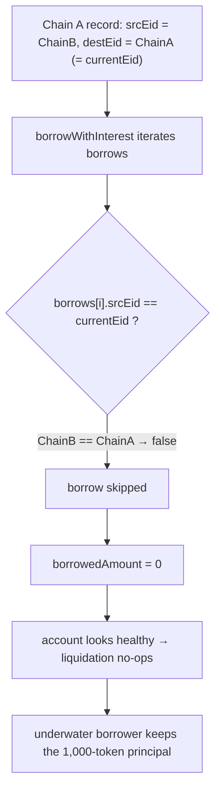

# LEND H-18: incorrect `srcEid` check in `borrowWithInterest` (cross-chain debt reads 0 → liquidation evasion)

> **Vulnerability classes:** cross-chain · wrong-endpoint-id-field · liquidation-evasion · accounting-under-report
>
> **Reproduction:** a faithful minimal reproduction of `LendStorage.borrowWithInterest`
> (Sherlock `2025-05-lend-audit-contest`, commit `713372a1`). The vulnerable function
> is reproduced **verbatim** (marked `@>`); the lToken interest index and the
> liquidation gate are faithful minimal doubles. Local deploy, no fork.

<!-- source-auditvault: https://github.com/Auditware/AuditVault/blob/main/findings/58387-h-18-incorrect-srceid-check-in-borrowwithinterest-sherlock-l.md -->
<!-- date: 2025-05 -->

## Root cause

`LendStorage.borrowWithInterest` sums a borrower's cross-chain debt on the current
chain. When a cross-chain borrow is stored on the **source** chain (Chain A), the
record's fields are set to `srcEid = ChainB` (the destination) and
`destEid = ChainA` (the current chain). But the filter uses the wrong field:

```solidity
Borrow[] memory borrows = crossChainBorrows[borrower][_token];
...
for (uint256 i = 0; i < borrows.length; i++) {
    if (borrows[i].srcEid == currentEid) {                         // @> wrong field
        borrowedAmount +=
            (borrows[i].principle * LTokenInterface(_lToken).borrowIndex()) / borrows[i].borrowIndex;
    }
}
return borrowedAmount;
```

`borrows[i].srcEid` is `ChainB`, and `currentEid` is `ChainA`, so the condition is
**never true** on the source chain. Every real cross-chain borrow is skipped and
`borrowWithInterest` returns **0**.

## Impact

- **Cross-chain debt is invisible.** An account with a real cross-chain borrow reads
  as having zero cross-chain debt, so `getHypotheticalAccountLiquidity` treats it as
  over-collateralized.
- **Liquidation evasion → bad debt.** An underwater cross-chain borrower cannot be
  liquidated (the liquidation path sees no debt), so the protocol eats the loss. The
  same under-report also lets the borrower draw further borrows against phantom
  capacity.
- In the PoC, a 1,000-token underwater borrow reads as **0**; the liquidation attempt
  no-ops and the borrower retains the full 1,000-token principal.

## Attack walkthrough



## PoC

Registry (Foundry, local deploy — exploit path + a fixed-filter control):

```bash
cd 58387-h-18-incorrect-srceid-check-in-borrowwithinterest-sherlock_exp
forge test -vv
```

Expected: `test_attacker_evadesLiquidation` PASS (reported debt **0** vs a real
`1_000e18` borrow; principal retained) and `test_control_fixedReportsDebtAndLiquidates`
PASS (fixed `destEid == currentEid` filter reports the real `1_000e18`). The browser
EVM Playground is served at
`/hacks/58387-h-18-incorrect-srceid-check-in-borrowwithinterest-sherlock/`.

## Remediation

Filter cross-chain borrows on the source chain by `destEid == currentEid`, matching
how the records are actually stored:

```diff
-    if (borrows[i].srcEid == currentEid) {
+    if (borrows[i].destEid == currentEid) {
```

## References

- Sherlock 2025-05-lend-audit-contest, issue #831: https://github.com/sherlock-audit/2025-05-lend-audit-contest-judging/issues/831
- Vulnerable code: https://github.com/sherlock-audit/2025-05-lend-audit-contest/blob/713372a1ccd8090ead836ca6b1acf92e97de4679/Lend-V2/src/LayerZero/LendStorage.sol#L478-L503
