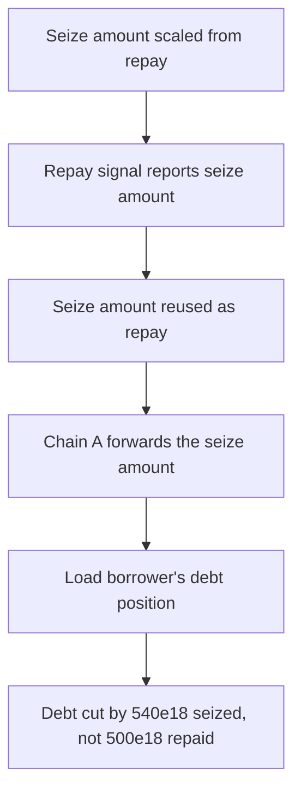

# Lend V2: cross-chain liquidation reduces debt by the collateral seized

> **Vulnerability classes:** vuln/logic · vuln/accounting · cross-chain-message
>
> **Reproduction:** a faithful minimal reproduction of the vulnerable finding — the cross-chain liquidation functions of `CrossChainRouter` (`_executeLiquidationCore`, `_handleLiquidationExecute`, `_handleLiquidationSuccess`, `repayCrossChainBorrowInternal`) are reproduced **verbatim** (the finding's anchor line marked `@>`) with faithful minimal doubles and an in-process LayerZero transport; local deploy, no fork.

<!-- source-auditvault: https://github.com/sherlock-audit/2025-05-lend-audit-contest-judging/issues/836 -->

## Root cause

Cross-chain liquidation reuses a single generic `Payload.amount` field across every LayerZero hop. `_executeLiquidationCore` writes `seizeTokens` (the amount of collateral to seize, in collateral-lToken units) into that field, and the return hop hands the very same value to `repayCrossChainBorrowInternal` as the repay amount — so the borrower's debt is reduced by the collateral seized, not by the liquidator's actual `params.repayAmount`. The vulnerable send, reproduced verbatim from the finding's Root Cause:

```solidity
        // Send message to Chain A to execute the seize
        _send(
            params.srcEid,
@>          seizeTokens,
            params.storedBorrowIndex,
            0,
            params.borrower,
            lendStorage.crossChainLTokenMap(params.lTokenToSeize, params.srcEid), // Convert to Chain A version before sending
            msg.sender,
            params.borrowedAsset,
            ContractType.CrossChainLiquidationExecute
        );
```

Placing `seizeTokens` here is correct for the seize step on Chain A. The bug is that the return hop (`_handleLiquidationExecute`) forwards this same `payload.amount` back to Chain B, where `_handleLiquidationSuccess` passes it straight into `repayCrossChainBorrowInternal` as the debt repay amount.

## Why it's exploitable here

Following the finding's worked example — `liquidationIncentive = 1.08`, equal borrowed/collateral prices, `exchangeRate = 1`:

1. A liquidator initiates a cross-chain liquidation with `repayAmount = 500e18` against a borrower whose Chain B debt principle is `1000e18`.
2. `liquidateCalculateSeizeTokens` computes `seizeTokens = 500e18 * 1.08 = 540e18` of collateral to seize.
3. `540e18` is packed into `Payload.amount`, seized on Chain A, then bounced back unchanged and consumed by `repayCrossChainBorrowInternal` as the repay amount.
4. The borrower's debt is reduced by `540e18` instead of the `500e18` actually repaid — a `40e18` discrepancy of debt erased with **no matching repayment**, corrupting protocol accounting (over-repayment here; under-repayment whenever `seizeTokens < repayAmount`).

## Attack path



## Marked-line walkthrough (Playground)

The EVM Playground pins each step to the exact executed source line in `0xd3760b84…`:

1. **L58** — Seize amount scaled from repay: The liquidation math scales the 500e18 repayAmount by the 1.08 incentive, computing seizeTokens = 540e18 of collateral to seize.
2. **L294** — Repay signal reports seize amount: RepaySuccess fires when the borrow is repaid; its reported amount becomes the 540e18 seize value, masking the mis-accounting as a normal repayment.
3. **L327** — Seize amount reused as repay: Root cause: seizeTokens (540e18 collateral) is packed into the generic Payload.amount and later consumed as the debt repay amount, cutting debt by the seize value.
4. **L368** — Chain A forwards the seize amount: Chain A executes the seize, emits LiquidateBorrow, then sends the same payload.amount (still 540e18 seizeTokens) back to Chain B as the repay message.
5. **L448** — Load borrower's debt position: Back on Chain B, `_getBorrowDetails` loads the borrower's cross-chain borrow (principle 1000e18) so the incoming repay message can be applied.
6. **L523** — Same amount reused everywhere: Every hop, even this failure-bounce path, reuses one generic payload.amount, so the 1000e18 debt is cut by 540e18 seized, not the 500e18 repaid.

## PoC

Registry (Foundry, local deploy — verbatim vulnerable source + harm-asserting test):

```bash
cd 58388-lend-cross-chain-liquidation-reduces-debt-by-collateral-seized_exp && forge test -vvv
```

The browser Playground replays the same synthetic opcode-for-opcode and measures the harm: **liquidator repays 500e18, but the borrower's debt is reduced by the 540e18 seize amount — a 40e18 mis-accounting with no matching repayment**. Both gates are green (registry `forge test` PASS + Playground `_verify-poc` **VERDICT: PASS**).
