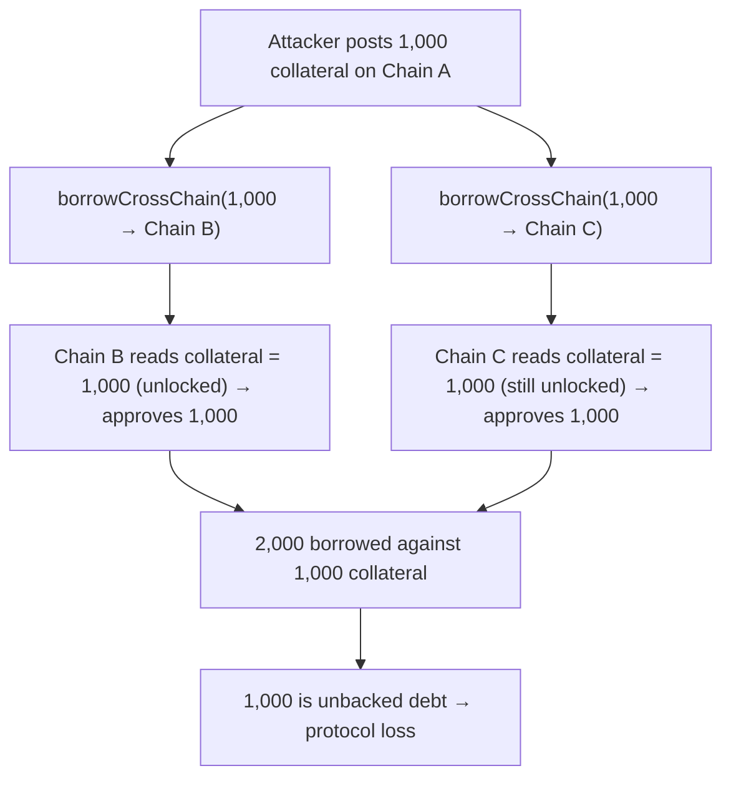

# LEND H-20: multiple cross-chain borrows reuse the same collateral (Nx overborrow)

> **Vulnerability classes:** cross-chain · missing-collateral-lock · TOCTOU · overborrow
>
> **Reproduction:** a faithful minimal reproduction of the `borrowCrossChain`
> read-collateral-then-dispatch sequence (Sherlock `2025-05-lend-audit-contest`,
> `CrossChainRouter.sol` L113 @ `713372a1`) — the vulnerable "read collateral → send,
> no lock" ordering is preserved (marked `@>`). The destination market and collateral
> bookkeeping are faithful minimal doubles. Local deploy, no fork.

<!-- source-auditvault: https://github.com/Auditware/AuditVault/blob/main/findings/58389-h-20-multiple-cross-chain-borrows-using-same-collateral-sher.md -->
<!-- date: 2025-05 -->

## Root cause

`CrossChainRouter.borrowCrossChain` reads the borrower's **current** collateral and
ships it to the destination chain so the destination market can approve the borrow —
but it **never locks or reserves** that collateral on the source chain before
dispatching:

```solidity
// Get current collateral amount for the LayerZero message
(, uint256 collateral) =
    lendStorage.getHypotheticalAccountLiquidityCollateral(msg.sender, LToken(_lToken), 0, 0);

_send(_destEid, _amount, 0, collateral, msg.sender, destLToken, address(0), _borrowToken, ...); // @> no lock
```

The collateral is only registered as used after the destination confirms
(`_handleValidBorrowRequest`). In the window before confirmation, the borrower can
fire multiple `borrowCrossChain` requests to **different destination chains**, each
carrying the **full** collateral value. Each destination approves the full borrow
independently — so N destinations lend N× the collateral.

## Attack walkthrough



## Impact

- **N× overborrow against a single collateral position.** With two destination
  chains, the attacker borrows 2,000 against 1,000 of collateral; 1,000 is unbacked
  debt the protocol eats. The factor scales with the number of destination chains.
- No special privileges; any borrower can do it by dispatching concurrent requests
  before any confirmation locks the collateral.

## PoC

Registry (Foundry, local deploy — exploit path + a collateral-locking control):

```bash
cd 58389-h-20-multiple-cross-chain-borrows-using-same-collateral-sh_exp
forge test -vv
```

Expected: `test_attacker_doubleBorrowsSameCollateral` PASS (2,000 borrowed vs 1,000
collateral, 1,000 unbacked) and `test_control_fixedLocksCollateral` PASS (locking the
collateral before dispatch makes the second borrow revert, capping the total at
1,000). The browser EVM Playground is served at
`/hacks/58389-h-20-multiple-cross-chain-borrows-using-same-collateral-sh/`.

## Remediation

Reserve (lock) the collateral on the source chain **before** dispatching the borrow
request, and release it if the destination rejects. A concurrent second request then
sees reduced availability and cannot reuse the same collateral.

## References

- Sherlock 2025-05-lend-audit-contest, issue #851: https://github.com/sherlock-audit/2025-05-lend-audit-contest-judging/issues/851
- Vulnerable code: https://github.com/sherlock-audit/2025-05-lend-audit-contest/blob/713372a1ccd8090ead836ca6b1acf92e97de4679/Lend-V2/src/LayerZero/CrossChainRouter.sol#L113
