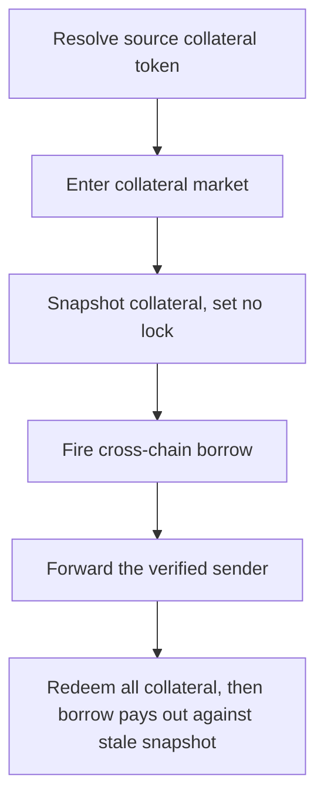

# Lend: borrower can redeem collateral immediately after a cross-chain borrow

> **Vulnerability classes:** vuln/theft · vuln/logic
>
> **Reproduction:** a faithful minimal reproduction of the vulnerable finding — the vulnerable `borrowCrossChain` body is reproduced **verbatim** (marked `@>`) with faithful minimal doubles; local deploy, no fork.

<!-- source-auditvault: https://github.com/sherlock-audit/2025-05-lend-audit-contest/blob/main/Lend-V2/src/LayerZero/CrossChainRouter.sol#L113C5-L154 -->

## Root cause

In [`Lend-V2/src/LayerZero/CrossChainRouter.sol#L113`](https://github.com/sherlock-audit/2025-05-lend-audit-contest/blob/main/Lend-V2/src/LayerZero/CrossChainRouter.sol#L113), `borrowCrossChain()` adds collateral tracking and snapshots the current collateral into the LayerZero message, then fires the borrow — **without locking the collateral on the source chain**. The vulnerable body is reproduced verbatim:

```solidity
function borrowCrossChain(uint256 _amount, address _borrowToken, uint32 _destEid) external payable {
    // ... validations ...
    // Then adding collateral tracking on source chain
    lendStorage.addUserSuppliedAsset(msg.sender, _lToken);

    if (!isMarketEntered(msg.sender, _lToken)) {
        enterMarkets(_lToken);
    }

    // Get current collateral amount for the LayerZero message
    (, uint256 collateral) =
        lendStorage.getHypotheticalAccountLiquidityCollateral(msg.sender, LToken(_lToken), 0, 0);

    // Send message to destination chain with verified sender
@>  _send(_destEid, _amount, 0 /* borrowIndex */, collateral, msg.sender, destLToken, address(0), _borrowToken, ContractType.BorrowCrossChain);
}
```

Because no lock is placed and the pending borrow is not recorded on the source chain, the user can immediately call `redeem()` on the source chain — the liquidity check sees no debt and releases all collateral. When the LayerZero message lands on the destination chain, the borrow is authorized against the **stale** collateral snapshot and pays out.

## Why it's exploitable here

1. The attacker supplies 100e18 collateral on Chain A.
2. The attacker calls `borrowCrossChain(75e18, ...)`. The current collateral (100e18) is snapshotted into the message; no lock is set.
3. The attacker immediately `redeem()`s all 100e18 collateral on Chain A — the pending cross-chain borrow is unrecorded, so the liquidity check passes.
4. The message lands on Chain B and authorizes the 75e18 borrow against the stale snapshot. The attacker keeps the full collateral **and** the borrowed funds — an entirely unbacked position that drains the destination pool.

## Attack path



## Marked-line walkthrough (Playground)

The EVM Playground pins each step to the exact executed source line in `0x8f111d8b…`:

1. **L364** — Resolve source collateral token: Resolves the source-chain lToken for the collateral the pending cross-chain borrow will draw against.
2. **L376** — Enter collateral market: Ensures the borrower has entered the collateral market before the cross-chain borrow message is sent.
3. **L382** — Snapshot collateral, set no lock: Root cause: snapshots current collateral into the message but sets NO source-chain lock, so the position stays fully redeemable.
4. **L389** — Fire cross-chain borrow: Sends the borrow to the destination chain carrying the pre-redeem snapshot; the pending debt is recorded nowhere on the source chain.
5. **L391** — Forward the verified sender: The borrower is forwarded as the verified sender used for the destination-chain borrow authorization.
6. **L396** — Tag as cross-chain borrow: Marks the message as a cross-chain borrow; delivery on Chain B later pays out against the stale collateral snapshot after the attacker has redeemed everything.

## PoC

Registry (Foundry, local deploy — verbatim vulnerable source + harm-asserting test):

```bash
cd 58390-lend-borrower-can-redeem-collateral-immediately-after-borrowing_exp
forge test -vvv
```

The browser Playground replays the same synthetic opcode-for-opcode and measures the harm: **supply 100e18, borrow 75e18 cross-chain, redeem 100e18 — the attacker keeps its full collateral AND the borrowed funds**. Both gates are green (registry `forge test` PASS + Playground `_verify-poc` **VERDICT: PASS**).
