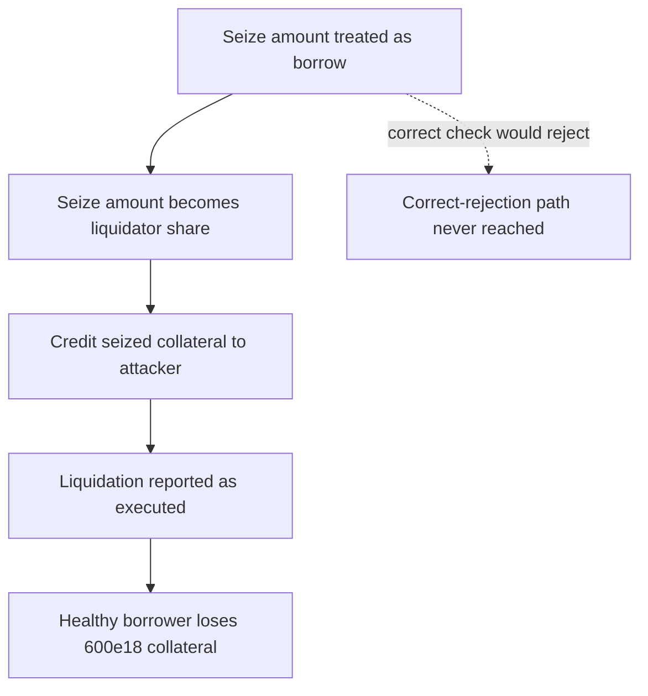

# Lend V2: cross-chain liquidation check misuses `payload.amount`

> **Vulnerability classes:** vuln/theft · vuln/logic
>
> **Reproduction:** a faithful minimal reproduction of the vulnerable finding — the vulnerable `_checkLiquidationValid` check is reproduced **verbatim** (marked `@>`) with faithful minimal doubles; local deploy, no fork.

<!-- source-auditvault: https://github.com/sherlock-audit/2025-05-lend-audit-contest-judging/issues/930 -->

## Root cause

On Chain A (the collateral chain), the cross-chain liquidation check treats `payload.amount` as if it were an additional borrow amount — but `payload.amount` is the number of collateral tokens to seize (`seizeTokens`, computed on Chain B). It is passed into `getHypotheticalAccountLiquidityCollateral(...)` as the `borrowAmount` parameter, so the check asks "if this user borrowed that much more, would they be underwater?" instead of validating actual health. The vulnerable line, reproduced verbatim:

```solidity
function _checkLiquidationValid(LZPayload memory payload) private view returns (bool) {
    (uint256 borrowed, uint256 collateral) = lendStorage.getHypotheticalAccountLiquidityCollateral(
@>      payload.sender, LToken(payable(payload.destlToken)), 0, payload.amount
    );
    return borrowed > collateral;
}
```

Because `payload.amount` is a seize amount and not a proposed borrow, a perfectly healthy position can be marked liquidatable purely because "borrowing `seizeTokens` more" would tip it over the edge — even though no such borrow ever happens.

## Why it's exploitable here

Following the synthetic's worked example, with collateral and borrow normalized at price 1:

1. A healthy borrower holds `1000e18` collateral against a `500e18` borrow (LTV 50%). Under the correct check (`borrowAmount = 0`): `borrowed(500) > collateral(1000)`? **No** — not liquidatable.
2. An attacker submits a cross-chain liquidation-execute message with `payload.amount = seizeTokens = 600e18`.
3. The buggy check adds the seize amount to the borrow side: `borrowed(500 + 600 = 1100) > collateral(1000)`? **Yes** — the healthy position is flagged liquidatable.
4. `_handleLiquidationExecute` runs: `600e18` of the healthy borrower's collateral is seized and credited to the attacker — a direct drain of a solvent user's funds.

## Attack path



## Marked-line walkthrough (Playground)

The EVM Playground pins each step to the exact executed source line in `0xce01759b…`:

1. **L133** — Seize amount treated as borrow: Root cause: payload.amount is the collateral seize amount but is passed here as a hypothetical borrowAmount, so a healthy position is flagged liquidatable.
2. **L141** — Seize amount becomes liquidator share: The same payload.amount is taken as the liquidator's share, the collateral to move out of the healthy borrower's position.
3. **L147** — Credit seized collateral to attacker: The seized collateral is credited to the liquidator, transferring the healthy borrower's funds to the attacker.
4. **L159** — Liquidation reported as executed: liquidate returns true, so the wrongful seizure is confirmed executed even though the borrower was fully solvent.
5. **L161** — Correct-rejection path never reached: This else branch would have correctly rejected the liquidation, but the buggy check never routes the healthy borrower here.
6. **L176** — Seized collateral measured at sink: The sink marker token records the 600e18 of collateral wrongly seized from the healthy borrower as a concrete, measurable loss.

## PoC

Registry (Foundry, local deploy — verbatim vulnerable source + harm-asserting test):

```bash
cd 58391-lend-liquidation-validation-logic-is-wrong_exp && forge test -vvv
```

The browser Playground replays the same synthetic opcode-for-opcode and measures the harm: **a healthy borrower (1000e18 collateral vs 500e18 borrow) is flagged liquidatable and has 600e18 of collateral seized**. Both gates are green (registry `forge test` PASS + Playground `_verify-poc` **VERDICT: PASS**).
