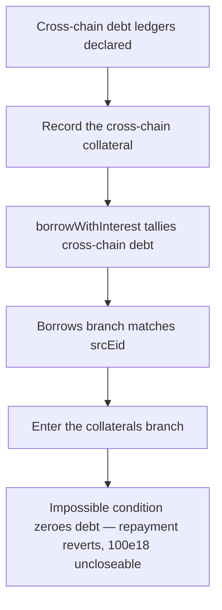

# Lend V2: cross-chain collateral is miscounted as zero in `borrowWithInterest`

> **Vulnerability classes:** vuln/logic · vuln/accounting-error · vuln/dos
>
> **Reproduction:** a faithful minimal reproduction of the vulnerable finding — the cross-chain-collateral branch of `borrowWithInterest` is reproduced **verbatim** (marked `@>`) with faithful minimal doubles; local deploy, no fork.

<!-- source-auditvault: https://github.com/sherlock-audit/2025-05-lend-audit-contest-judging/issues/946 -->

## Root cause

When a user borrows cross-chain from source chain A to destination chain B, the collateral record is stored on chain B with `srcEid != destEid`. But while summing that debt, `borrowWithInterest` only counts a cross-chain collateral when `destEid == currentEid && srcEid == currentEid` — a condition that can never be satisfied because `srcEid` is always different from `destEid`. The vulnerable line, reproduced verbatim from the finding:

```solidity
// LendStorage.borrowWithInterest — cross-chain-collateral branch (LendStorage.sol L497)
@> if (collaterals[i].destEid == currentEid && collaterals[i].srcEid == currentEid)
```

Because the guard is always false, the borrower's outstanding cross-chain debt is never added to `borrowedAmount`, and the function returns `0` for any live cross-chain borrow.

## Why it's exploitable here

Following the finding with a clean worked example (`borrowIndex = 1e18`, no accrual):

1. The borrower has a live cross-chain borrow recorded on the destination chain (`currentEid = 2`) with `srcEid = 1`, `destEid = 2`, `principle = 100e18`. Their true outstanding debt is `100e18 * borrowIndex / storedIndex = 100e18`.
2. `borrowWithInterest` takes the `collaterals` branch and evaluates `destEid == currentEid && srcEid == currentEid` → `2 == 2 && 1 == 2` → **false**, so nothing is added and it returns `0`.
3. The cross-chain repay path (`repayBorrowInternal`) reads that `0` and hits `require(borrowedAmount > 0, "Borrowed amount is 0")`, which reverts.
4. The borrower can never repay or close the `100e18` cross-chain borrow, and the debt is invisible to liquidity accounting.

## Attack path



## Marked-line walkthrough (Playground)

The EVM Playground pins each step to the exact executed source line in `0x671d353a…`:

1. **L76** — Cross-chain debt ledgers declared: Setup: crossChainBorrows holds locally-originated debts and stays empty for a pure cross-chain borrow, whose record instead lives in crossChainCollaterals.
2. **L88** — Record the cross-chain collateral: Setup: addCrossChainCollateral stores the borrower's 100e18 cross-chain debt with srcEid=1 and destEid=2 (this chain), so srcEid never equals destEid.
3. **L96** — borrowWithInterest tallies cross-chain debt: borrowWithInterest sums the borrower's outstanding cross-chain debt, relying on exactly one of the two ledgers being populated on a given chain.
4. **L112** — Borrows branch matches srcEid: The crossChainBorrows branch correctly matches srcEid == currentEid, but it is skipped here because this cross-chain debt lives in the collaterals ledger.
5. **L117** — Enter the collaterals branch: Execution enters the collaterals branch, which is meant to sum exactly the cross-chain-collateral debt the borrower is now trying to repay.
6. **L120** — Impossible collateral match condition: Root cause: it needs destEid == currentEid AND srcEid == currentEid, but a cross-chain borrow always has srcEid != destEid, so it never matches and the debt counts as 0.
7. **L133** — Repayment reverts on zeroed debt: The repay path reads the debt as 0 and its require(borrowedAmount > 0) reverts, so the borrower can never repay or close a live 100e18 cross-chain borrow.

## PoC

Registry (Foundry, local deploy — verbatim vulnerable source + harm-asserting test):

```bash
cd 58392-lend-cross-chain-collateral-is-miscalculated-in-borrowwithinterest_exp && forge test -vvv
```

The browser Playground replays the same synthetic opcode-for-opcode and measures the harm: **a borrower's live 100e18 cross-chain debt is reported as 0, and their repayment reverts on the "Borrowed amount is 0" guard**. Both gates are green (registry `forge test` PASS + Playground `_verify-poc` **VERDICT: PASS**).
