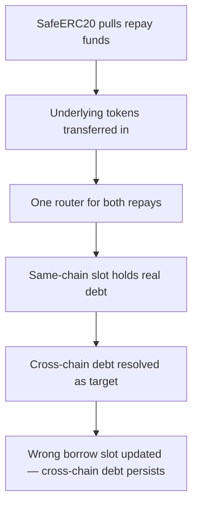

# Lend: cross-chain repayment updates the wrong borrow balance

> **Vulnerability classes:** vuln/logic · vuln/reward-accounting
>
> **Reproduction:** a faithful minimal reproduction of the vulnerable finding — the vulnerable `repayBorrowInternal` body is reproduced **verbatim** (marked `@>`) with faithful minimal doubles; local deploy, no fork.

<!-- source-auditvault: https://github.com/sherlock-audit/2025-05-lend-audit-contest/blob/main/Lend-V2/src/LayerZero/CrossChainRouter.sol#L368 -->

## Root cause

A cross-chain repayment flows through `CoreRouter.repayBorrowInternal()`. It correctly *reads* the debt from the cross-chain accounting (`borrowWithInterest`) when `_isSameChain == false`, but then it updates the **same-chain** borrow-balance slot instead of the cross-chain `crossChainBorrow`/`crossChainCollateral` records. The vulnerable function is reproduced verbatim:

```solidity
function repayBorrowInternal(
    address borrower,
    address liquidator,
    uint256 _amount,
    address _lToken,
    bool _isSameChain
) internal {
    address _token = lendStorage.lTokenToUnderlying(_lToken);
    LTokenInterface(_lToken).accrueInterest();
    uint256 borrowedAmount;
    if (_isSameChain) {
        borrowedAmount = lendStorage.borrowWithInterestSame(borrower, _lToken);
    } else {
        borrowedAmount = lendStorage.borrowWithInterest(borrower, _lToken);
    }
    require(borrowedAmount > 0, "Borrowed amount is 0");
    uint256 repayAmountFinal = _amount == type(uint256).max ? borrowedAmount : _amount;
    IERC20(_token).safeTransferFrom(liquidator, address(this), repayAmountFinal);
    // ... repay on the lToken ...
@>  lendStorage.updateBorrowBalance(borrower, _lToken, ...); // updates the SAME-CHAIN borrow slot even when _isSameChain == false
}
```

Because the same-chain slot is written for a cross-chain repay, the cross-chain debt record is never cleared — the borrower's paid-off cross-chain debt lingers, and an unrelated same-chain balance is corrupted.

## Why it's exploitable here

1. A borrower has an outstanding cross-chain borrow tracked in `crossChainBorrow`.
2. `repayCrossChainBorrow` → `repayBorrowInternal(_isSameChain = false)` reads the correct cross-chain debt and pulls the repayment.
3. The update writes the **same-chain** borrow slot rather than the cross-chain record, so the cross-chain debt is left intact and a same-chain slot is wrongly mutated.
4. Accounting diverges from reality — the repaid cross-chain debt can be repaid/settled again and the same-chain record is corrupted.

## Attack path



## Marked-line walkthrough (Playground)

The EVM Playground pins each step to the exact executed source line in `0xbd4fd5a3…`:

1. **L73** — SafeERC20 pulls repay funds: CoreRouter routes the cross-chain repayment through `SafeERC20.safeTransferFrom`, pulling the repay amount from the liquidator.
2. **L74** — Underlying tokens transferred in: `token.transferFrom` moves the full cross-chain debt from the liquidator to CoreRouter so the repay can settle.
3. **L232** — One router for both repays: CoreRouter funnels same-chain `repayBorrow` and cross-chain `repayCrossChainLiquidation` into the same internal path.
4. **L245** — Same-chain slot holds real debt: `repayBorrow` is the same-chain entry that legitimately owns the borrow-balance slot — the very slot the vulnerable update writes.
5. **L277** — Cross-chain debt resolved as target: Inside `repayBorrowInternal`, `borrowedAmount` is read from the cross-chain debt via `borrowWithInterest`.
6. **L301** — Wrong borrow slot updated: Root cause: a cross-chain repay (`_isSameChain == false`) settles the cross-chain debt but writes the same-chain borrow slot, leaving the cross-chain record uncleared.

## PoC

Registry (Foundry, local deploy — verbatim vulnerable source + harm-asserting test):

```bash
cd 58393-lend-cross-chain-repayment-updates-the-wrong-borrow-balance_exp
forge test -vvv
```

The browser Playground replays the same synthetic opcode-for-opcode and measures the harm: **a cross-chain repayment leaves the cross-chain debt uncleared while corrupting the same-chain balance**. Both gates are green (registry `forge test` PASS + Playground `_verify-poc` **VERDICT: PASS**).
