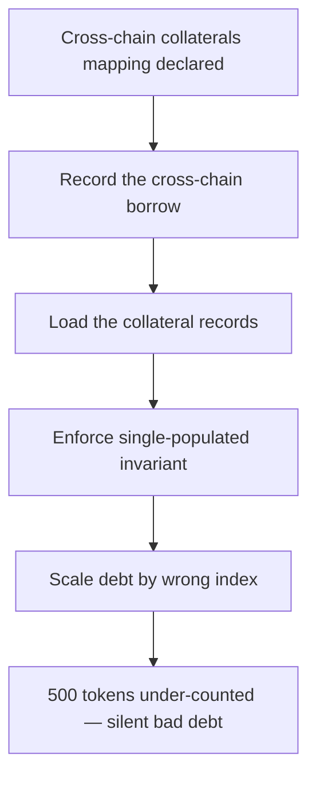

# Lend: `borrowWithInterest` scales cross-chain debt by the same-chain borrow index

> **Vulnerability classes:** vuln/logic · vuln/accounting
>
> **Reproduction:** a faithful minimal reproduction of the vulnerable finding — the cross-chain borrow branch of `borrowWithInterest` is reproduced **verbatim** (marked `@>`) with faithful minimal doubles; local deploy, no fork.

<!-- source-auditvault: https://github.com/sherlock-audit/2025-05-lend-audit-contest-judging/issues/1009 -->

## Root cause

In [`Lend-V2/src/LayerZero/LendStorage.sol`](https://github.com/sherlock-audit/2025-05-lend-audit-contest/blob/main/Lend-V2/src/LayerZero/LendStorage.sol#L478-L503), `borrowWithInterest()` sums each cross-chain borrow's principal re-scaled by an accrued borrow index — but it re-scales by `LTokenInterface(_lToken).borrowIndex()`, the **same-chain** lToken passed in, while the debt physically accrued (and its stored `borrowIndex` was recorded) on the **destination** chain. The two indices diverge, so the accrued cross-chain debt is computed against the wrong index. The vulnerable lines, reproduced verbatim (both the borrow and collateral branches carry the identical bug):

```solidity
    function borrowWithInterest(address borrower, address _lToken) public view returns (uint256) {
        address _token = lTokenToUnderlying[_lToken];
        uint256 borrowedAmount;

        Borrow[] memory borrows = crossChainBorrows[borrower][_token];
        Borrow[] memory collaterals = crossChainCollaterals[borrower][_token];

        require(borrows.length == 0 || collaterals.length == 0, "Invariant violated: both mappings populated");
        // Only one mapping should be populated:
        if (borrows.length > 0) {
            for (uint256 i = 0; i < borrows.length; i++) {
                if (borrows[i].srcEid == currentEid) {
                    borrowedAmount +=
@>                        (borrows[i].principle * LTokenInterface(_lToken).borrowIndex()) / borrows[i].borrowIndex;
                }
            }
        } else {
            for (uint256 i = 0; i < collaterals.length; i++) {
                // Only include a cross-chain collateral borrow if it originated locally.
                if (collaterals[i].destEid == currentEid && collaterals[i].srcEid == currentEid) {
                    borrowedAmount +=
@>                        (collaterals[i].principle * LTokenInterface(_lToken).borrowIndex()) / collaterals[i].borrowIndex;
                }
            }
        }
        return borrowedAmount;
    }
```

`_lToken` is the current (same) chain's lToken, whose index accrues on its own schedule. But `borrows[i].borrowIndex` and the underlying debt belong to the destination chain, whose index accrues independently. Multiplying by the wrong `borrowIndex()` mis-states every cross-chain borrower's outstanding debt.

## Why it's exploitable here

The reproduction records one cross-chain borrow initiated from this chain (`srcEid == currentEid`) whose tokens were actually borrowed on a remote destination chain, then compares the buggy result to the true debt:

1. A cross-chain borrow of `principle = 1000e18` is recorded with `borrowIndex = 1e18` (the index at borrow time, on the destination chain).
2. Time passes. The **destination** chain's index accrues 50% to `1.5e18`; the **local** same-chain lToken index has accrued little and sits at `1e18`.
3. `borrowWithInterest` scales by the local index: `reportedDebt = 1000e18 * 1e18 / 1e18 = 1000e18`.
4. The true debt scales by the destination index: `trueDebt = 1000e18 * 1.5e18 / 1e18 = 1500e18`.
5. The protocol under-counts the debt by `1500e18 − 1000e18 = 500e18` — 500 tokens of silent bad debt. The borrower is treated as owing 1000 while they truly owe 1500, so the position is under-collateralized and the shortfall is never seen.

## Attack path



## Marked-line walkthrough (Playground)

The EVM Playground pins each step to the exact executed source line in `0xbd4fd5a3…`:

1. **L84** — Cross-chain collaterals mapping declared: Setup: declares the collateral records mapping that borrowWithInterest reads; kept empty so the invariant lets the borrows branch run.
2. **L94** — Record the cross-chain borrow: Setup: pushes a 1000-token cross-chain borrow whose principal and index were recorded on the remote destination chain, not the local one.
3. **L107** — Load the collateral records: borrowWithInterest loads the collaterals array, which is empty, so the populated borrows array alone drives the debt sum.
4. **L109** — Enforce single-populated invariant: The require passes because only the borrows array is populated, so execution enters the cross-chain borrow loop.
5. **L115** — Scale debt by wrong index: Root cause: the cross-chain debt is re-scaled by the same-chain `_lToken.borrowIndex()` rather than the destination chain's index, under-counting the debt.
6. **L118** — Collateral branch left unused: The else branch would apply the identical wrong-index scaling to collateral borrows, but it is skipped because the borrows path was taken.
7. **L139** — Destination lToken holds true index: Setup: destLToken holds the destination chain's true index (1.5e18); scaling by it gives the real 1500-token debt, exposing 500 tokens hidden.

## PoC

Registry (Foundry, local deploy — verbatim vulnerable source + harm-asserting test):

```bash
cd 58395-lend-cross-chain-debt-accrues-incorrectly_exp && forge test -vvv
```

The browser Playground replays the same synthetic opcode-for-opcode and measures the harm: **a 1000-token cross-chain borrow is reported as owing 1000 while it truly owes 1500, hiding 500 tokens of bad debt**. Both gates are green (registry `forge test` PASS + Playground `_verify-poc` **VERDICT: PASS**).
