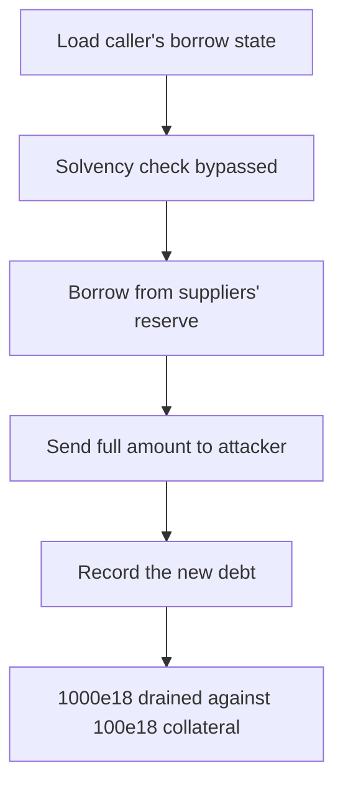

# Lend: `CoreRouter.borrow()` uses an incorrect collateral check

> **Vulnerability classes:** vuln/theft · vuln/logic
>
> **Reproduction:** a faithful minimal reproduction of the vulnerable finding — the vulnerable `borrow()` body is reproduced **verbatim** (marked `@>`) with faithful minimal doubles; local deploy, no fork.

<!-- source-auditvault: https://github.com/sherlock-audit/2025-05-lend-audit-contest/blob/main/Lend-V2/src/LayerZero/CoreRouter.sol#L153 -->

## Root cause

In [`Lend-V2/src/LayerZero/CoreRouter.sol#L153`](https://github.com/sherlock-audit/2025-05-lend-audit-contest/blob/main/Lend-V2/src/LayerZero/CoreRouter.sol#L153), `borrow()` computes the correct hypothetical debt (`borrowed`, the total hypothetical USD debt) but then discards it, checking a separate `borrowAmount` that collapses to `0` on a first borrow. The vulnerable block is reproduced verbatim:

```solidity
(uint256 borrowed, uint256 collateral) =
    lendStorage.getHypotheticalAccountLiquidityCollateral(msg.sender, LToken(payable(_lToken)), 0, _amount);

LendStorage.BorrowMarketState memory currentBorrow = lendStorage.getBorrowBalance(msg.sender, _lToken);

uint256 borrowAmount = currentBorrow.borrowIndex != 0
    ? ((borrowed * LTokenInterface(_lToken).borrowIndex()) / currentBorrow.borrowIndex)
    : 0;

@>  require(collateral >= borrowAmount, "Insufficient collateral"); // checks borrowAmount (==0 on first borrow) instead of `borrowed`
```

On a first borrow in a market, `currentBorrow.borrowIndex == 0`, so the ternary yields `borrowAmount = 0`. The guard `collateral >= 0` is trivially true, so the solvency check is bypassed entirely — the correct check is `collateral >= borrowed`.

## Why it's exploitable here

1. The attacker supplies 100e18 of collateral, then calls `borrow()` for 1000e18 in a market where it has no prior borrow.
2. `getHypotheticalAccountLiquidityCollateral` correctly reports `borrowed = 1000e18` (the debt would exceed collateral), but `borrowAmount` collapses to `0`.
3. `require(collateral >= 0)` passes, and the router borrows the full 1000e18 out of honest suppliers' reserve and sends it to the attacker.
4. The attacker walks away with a wildly under-collateralized position — 900e18 net drained.

## Attack path



## Marked-line walkthrough (Playground)

The EVM Playground pins each step to the exact executed source line in `0xbd4fd5a3…`:

1. **L164** — Load caller's borrow state: Reads the caller's existing borrow record for this market; on a first borrow it is a zeroed record (`borrowIndex == 0`).
2. **L170** — Solvency check bypassed: Root cause: the guard checks `collateral >= borrowAmount` (0 on a first borrow) instead of `collateral >= borrowed`, so the solvency check is bypassed.
3. **L176** — Borrow from suppliers' reserve: With the check bypassed, CoreRouter calls the lToken to borrow the full 1000e18 out of honest suppliers' reserve.
4. **L179** — Send full amount to attacker: The full 1000e18 of borrowed underlying is transferred to the attacker, who posted only 100e18 of collateral.
5. **L185** — Existing-borrower record rescale: The if-branch rescales an existing borrower's principal by the interest index for record-keeping.
6. **L191** — Record the new debt: The else branch stores the new 1000e18 debt at the current borrow index, finalizing the unbacked position.
7. **L206** — Confirm the reserve drain: Reading the lToken reserve balance shows 1000e18 drained from honest suppliers against 100e18 of collateral.

## PoC

Registry (Foundry, local deploy — verbatim vulnerable source + harm-asserting test):

```bash
cd 58396-lend-corerouter-borrow-has-an-incorrect-collateral-check_exp
forge test -vvv
```

The browser Playground replays the same synthetic opcode-for-opcode and measures the harm: **post 100e18 collateral, borrow 1000e18, netting 900e18 drained from honest suppliers**. Both gates are green (registry `forge test` PASS + Playground `_verify-poc` **VERDICT: PASS**).
