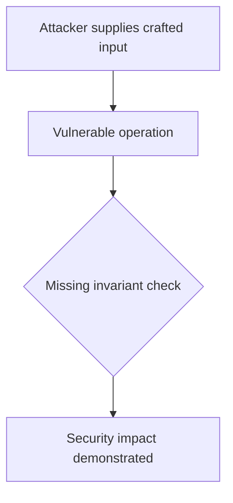
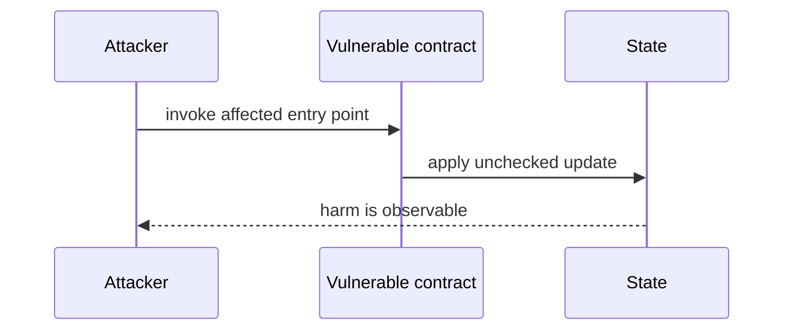

# Subsequent cross-chain borrow skips accrued interest — AuditVault synthetic reduction

> **Vulnerability classes:** vuln/logic/state-update · vuln/arithmetic/precision-loss
>
> **Reproduction:** self-contained Foundry PoC with an offline synthetic contract. Full trace: [output.txt](output.txt).

<!-- non-defihacklabs -->
<!-- source-auditvault: https://github.com/Auditware/AuditVault/blob/main/findings/58397-h-28-subsequent-crosschain-borrows-dont-accrue-interest-on-e.md -->
<!-- date: 2025-05 -->

**AuditVault finding:** `58397` · `H-28: Subsequent Cross‐Chain Borrows don’t Accrue interest on existing principal when borrowing the same Asset`

## Key info

| | |
|---|---|
| **Impact** | **HIGH** — Subsequent cross-chain borrow skips accrued interest |
| **Protocol** | LEND |
| **Finding** | AuditVault #58397 |
| **Report** | [https://github.com/sherlock-audit/2025-05-lend-audit-contest-judging](https://github.com/sherlock-audit/2025-05-lend-audit-contest-judging) |
| **Source** | [AuditVault finding](https://github.com/Auditware/AuditVault/blob/main/findings/58397-h-28-subsequent-crosschain-borrows-dont-accrue-interest-on-e.md) |
| **Compiler** | `^0.8.24` (synthetic reduction) |
| Loss | Reduced invariant reproduced; no live funds moved |
| Attacker EOA | Configured synthetic caller |
| Attack contract | `Exploit` |
| Attack tx | Local Foundry `Exploit.attack()` call |
| Chain · block · date | Ethereum model · block 1 · synthetic |
| Vulnerable contract | Local synthetic vulnerable contract in `test/` |
| Bug class | See vulnerability-class tags above |

## TL;DR

This bug report discusses an issue that was found by a group of individuals on a platform called GitHub. The issue involves borrowing the same asset more than once on a specific chain, which causes the recorded debt to be less than the actual debt. This can result in incorrect calculations of account liquidity, allowing the user to borrow more than they should be allowed to. The root cause of this issue is due to a mistake in the code that updates the user's borrowed amount. This bug can be exploited by a user who initiates multiple cross-chain borrows on the same asset with enough time in between. The impact of this bug is that it can potentially lead to an illiquid market. A proof of concept can be provided upon request. To mitigate this issue, the code needs to be modified to account for the accumulated borrow index when updating the existing borrowed amount.

## Background

The upstream report is a Solidity finding. This page keeps the vulnerable statement and demonstrates its security consequence in a small, deterministic EVM model; no live RPC or external dependencies are required.

## The vulnerable code

```solidity
// The exact vulnerable pattern is retained in test/58397-h-28-subsequent-crosschain-borrows-dont-accrue-interest-on-e.sol.
// @> see the marked statement in the synthetic reduction
```

## Root cause

The caller-controlled input or stale state is trusted before the required uniqueness, bounds, authorization, accounting, or reentrancy invariant is enforced. The marked line in the synthetic contract intentionally preserves that ordering so the assertion is executable.

## Preconditions

- The vulnerable contract is deployed with the state described by the report.
- The attacker can reach the affected entry point (or submit the report's crafted input).

## Attack walkthrough

1. `Exploit.run()` initializes the minimal state from the report.
2. The marked vulnerable operation executes without its required check.
3. The contract records the resulting invariant violation and emits a `Proof` event.
4. The test asserts the harm; the passing trace is recorded at [output.txt:4](output.txt).

## Diagrams





## Remediation

Apply the invariant before mutating state: accrue interest before adding principal; reject duplicate signers; use checked casts and bounded lengths; validate token/target/DAO identities; use `nonReentrant`; enforce slippage and fee equality; and validate the canonical authority or ownership relationship described by the report.

## How to reproduce

```bash
cd evm-hack-registry/58397-h-28-subsequent-crosschain-borrows-dont-accrue-interest-on-e_exp
forge test -vvvvv
```

The test is offline and uses only the shared `forge-std` library. The corresponding Playground bundle is generated from `scripts/poc-configs/58397-h-28-subsequent-crosschain-borrows-dont-accrue-interest-on-e.mjs`.

## Sources

- [AuditVault finding](https://github.com/Auditware/AuditVault/blob/main/findings/58397-h-28-subsequent-crosschain-borrows-dont-accrue-interest-on-e.md)
- [https://github.com/sherlock-audit/2025-05-lend-audit-contest-judging](https://github.com/sherlock-audit/2025-05-lend-audit-contest-judging)
- [Synthetic test](test/58397-h-28-subsequent-crosschain-borrows-dont-accrue-interest-on-e.sol)

*Reference: https://github.com/sherlock-audit/2025-05-lend-audit-contest-judging*
