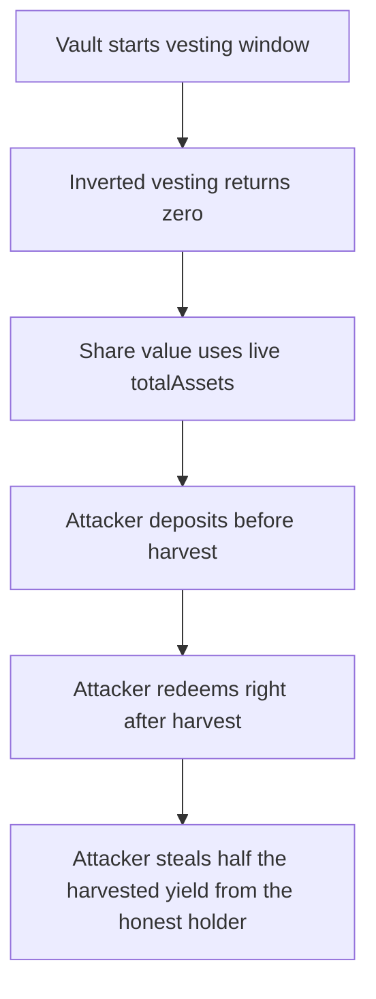

# LoopVaults: inverted `_vestingInterest()` enables an MEV sandwich

> **Vulnerability classes:** vuln/theft · vuln/mev · vuln/logic
>
> **Reproduction:** a faithful minimal reproduction of the vulnerable finding — the vulnerable `totalAssets()` + `_vestingInterest()` are reproduced **verbatim** (marked `@>`) with faithful minimal ERC4626-style doubles; local deploy, no fork.

<!-- source-auditvault: https://github.com/pashov/audits/blob/master/team/md/LoopVaults-security-review_2025-04-30.md -->

## Root cause

Harvested interest is meant to **vest** — stay locked right after an update and release linearly over `vestingDuration` — so a deposit/redeem sandwiching the harvest cannot capture it. But `_vestingInterest()` is inverted: it returns `0` when `block.timestamp == lastUpdate` (right after the update) and rises to the full amount only at `vestingDuration`. So `totalAssets() = lastTotalAssets - _vestingInterest()` counts the **entire** freshly harvested interest immediately, and the share price jumps at the update instead of drifting up over the window. The vulnerable lines, reproduced verbatim:

```solidity
    function totalAssets() public view override returns (uint256) {
        return lastTotalAssets - _vestingInterest();
    }

    function _vestingInterest() internal view returns (uint256) {
        if (block.timestamp - lastUpdate >= vestingDuration) return 0;

@>      uint256 __vestingInterest = (block.timestamp - lastUpdate) * vestingInterest / vestingDuration;
        return __vestingInterest;
    }
```

The multiplier `(block.timestamp - lastUpdate)` should have been the *remaining* time `(vestingDuration - (block.timestamp - lastUpdate))`. Because it is not, `_vestingInterest()` is `0` exactly when the interest should be fully locked, exposing 100% of the harvest to a same-block MEV sandwich.

## Why it's exploitable here

Following the reproduction's numbers (`VESTING_DURATION = 1 day`, honest holder and attacker each stake `1000e18`, harvested `YIELD = 100e18`):

1. The honest holder deposits `1000e18` and receives `1000e18` shares (1:1). `lastTotalAssets = 1000e18`, `totalSupply = 1000e18`.
2. The attacker **front-runs the harvest** with a `1000e18` deposit at the pre-harvest price — `totalAssets()` is still `1000e18`, so they mint `1000e18` shares. Now `totalSupply = 2000e18`.
3. The harvest lands: `100e18` of external yield enters the vault and `harvest()` sets `lastTotalAssets = 2100e18`, `vestingInterest = 100e18`, `lastUpdate = now`.
4. The attacker **back-runs with an immediate redeem** in the same block. `block.timestamp == lastUpdate` ⇒ `_vestingInterest() == 0` ⇒ `totalAssets() == 2100e18`. Their `1000e18` shares are worth `1000e18 * 2100e18 / 2000e18 = 1050e18`.

The attacker deposited `1000e18` and withdrew `1050e18` — `50e18` profit with **zero time at risk**. The honest holder, who should have earned the full `100e18`, is left holding shares worth only `1050e18` — a `50e18` shortfall. The attacker captured exactly half the yield (`YIELD / 2`). With correct vesting the same-block redeem would have returned exactly the deposit and `profit == 0`.

## Attack path



## Marked-line walkthrough (Playground)

The EVM Playground pins each step to the exact executed source line in `0x671d353a…`:

1. **L92** — Vault starts vesting window: Setup: the constructor stores `vestingDuration` and records `lastUpdate = block.timestamp`, anchoring the window over which harvested interest should unlock.
2. **L105** — Inverted vesting returns zero: Root cause: inverted `_vestingInterest()` returns 0 right after a harvest, so freshly harvested interest is counted in totalAssets() immediately and is MEV-extractable.
3. **L118** — Share value uses live totalAssets: `_convertToAssets()` prices each share as `shares * totalAssets() / totalSupply`, so it directly reflects the interest that vesting failed to lock away.
4. **L133** — Attacker deposits before harvest: In deposit(), `totalSupply += shares_` mints the attacker fresh shares at the current pre-harvest price, moments before the interest lands.
5. **L139** — Attacker redeems right after harvest: In the same block, redeem() calls `_convertToAssets(shares_)` — now inflated by the just-harvested interest — paying the attacker back far more than deposited.
6. **L150** — Harvest jumps the share price: harvest() adds the new interest to lastTotalAssets and resets lastUpdate to now, making the share price jump instantly instead of drifting up over the window.
7. **L171** — Attacker sandwich capital sized: Setup: `ATTACKER_DEPOSIT = 1000e18` sizes the MEV bot's sandwich; matching the victim's stake, it captures half the harvested yield.

## PoC

Registry (Foundry, local deploy — verbatim vulnerable source + harm-asserting test):

```bash
cd 58543-h-01-incorrect-vesting-interest-calculation-enables-mev-atta_exp && forge test -vvv
```

The browser Playground replays the same synthetic opcode-for-opcode and measures the harm: **the attacker sandwiches the harvest (deposit just before, redeem just after, same block) and walks away with half the yield — `profit == YIELD / 2` — while the honest holder suffers an equal shortfall**. Both gates are green (registry `forge test` PASS + Playground `_verify-poc` **VERDICT: PASS**).
