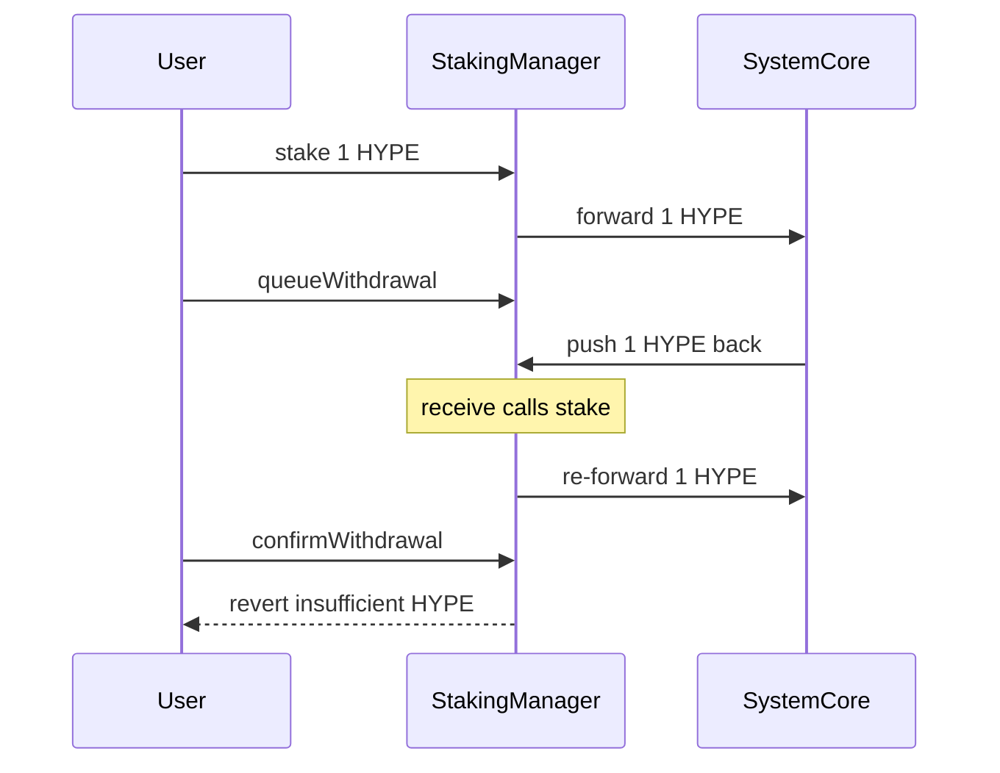

# Kinetiq — `receive()` re-stakes Core-returned HYPE and bricks confirmWithdrawal

> **Vulnerability classes:** vuln/accounting/reward-accounting · vuln/logic/state-update · vuln/liveness/withdrawal-brick

> **Reproduction:** a self-contained Foundry PoC that compiles & runs in an
> isolated project with **only `forge-std`** — no fork, no RPC, no `anvil_state`.
> Full trace: [output.txt](output.txt). PoC:
> [test/58555-h-03-mishandling-of-receiving-hype-in-the-stakingmanager-use_exp.sol](test/58555-h-03-mishandling-of-receiving-hype-in-the-stakingmanager-use_exp.sol).

<!-- non-defihacklabs -->
<!-- source-auditvault: https://github.com/Auditware/AuditVault/blob/main/findings/58555-h-03-mishandling-of-receiving-hype-in-the-stakingmanager-use.md -->
<!-- date: 2025-04 -->

**AuditVault taxonomy:** `severity/high` · `sector/oracle` · `sector/staking` · `sector/token` · `platform/code4rena` · `reward-accounting` · `logic/state-update` · `data-corruption/accounting-error` · `known-pattern` · `always` · `redesign-logic` · `blast-radius/protocol-wide`

---

## Key info

| | |
|---|---|
| **Impact** | **HIGH** — Core-returned HYPE is auto-staked; users cannot `confirmWithdrawal`; spurious kHYPE mint to system inflates exchange accounting |
| **Protocol** | Kinetiq — StakingManager on HyperEVM |
| **Vulnerable code** | `StakingManager.receive` — unconditionally calls `stake()` (StakingManager.sol#L208-L211) |
| **Bug class** | Native receive handler re-enters deposit path (withdrawal funds re-staked) |
| **Finding** | Code4rena 2025-04-kinetiq · #58555 · reporter **FalseGenius** |
| **Report** | [code4rena.com/reports/2025-04-kinetiq](https://code4rena.com/reports/2025-04-kinetiq) |
| **Source** | [AuditVault](https://github.com/Auditware/AuditVault/blob/main/findings/58555-h-03-mishandling-of-receiving-hype-in-the-stakingmanager-use.md) |
| **Status** | Audit finding — acknowledged by Kinetiq. Reproduced as a standalone local PoC. |
| **Compiler** | `^0.8.24` (PoC) |

---

## TL;DR

1. On HyperEVM, HYPE is the native gas token. Undelegations from Hypercore arrive as native ETH-like transfers to `StakingManager`.
2. `receive() external payable { stake(); }` immediately re-stakes any incoming HYPE and forwards it back to Core, minting kHYPE to the sender.
3. After a user queues a withdrawal, Core returns the undelegated HYPE — but it is re-staked, so the manager balance stays **0**.
4. `confirmWithdrawal` requires `address(this).balance >= pending` and reverts. The user is stuck.
5. Spurious kHYPE is minted to the system address; `totalStaked` grows again → exchange-ratio inflation. Fix: skip `stake()` when `msg.sender == systemAddress`.

---

## The vulnerable code

```solidity
receive() external payable {
    // Simply call the stake function
    stake(); // @> VULN
    // FIX: if (msg.sender != systemAddress) { stake(); }
}
```

---

## Root cause

`receive()` treats every native credit as a user deposit. Withdrawal returns and validator rewards from Core are not user deposits — they are **liquidity the manager must hold** to pay `confirmWithdrawal`. Auto-staking them empties the balance the withdrawal path needs and mints unbacked kHYPE to whoever sent the ETH (Core/system).

## Preconditions

- `targetBuffer = 0` (simplest; with buffer the user may still confirm but ratio still inflates).
- User has queued a withdrawal; operator has undelegated on L1; Core pushes HYPE back.

## Attack walkthrough

1. User stakes 1 HYPE → forwarded to Core; manager balance 0.
2. User queues full withdrawal (kHYPE burned, pending = 1e18).
3. Core `pushTo(manager, 1e18)` → `receive()` → `stake()` → HYPE re-forwarded to Core; manager balance still 0; system receives 1e18 spurious kHYPE.
4. `confirmWithdrawal` reverts (`insufficient HYPE`). User funds stuck; accounting inflated.

## Diagrams



## Impact

Withdrawal confirmations fail whenever Core returns HYPE through the native receive path. Users cannot exit. Spurious kHYPE mint + re-counted stake distorts the HYPE/kHYPE exchange ratio protocol-wide. The same path fires for validator rewards sent to the manager.

## Sources

- [AuditVault finding #58555](https://github.com/Auditware/AuditVault/blob/main/findings/58555-h-03-mishandling-of-receiving-hype-in-the-stakingmanager-use.md)
- [Code4rena report 2025-04-kinetiq](https://code4rena.com/reports/2025-04-kinetiq)
- Reduced source: [code-423n4/2025-04-kinetiq @ 7f29c91](https://github.com/code-423n4/2025-04-kinetiq/blob/7f29c917c09341672e73be2f7917edf920ea2adb/src/StakingManager.sol#L208-L211) — `StakingManager.receive`
