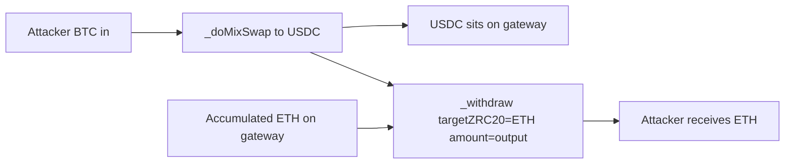

# DODO Cross-Chain DEX — swap output token ≠ withdrawal target drains gateway

> **Vulnerability classes:** vuln/logic/cross-contract-state-consistency · vuln/loss-of-funds/direct-drain · vuln/bridge/message-parameter-mismatch

> **Reproduction:** a self-contained Foundry PoC that compiles & runs in an
> isolated project with **only `forge-std`** — no fork, no RPC, no `anvil_state`.
> Full trace: [output.txt](output.txt). PoC:
> [test/58578-h-1-missing-swap-withdrawal-validation-enables-accumulated-t_exp.sol](test/58578-h-1-missing-swap-withdrawal-validation-enables-accumulated-t_exp.sol).

<!-- non-defihacklabs -->
<!-- source-auditvault: https://github.com/Auditware/AuditVault/blob/main/findings/58578-h-1-missing-swap-withdrawal-validation-enables-accumulated-t.md -->
<!-- date: 2025-05 -->

**AuditVault taxonomy:** `severity/high` · `sector/bridge` · `sector/dex` · `sector/stable` · `platform/sherlock` · `cross-contract-state-consistency` · `variant`

---

## Key info

| | |
|---|---|
| **Impact** | **HIGH** — attacker swaps cheap input → cheap output, then withdraws a different high-value token accumulated on the gateway |
| **Protocol** | DODO Cross-Chain DEX — GatewayCrossChain (ZetaChain) |
| **Vulnerable code** | `onCall` swaps with `params.toToken` then withdraws `decoded.targetZRC20` with no equality check (GatewayCrossChain.sol#L465-L508, #L371-L376, #L431-L437) |
| **Bug class** | Missing validation between swap output and withdrawal target |
| **Finding** | Sherlock 2025-05-dodo-cross-chain-dex · #58578 · reporter **patitonar** (and many others) |
| **Report** | [sherlock-audit/2025-05-dodo-cross-chain-dex-judging](https://github.com/sherlock-audit/2025-05-dodo-cross-chain-dex-judging) |
| **Source** | [AuditVault](https://github.com/Auditware/AuditVault/blob/main/findings/58578-h-1-missing-swap-withdrawal-validation-enables-accumulated-t.md) |
| **Status** | Audit finding — fixed in PR 33. Reproduced as a standalone local PoC. |
| **Compiler** | `^0.8.24` (PoC) |

---

## TL;DR

1. `onCall` performs `_doMixSwap(..., params.toToken)` then withdraws `decoded.targetZRC20`.
2. Nothing requires `toToken == targetZRC20`.
3. Attacker crafts a message: swap BTC→USDC, withdraw ETH (accumulated from prior ops).
4. Gateway spends the swap output amount of **ETH** to the attacker while USDC sits on the contract.
5. Fix: `require(toToken == targetZRC20)`.

---

## The vulnerable code

```solidity
uint256 outputAmount = _doMixSwap(fromZRC20, toToken, amount);
// FIX: require(toToken == targetZRC20, "swap/target mismatch");
_withdraw(targetZRC20, receiver, outputAmount - GAS_FEE); // @> VULN
```

---

## Root cause

Two independent message fields control the economic flow: the swap's output token and the withdrawal token. The code uses the swap's **amount** with the withdrawal's **token**. When they differ, the gateway pays the attacker from whichever balance `targetZRC20` has — typically residual high-value tokens from refunds/prior bridges.

## Preconditions

- Gateway holds accumulated ZRC20 balances (common after refunds / partial fills).
- Attacker can initiate a cross-chain `depositAndCall` (or the synthetic `onCall` entry).

## Attack walkthrough

1. Gateway holds 1000 ETH.ZRC20 from prior operations.
2. Attacker supplies 1 BTC.ZRC20; message sets `toToken = USDC`, `targetZRC20 = ETH`.
3. Swap converts BTC→USDC on the gateway.
4. Withdraw transfers 1 ETH.ZRC20 to the attacker receiver.
5. Protocol loses ETH; attacker paid only BTC.

## Diagrams



## Impact

Complete drainage of any accumulated ZRC20 the attacker can name as `targetZRC20`, sized by how much input they swap (output amount drives the withdraw size). Sherlock PoC showed ~99% drainage of 1000 ETH with a tiny BTC input under realistic pricing.

## Sources

- [AuditVault finding #58578](https://github.com/Auditware/AuditVault/blob/main/findings/58578-h-1-missing-swap-withdrawal-validation-enables-accumulated-t.md)
- [Sherlock judging issue #158](https://github.com/sherlock-audit/2025-05-dodo-cross-chain-dex-judging/issues/158)
- Reduced source: [sherlock-audit/2025-05-dodo-cross-chain-dex @ d4834a4](https://github.com/sherlock-audit/2025-05-dodo-cross-chain-dex/blob/d4834a468f7dad56b007b4450397289d4f767757/omni-chain-contracts/contracts/GatewayCrossChain.sol) — `GatewayCrossChain.onCall` / withdraw helpers
