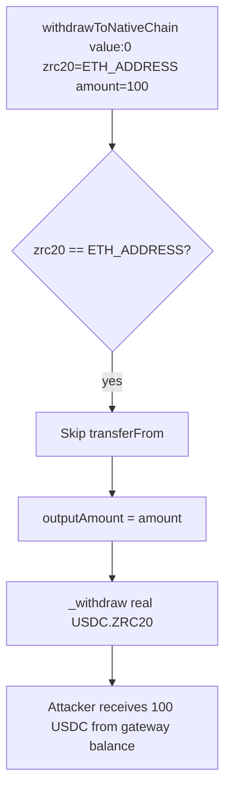

# DODO Cross-Chain DEX — missing `msg.value` check on ETH placeholder drains ZRC20

> **Vulnerability classes:** vuln/access-control/missing-auth · vuln/bridge/message-spoofing · vuln/loss-of-funds/direct-drain

> **Reproduction:** a self-contained Foundry PoC that compiles & runs in an
> isolated project with **only `forge-std`** — no fork, no RPC, no `anvil_state`.
> Full trace: [output.txt](output.txt). PoC:
> [test/58579-h-2-any-attacker-will-steal-accumulated-zrc20-tokens-from-ga_exp.sol](test/58579-h-2-any-attacker-will-steal-accumulated-zrc20-tokens-from-ga_exp.sol).

<!-- non-defihacklabs -->
<!-- source-auditvault: https://github.com/Auditware/AuditVault/blob/main/findings/58579-h-2-any-attacker-will-steal-accumulated-zrc20-tokens-from-ga.md -->
<!-- date: 2025-05 -->

**AuditVault taxonomy:** `severity/high` · `sector/bridge` · `sector/dex` · `sector/stable` · `sector/token` · `platform/sherlock` · `bridge-sender-auth` · `message-spoofing` · `direct-drain` · `variant` · `bridge-is-secure` · `add-check` · `cross-chain-message`

---

## Key info

| | |
|---|---|
| **Impact** | **HIGH** — attacker calls `withdrawToNativeChain` with `zrc20 = ETH_ADDRESS`, `value: 0`, and a message targeting real accumulated ZRC20; drains gateway with only gas cost |
| **Protocol** | DODO Cross-Chain DEX — GatewayTransferNative |
| **Vulnerable code** | `withdrawToNativeChain` skips `transferFrom` for `_ETH_ADDRESS_` without requiring `msg.value >= amount` (GatewayTransferNative.sol#L534-L537) |
| **Bug class** | Missing native-value validation on placeholder token path |
| **Finding** | Sherlock 2025-05-dodo-cross-chain-dex · #58579 · reporter **X0sauce** (and others) |
| **Report** | [sherlock-audit/2025-05-dodo-cross-chain-dex-judging](https://github.com/sherlock-audit/2025-05-dodo-cross-chain-dex-judging) |
| **Source** | [AuditVault](https://github.com/Auditware/AuditVault/blob/main/findings/58579-h-2-any-attacker-will-steal-accumulated-zrc20-tokens-from-ga.md) |
| **Status** | Audit finding — fixed in PR 32. Reproduced as a standalone local PoC. |
| **Compiler** | `^0.8.24` (PoC) |

---

## TL;DR

1. For non-ETH inputs, the gateway pulls tokens via `transferFrom`.
2. For `zrc20 == _ETH_ADDRESS_`, that pull is skipped — but **`msg.value` is never checked**.
3. Attacker claims `amount = 100e18` with `value: 0`, sets `targetZRC20` to real USDC.ZRC20 in the message.
4. Gateway withdraws 100 USDC.ZRC20 from its own balance to the attacker. Cost: gas only.
5. Fix: `require(msg.value >= amount)` when `zrc20 == _ETH_ADDRESS_`.

---

## The vulnerable code

```solidity
if (zrc20 != ETH_ADDRESS) {
    require(IZRC20(zrc20).transferFrom(msg.sender, address(this), amount), "...");
}
// FIX: if (zrc20 == ETH_ADDRESS) require(msg.value >= amount, "INSUFFICIENT NATIVE TOKEN");
uint256 outputAmount = amount; // @> VULN: amount accepted with no msg.value check
_withdraw(targetZRC20, receiver, outputAmount - gasFee);
```

---

## Root cause

The ETH placeholder path assumes the caller paid native value equal to `amount`, but never enforces it. Combined with a message that names a **different** real ZRC20 as the withdrawal target, the claimed amount is satisfied from gateway inventory the attacker never deposited.

## Preconditions

- Gateway holds accumulated ZRC20 (refunds / prior ops).
- Anyone can call `withdrawToNativeChain`.

## Attack walkthrough

1. Gateway holds 100 USDC.ZRC20.
2. Attacker calls `withdrawToNativeChain{value:0}(ETH_ADDRESS, 100e18, message)` with `targetZRC20 = USDC`.
3. `transferFrom` skipped; no native paid.
4. Withdraw burns/transfers 100 USDC to attacker receiver.

## Diagrams



## Impact

Near-complete drainage of any accumulated ZRC20 the attacker can name as `targetZRC20`, for gas fees only. Sherlock logs showed 99/100 tokens stolen in one call.

## Sources

- [AuditVault finding #58579](https://github.com/Auditware/AuditVault/blob/main/findings/58579-h-2-any-attacker-will-steal-accumulated-zrc20-tokens-from-ga.md)
- [Sherlock judging issue #219](https://github.com/sherlock-audit/2025-05-dodo-cross-chain-dex-judging/issues/219)
- Reduced source: [sherlock-audit/2025-05-dodo-cross-chain-dex @ d4834a4](https://github.com/sherlock-audit/2025-05-dodo-cross-chain-dex/blob/d4834a468f7dad56b007b4450397289d4f767757/omni-chain-contracts/contracts/GatewayTransferNative.sol#L534-L537) — `GatewayTransferNative.withdrawToNativeChain`
