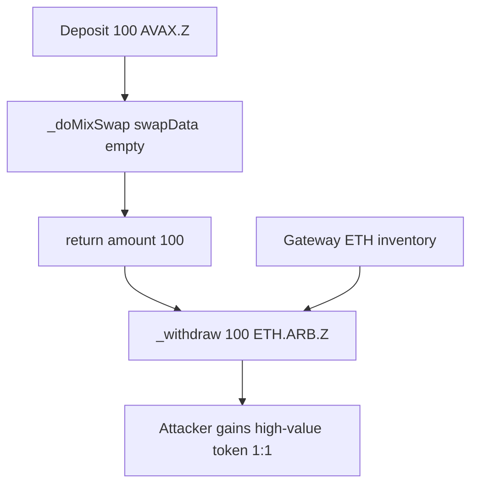

# DODO Cross-Chain DEX — empty `swapData` skips swap and pays high-value target 1:1

> **Vulnerability classes:** vuln/access-control/broken-logic · vuln/loss-of-funds/direct-drain · vuln/logic/missing-swap-enforcement

> **Reproduction:** a self-contained Foundry PoC that compiles & runs in an
> isolated project with **only `forge-std`** — no fork, no RPC, no `anvil_state`.
> Full trace: [output.txt](output.txt). PoC:
> [test/58580-h-3-attacker-can-steal-an-high-value-token-due-to-lack-of-sw_exp.sol](test/58580-h-3-attacker-can-steal-an-high-value-token-due-to-lack-of-sw_exp.sol).

<!-- non-defihacklabs -->
<!-- source-auditvault: https://github.com/Auditware/AuditVault/blob/main/findings/58580-h-3-attacker-can-steal-an-high-value-token-due-to-lack-of-sw.md -->
<!-- date: 2025-05 -->

**AuditVault taxonomy:** `severity/high` · `sector/bridge` · `sector/dex` · `platform/sherlock` · `access-roles` · `direct-drain`

---

## Key info

| | |
|---|---|
| **Impact** | **HIGH** — empty `swapData` returns the input amount without requiring `zrc20 == targetZRC20`, so depositing cheap token withdraws equal units of expensive accumulated token |
| **Protocol** | DODO Cross-Chain DEX — GatewayTransferNative (`_doMixSwap`) |
| **Vulnerable code** | `_doMixSwap`: `if (swapData.length == 0) return amount;` with no token match (GatewayTransferNative.sol#L430) |
| **Bug class** | Missing swap enforcement when tokens differ |
| **Finding** | Sherlock 2025-05-dodo-cross-chain-dex · #58580 · reporter **X0sauce** (and others) |
| **Report** | [sherlock-audit/2025-05-dodo-cross-chain-dex-judging](https://github.com/sherlock-audit/2025-05-dodo-cross-chain-dex-judging) |
| **Source** | [AuditVault](https://github.com/Auditware/AuditVault/blob/main/findings/58580-h-3-attacker-can-steal-an-high-value-token-due-to-lack-of-sw.md) |
| **Status** | Audit finding — fixed in PR 33. Reproduced as a standalone local PoC. |
| **Compiler** | `^0.8.24` (PoC) |

---

## TL;DR

1. `_doMixSwap` short-circuits when `swapData` is empty: `return amount`.
2. No check that the deposit token equals `decoded.targetZRC20`.
3. Attacker deposits 100 AVAX.ZRC20, empty swapData, target = ETH.ARB.ZRC20.
4. Gateway pays 100 ETH.ARB.ZRC20 from accumulated balances (1:1 units, huge USD gain).
5. Fix: `require(toToken == zrc20)` on the empty-swapData path.

---

## The vulnerable code

```solidity
if (swapData.length == 0) {
    // FIX: require(toToken == zrc20, "swap required");
    return amount; // @> VULN
}
```

---

## Root cause

Empty `swapData` is a legitimate "no swap needed" path **only when** the input token already is the withdrawal token. Without that equality check, the function treats units of token A as interchangeable with units of token B — enabling economic arbitrage against the gateway's inventory whenever token prices differ.

## Preconditions

- Gateway holds high-value ZRC20 (refunds / prior ops).
- Attacker holds some cheaper ZRC20 to deposit.

## Attack walkthrough

1. Gateway holds 2000 ETH.ARB.ZRC20.
2. Attacker deposits 100 AVAX.ZRC20 with `swapData = ""` and `targetZRC20 = ETH.ARB`.
3. `_doMixSwap` returns 100 without swapping.
4. Withdraw sends 100 ETH.ARB to the attacker; 100 AVAX sits on the gateway.

## Diagrams



## Impact

Major loss of high-value ZRC20 balances. Same class of bug also exists on `GatewayCrossChain`. Attacker profit scales with the USD price gap between deposit and target tokens.

## Sources

- [AuditVault finding #58580](https://github.com/Auditware/AuditVault/blob/main/findings/58580-h-3-attacker-can-steal-an-high-value-token-due-to-lack-of-sw.md)
- [Sherlock judging issue #416](https://github.com/sherlock-audit/2025-05-dodo-cross-chain-dex-judging/issues/416)
- Reduced source: [sherlock-audit/2025-05-dodo-cross-chain-dex @ d4834a4](https://github.com/sherlock-audit/2025-05-dodo-cross-chain-dex/blob/d4834a468f7dad56b007b4450397289d4f767757/omni-chain-contracts/contracts/GatewayTransferNative.sol#L430) — `GatewayTransferNative._doMixSwap`
