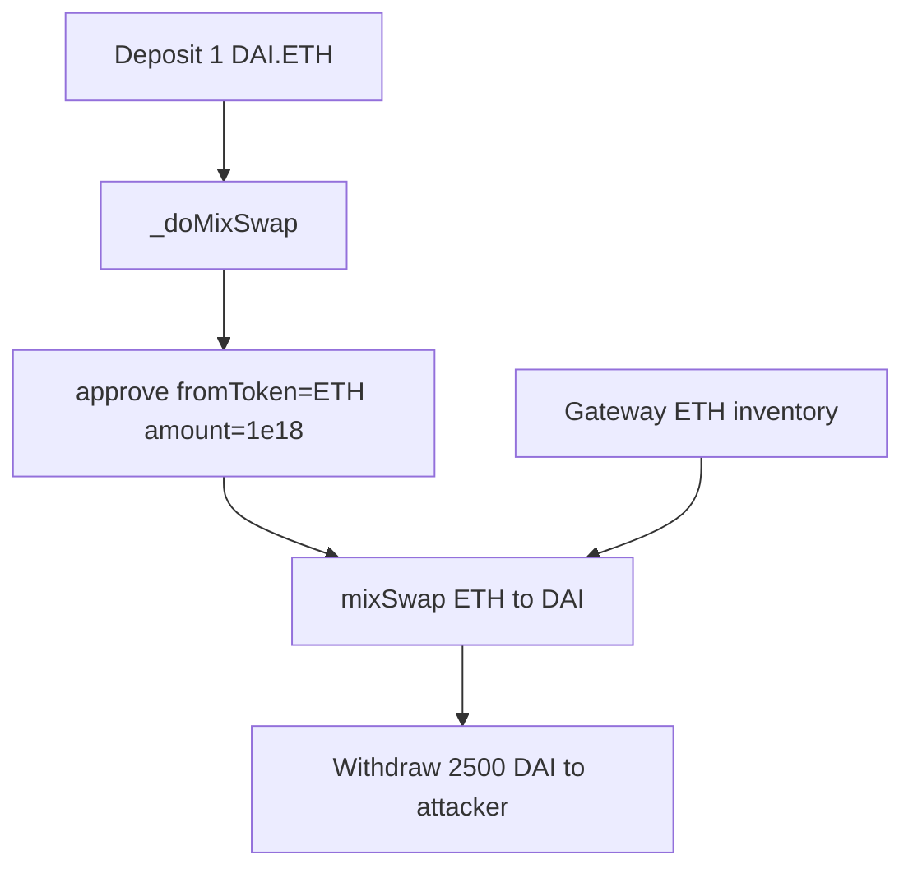

# DODO Cross-Chain DEX — `withdrawToNativeChain` swaps arbitrary ZRC20 inventory

> **Vulnerability classes:** vuln/access-control/broken-logic · vuln/loss-of-funds/direct-drain · vuln/logic/missing-token-match

> **Reproduction:** a self-contained Foundry PoC that compiles & runs in an
> isolated project with **only `forge-std`** — no fork, no RPC, no `anvil_state`.
> Full trace: [output.txt](output.txt). PoC:
> [test/58581-h-4-gatewaytransfernativewithdrawtonativechain-allows-swappi_exp.sol](test/58581-h-4-gatewaytransfernativewithdrawtonativechain-allows-swappi_exp.sol).

<!-- non-defihacklabs -->
<!-- source-auditvault: https://github.com/Auditware/AuditVault/blob/main/findings/58581-h-4-gatewaytransfernativewithdrawtonativechain-allows-swappi.md -->
<!-- date: 2025-05 -->

**AuditVault taxonomy:** `severity/high` · `sector/bridge` · `sector/dex` · `platform/sherlock` · `bridge-message-validation` · `direct-drain`

---

## Key info

| | |
|---|---|
| **Impact** | **HIGH** — deposit cheap ZRC20, set `params.fromToken` to a different high-value token held by the gateway, drain it via mixSwap |
| **Protocol** | DODO Cross-Chain DEX — GatewayTransferNative (`_doMixSwap`) |
| **Vulnerable code** | `_doMixSwap`: `IZRC20(params.fromToken).approve(DODOApprove, amount)` with no `fromToken == zrc20` check |
| **Bug class** | Message-controlled swap input ignores deposited token |
| **Finding** | Sherlock 2025-05-dodo-cross-chain-dex · #58581 · reporter **HeckerTrieuTien** (and others) |
| **Report** | [sherlock-audit/2025-05-dodo-cross-chain-dex-judging](https://github.com/sherlock-audit/2025-05-dodo-cross-chain-dex-judging) |
| **Source** | [AuditVault](https://github.com/Auditware/AuditVault/blob/main/findings/58581-h-4-gatewaytransfernativewithdrawtonativechain-allows-swappi.md) |
| **Status** | Audit finding — fixed in PR 33. Reproduced as a standalone local PoC. |
| **Compiler** | `^0.8.24` (PoC) |

---

## TL;DR

1. `withdrawToNativeChain` decodes DODO `MixSwapParams` from the user `message`.
2. `_doMixSwap` approves `params.fromToken` for the **deposited** `amount` — no check that `fromToken == zrc20`.
3. Attacker deposits 1 DAI, sets `fromToken = ETH` (gateway inventory), swaps 1 ETH → 2500 DAI.
4. Gateway loses 1 ETH; attacker receives 2500 DAI. Fix: require `fromToken == zrc20` and `fromTokenAmount <= amount`.

---

## The vulnerable code

```solidity
function _doMixSwap(...) internal returns (uint256 outputAmount) {
    // FIX: require(fromToken == zrc20);
    MockERC20(fromToken).approve(dodoApprove, amount); // @> VULN
    return dodoRouteProxy.mixSwap(fromToken, toToken, fromTokenAmount);
}
```

---

## Root cause

The deposit (`zrc20`, `amount`) and the swap input (`params.fromToken`, `params.fromTokenAmount`) are independent user inputs. Approving `fromToken` with the deposit amount spends the **gateway's** balance of whatever token the message names — not necessarily what the user paid in.

## Preconditions

- Gateway holds a valuable ZRC20 (refunds / prior ops).
- DODO route liquidity exists for `fromToken → toToken`.
- Attacker holds enough cheaper ZRC20 to set a large enough approve/amount.

## Attack walkthrough

1. Gateway holds 1 ETH.ETH; router has 2500 DAI liquidity at 1 ETH = 2500 DAI.
2. Attacker deposits 1 DAI, message: `fromToken=ETH`, `toToken=DAI`, `fromTokenAmount=1e18`.
3. `_doMixSwap` approves ETH and swaps gateway's 1 ETH → 2500 DAI.
4. Withdraw sends 2500 DAI to the attacker; 1 DAI sits unused on the gateway.

## Diagrams



## Impact

Direct drain of any ZRC20 held by `GatewayTransferNative` (and the same pattern on related entrypoints). Profit scales with the price gap between deposit token and drained inventory.

## Sources

- [AuditVault finding #58581](https://github.com/Auditware/AuditVault/blob/main/findings/58581-h-4-gatewaytransfernativewithdrawtonativechain-allows-swappi.md)
- [Sherlock judging issue #681](https://github.com/sherlock-audit/2025-05-dodo-cross-chain-dex-judging/issues/681)
- Reduced source: [sherlock-audit/2025-05-dodo-cross-chain-dex](https://github.com/sherlock-audit/2025-05-dodo-cross-chain-dex/blob/main/omni-chain-contracts/contracts/GatewayTransferNative.sol) — `GatewayTransferNative._doMixSwap` / `withdrawToNativeChain`
