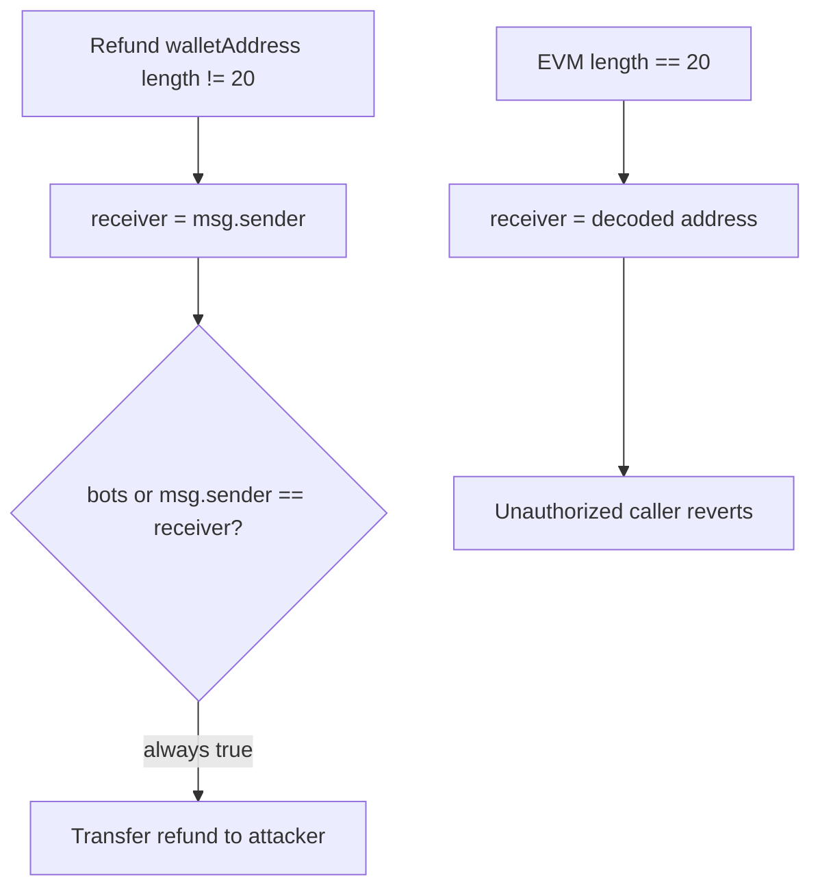

# DODO Cross-Chain DEX — unauthorized claim of non-EVM chain refunds

> **Vulnerability classes:** vuln/access-control/auth-bypass · vuln/loss-of-funds/direct-drain · vuln/logic/address-encoding

> **Reproduction:** a self-contained Foundry PoC that compiles & runs in an
> isolated project with **only `forge-std`** — no fork, no RPC, no `anvil_state`.
> Full trace: [output.txt](output.txt). PoC:
> [test/58582-h-5-unauthorized-claim-of-non-evm-chain-refunds-in-claimrefu_exp.sol](test/58582-h-5-unauthorized-claim-of-non-evm-chain-refunds-in-claimrefu_exp.sol).

<!-- non-defihacklabs -->
<!-- source-auditvault: https://github.com/Auditware/AuditVault/blob/main/findings/58582-h-5-unauthorized-claim-of-non-evm-chain-refunds-in-claimrefu.md -->
<!-- date: 2025-05 -->

**AuditVault taxonomy:** `severity/high` · `sector/bridge` · `sector/dex` · `platform/sherlock` · `flashloan-callback-auth` · `direct-drain`

---

## Key info

| | |
|---|---|
| **Impact** | **HIGH** — any caller can claim refunds whose `walletAddress` is not 20 bytes (Bitcoin, Solana, …) |
| **Protocol** | DODO Cross-Chain DEX — GatewayCrossChain / GatewayTransferNative `claimRefund` |
| **Vulnerable code** | `receiver = msg.sender` when `walletAddress.length != 20`, then `require(bots[msg.sender] \|\| msg.sender == receiver)` |
| **Bug class** | Auth bypass for non-EVM refund receivers |
| **Finding** | Sherlock 2025-05-dodo-cross-chain-dex · #58582 · reporter **newspacexyz** (and others) |
| **Report** | [sherlock-audit/2025-05-dodo-cross-chain-dex-judging](https://github.com/sherlock-audit/2025-05-dodo-cross-chain-dex-judging) |
| **Source** | [AuditVault](https://github.com/Auditware/AuditVault/blob/main/findings/58582-h-5-unauthorized-claim-of-non-evm-chain-refunds-in-claimrefu.md) |
| **Status** | Audit finding — fixed in PR 24. Reproduced as a standalone local PoC. |
| **Compiler** | `^0.8.24` (PoC) |

---

## TL;DR

1. Refunds store a `walletAddress` blob (20 bytes for EVM, longer for BTC/etc.).
2. `claimRefund` only decodes `receiver` when length is exactly 20; otherwise `receiver` stays `msg.sender`.
3. Auth becomes `msg.sender == msg.sender` → always true for non-bot callers.
4. Attacker frontruns bots and steals the refund tokens. Fix: non-EVM path must require `bots[msg.sender]` only (never equate receiver to caller).

---

## The vulnerable code

```solidity
address receiver = msg.sender;
if (refundInfo.walletAddress.length == 20) {
    receiver = address(uint160(bytes20(refundInfo.walletAddress)));
}
// FIX: non-EVM → require(bots[msg.sender]); do not set receiver = msg.sender for auth
require(bots[msg.sender] || msg.sender == receiver, "INVALID_CALLER"); // @> VULN
```

---

## Root cause

The default `receiver = msg.sender` was meant as a convenience for the bot path, but it also collapses the authorization predicate whenever the wallet is not a 20-byte EVM address. Non-EVM refunds therefore have **no** beneficiary check for arbitrary EOAs.

## Preconditions

- A refund exists with `walletAddress.length != 20` (failed Bitcoin/Solana outbound, etc.).
- Contract holds the refund token balance.

## Attack walkthrough

1. Seed refund: 10_000 TOKEN for Bitcoin address `bc1q…` (42 bytes).
2. Attacker (not a bot) calls `claimRefund(externalId)`.
3. `receiver = msg.sender`; require passes; tokens transfer to attacker.
4. Control: 20-byte EVM refund still reverts `INVALID_CALLER` for the same attacker.

## Diagrams



## Impact

Complete theft of all non-EVM-bound refund inventory at gas cost only. Legitimate users on Bitcoin and similar chains permanently lose those funds.

## Sources

- [AuditVault finding #58582](https://github.com/Auditware/AuditVault/blob/main/findings/58582-h-5-unauthorized-claim-of-non-evm-chain-refunds-in-claimrefu.md)
- [Sherlock judging issue #873](https://github.com/sherlock-audit/2025-05-dodo-cross-chain-dex-judging/issues/873)
- Reduced source: [sherlock-audit/2025-05-dodo-cross-chain-dex](https://github.com/sherlock-audit/2025-05-dodo-cross-chain-dex/blob/main/omni-chain-contracts/contracts/GatewayCrossChain.sol) — `claimRefund`
