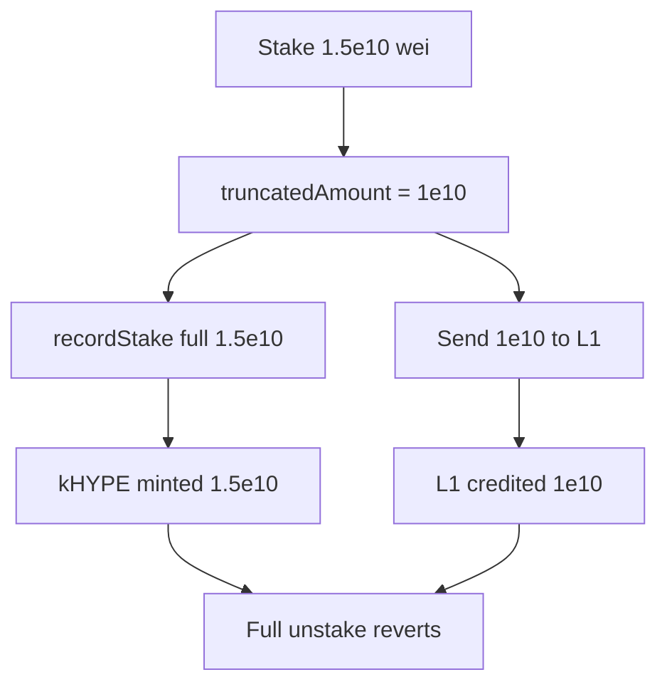

# Kinetiq LST — precision truncation on stake causes accounting insolvency

> **Vulnerability classes:** vuln/accounting/precision-loss · vuln/loss-of-funds/insolvency · vuln/math/truncation

> **Reproduction:** a self-contained Foundry PoC that compiles & runs in an
> isolated project with **only `forge-std`** — no fork, no RPC, no `anvil_state`.
> Full trace: [output.txt](output.txt). PoC:
> [test/58596-precision-truncation-on-stake-may-lead-to-improper-accountin_exp.sol](test/58596-precision-truncation-on-stake-may-lead-to-improper-accountin_exp.sol).

<!-- non-defihacklabs -->
<!-- source-auditvault: https://github.com/Auditware/AuditVault/blob/main/findings/58596-precision-truncation-on-stake-may-lead-to-improper-accountin.md -->
<!-- date: 2025-03 -->

**AuditVault taxonomy:** `severity/high` · `sector/liquid-staking` · `sector/staking` · `platform/spearbit` · `precision-loss` · `integer-bounds` · `direct-drain`

---

## Key info

| | |
|---|---|
| **Impact** | **HIGH** — L1 only credits 1e10-aligned HYPE, but kHYPE is minted for the full amount → unbacked shares / failed exits |
| **Protocol** | Kinetiq LST — StakingManager on HyperEVM |
| **Vulnerable code** | `_distributeStake` / `recordStake` records full `amount` while only `truncatedAmount` is sent to L1 |
| **Bug class** | Truncation vs full-amount accounting mismatch |
| **Finding** | Spearbit Kinetiq Mar 2025 · #58596 · reporter **Rvierdiiev** |
| **Report** | [Kinetiq Spearbit Security Review March 2025](https://github.com/spearbit/portfolio/blob/master/pdfs/Kinetiq-Spearbit-Security-Review-March-2025.pdf) |
| **Source** | [AuditVault](https://github.com/Auditware/AuditVault/blob/main/findings/58596-precision-truncation-on-stake-may-lead-to-improper-accountin.md) |
| **Status** | Audit finding — fixed in e2bac5c. Reproduced as a standalone local PoC. |
| **Compiler** | `^0.8.24` (PoC) |

---

## TL;DR

1. HyperCore books HYPE with 8 decimals → transfers must be multiples of `1e10` wei.
2. `_distributeStake` sends `truncatedAmount = amount / 1e10 * 1e10` but `recordStake` mints kHYPE for full `amount`.
3. Residual dust is unrecoverable; cumulative over-mint makes the vault insolvent.
4. Full unstake reverts when claimed shares exceed L1 credit. Fix: record only `truncatedAmount` (and track dust in buffer).

---

## The vulnerable code

```solidity
uint256 truncatedAmount = (amount / FACTOR) * FACTOR;
(bool success,) = payable(l1).call{value: truncatedAmount}("");
// FIX: _recordStake(truncatedAmount);
_recordStake(msg.sender, amount); // @> VULN
```

---

## Root cause

Two different quantities are treated as one: the **economic** amount the user intended to stake, and the **quantum** actually accepted by L1. Minting shares against the former while L1 only holds the latter creates permanent unbacked kHYPE equal to `Σ (a_i mod 1e10)`.

## Preconditions

- Stake amounts (or post-buffer `amountToStake`) not divisible by `1e10`.
- Often surfaces after withdrawals leave a misaligned buffer (report PoC).

## Attack walkthrough

1. User stakes `1.5e10` wei HYPE.
2. L1 is credited `1e10`; manager mints `1.5e10` kHYPE; `0.5e10` dust is lost to accounting.
3. Full unstake of `1.5e10` reverts (L1 insolvent).
4. Redeeming the backed `1e10` succeeds; remaining `0.5e10` shares are permanently unbacked.

## Diagrams



## Impact

Silent HYPE loss on every unaligned stake; incorrect `totalStaked`; users cannot fully exit; protocol-wide dilution if fees mask the gap temporarily. Loss accumulates as `Σ (a_i mod 10^10)`.

## Sources

- [AuditVault finding #58596](https://github.com/Auditware/AuditVault/blob/main/findings/58596-precision-truncation-on-stake-may-lead-to-improper-accountin.md)
- [Spearbit Kinetiq review (Mar 2025)](https://github.com/spearbit/portfolio/blob/master/pdfs/Kinetiq-Spearbit-Security-Review-March-2025.pdf)
- Reduced source: Kinetiq `StakingManager._distributeStake` / `recordStake` (fixed in e2bac5c)
