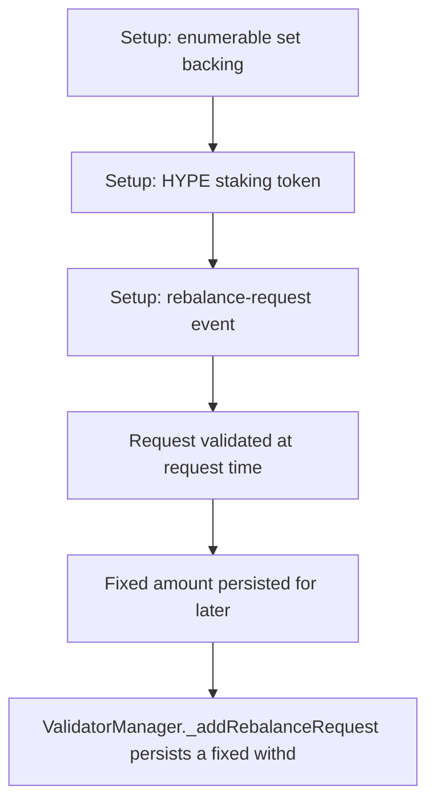

# Kinetiq: rebalance request uses an outdated validator balance

> **Vulnerability classes:** vuln/logic
>
> **Reproduction:** a faithful minimal reproduction of the vulnerable finding — the vulnerable code is reproduced **verbatim** (marked `@>`) with faithful minimal doubles; local deploy, no fork.

<!-- source-auditvault: https://github.com/pashov/audits/blob/master/team/md/Kinetiq-security-review_2025-02-26.md -->

## Root cause

ValidatorManager._addRebalanceRequest persists a fixed withdrawal amount validated against the validator balance at request time; closeRebalanceRequest reuses that stale amount and never re-reads the live balance. Rewards accruing between request and close (100e18 -> 110e18) leave 10e18 permanently stuck: a full-deactivation close retrieves only the stale 100e18. (Symmetric case: a balance decrease makes the undelegation revert and freezes the request.)

```solidity
    function _addRebalanceRequest(address validator, uint256 withdrawalAmount) internal {
        require(!_validatorsWithPendingRebalance.contains(validator), "Validator has pending rebalance");
        require(withdrawalAmount > 0, "Invalid withdrawal amount");

        (bool exists, uint256 index) = _validatorIndexes.tryGet(validator);
        require(exists, "Validator does not exist");
        require(_validators[index].balance >= withdrawalAmount, "Insufficient balance");

        validatorRebalanceRequests[validator] = RebalanceRequest({validator: validator, amount: withdrawalAmount}); // @> VULN: persists a FIXED amount validated against the balance at REQUEST time; closeRebalanceRequest reuses this stale amount and never re-reads the live balance
        _validatorsWithPendingRebalance.add(validator);

        emit RebalanceRequestAdded(validator, withdrawalAmount);
    }
```

## Why it's exploitable here

ValidatorManager._addRebalanceRequest persists a fixed withdrawal amount validated against the validator balance at request time; closeRebalanceRequest reuses that stale amount and never re-reads the live balance. Rewards accruing between request and close (100e18 -> 110e18) leave 10e18 permanently stuck: a full-deactivation close retrieves only the stale 100e18. (Symmetric case: a balance decrease makes the undelegation revert and freezes the request.)

## Attack path



## Marked-line walkthrough (Playground)

The EVM Playground pins each step to the exact executed source line in `0xce01759b82…`:

1. **L52** — Setup: enumerable set backing: Setup: minimal EnumerableSet/Map doubles back the validator bookkeeping so the marked line stays byte-identical.
2. **L85** — Setup: HYPE staking token: Setup: the HYPE token and HyperLiquid staking double provide real delegate and undelegate transfers.
3. **L175** — Setup: rebalance-request event: Setup: the manager emits RebalanceRequestAdded when a withdrawal request is recorded.
4. **L196** — Request validated at request time: addRebalanceRequest validates withdrawalAmount against the validator's balance as it stands at request time.
5. **L209** — Fixed amount persisted for later: Root cause: the request stores a fixed amount; closeRebalanceRequest reuses it and never re-reads the live balance, so rewards accrued in between are left behind.
6. **L222** — Close reuses the stale amount: On close the validator is looked up and the stale stored amount is undelegated — 10e18 of accrued rewards stay permanently stuck.

## PoC

Registry (Foundry, local deploy — verbatim vulnerable source + harm-asserting test):

```bash
cd 58609-h-01-addrebalancerequest-may-use-outdated-balance-for-deleg_exp
forge test -vvv
```

The browser Playground replays the same synthetic opcode-for-opcode and measures the harm. Both gates are green (registry `forge test` PASS + Playground `_verify-poc` **VERDICT: PASS**).
