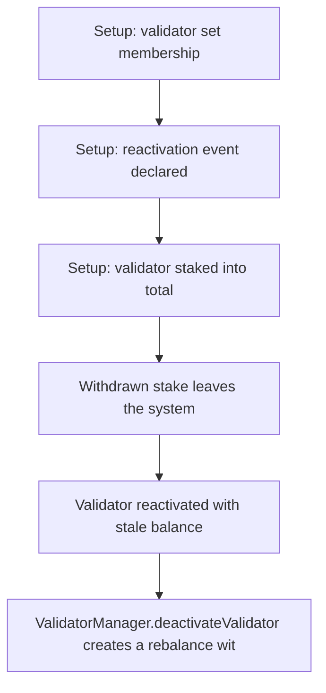

# Kinetiq: reactivated validator retains stale balance (underflow DoS)

> **Vulnerability classes:** vuln/logic
>
> **Reproduction:** a faithful minimal reproduction of the vulnerable finding — the vulnerable code is reproduced **verbatim** (marked `@>`) with faithful minimal doubles; local deploy, no fork.

<!-- source-auditvault: https://github.com/pashov/audits/blob/master/team/md/Kinetiq-security-review_2025-02-26.md -->

## Root cause

ValidatorManager.deactivateValidator creates a rebalance withdrawal for the validator's balance but never zeroes validatorData.balance nor subtracts it from totalBalance; OracleManager skips inactive validators, so the stale balance survives. After the withdrawn stake leaves the system (totalBalance correctly reduced) and the validator is reactivated, the routine oracle call totalBalance = totalBalance - oldBalance + balance subtracts the STALE 100e18 from a 40e18 totalBalance -> Solidity 0.8 underflow revert -> permanent DoS on updateValidatorPerformance/generatePerformance for that validator (100e18 of accounting bricked).

```solidity
        Validator storage val = _validators[_validatorIndex[validator] - 1];
        // Cache old balance for total balance update
        uint256 oldBalance = val.balance;
        // Update total balance
        totalBalance = totalBalance - oldBalance + balance; // @> VULN: subtracts the STALE stored balance; deactivateValidator never zeroed val.balance, so oldBalance exceeds the already-reduced totalBalance -> underflow revert
        val.balance = balance;
```

## Why it's exploitable here

ValidatorManager.deactivateValidator creates a rebalance withdrawal for the validator's balance but never zeroes validatorData.balance nor subtracts it from totalBalance; OracleManager skips inactive validators, so the stale balance survives. After the withdrawn stake leaves the system (totalBalance correctly reduced) and the validator is reactivated, the routine oracle call totalBalance = totalBalance - oldBalance + balance subtracts the STALE 100e18 from a 40e18 totalBalance -> Solidity 0.8 underflow revert -> permanent DoS on updateValidatorPerformance/generatePerformance for that validator (100e18 of accounting bricked).

## Attack path



## Marked-line walkthrough (Playground)

The EVM Playground pins each step to the exact executed source line in `0x671d353a77…`:

1. **L54** — Setup: validator set membership: Setup: an OZ-style AddressSet tracks validators and pending-rebalance membership.
2. **L109** — Setup: reactivation event declared: Setup: the manager emits ValidatorReactivated when a deactivated validator is brought back.
3. **L144** — Setup: validator staked into total: Setup: addValidator records a validator's balance and adds it to the global totalBalance.
4. **L167** — Withdrawn stake leaves the system: settleRebalanceWithdrawal finalizes a deactivated validator's withdrawal, correctly reducing totalBalance as the HYPE leaves.
5. **L208** — Validator reactivated with stale balance: reactivateValidator brings the validator back, but deactivateValidator never zeroed its stored balance.
6. **L252** — Oracle update underflows on stale balance: Root cause: the oracle update subtracts the stale stored oldBalance, which now exceeds the already-reduced totalBalance, causing a 0.8 underflow revert.
7. **L254** — Performance updates permanently bricked: The revert fires before val.balance is refreshed, so updateValidatorPerformance reverts forever for that validator — a permanent accounting DoS.

## PoC

Registry (Foundry, local deploy — verbatim vulnerable source + harm-asserting test):

```bash
cd 58611-h-03-deactivated-validator-retains-old-balance-after-reactiv_exp
forge test -vvv
```

The browser Playground replays the same synthetic opcode-for-opcode and measures the harm. Both gates are green (registry `forge test` PASS + Playground `_verify-poc` **VERDICT: PASS**).
