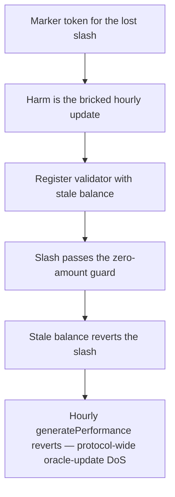

# Kinetiq: `reportSlashingEvent` reverts when the stale balance is below the slash amount

> **Vulnerability classes:** vuln/logic · vuln/dos
>
> **Reproduction:** a faithful minimal reproduction of the vulnerable finding — the slashing loop of `OracleManager.generatePerformance` and the guard in `ValidatorManager.reportSlashingEvent` are reproduced **verbatim** (marked `@>`) with faithful minimal doubles; local deploy, no fork.

<!-- source-auditvault: https://github.com/pashov/audits/blob/master/team/md/Kinetiq-security-review_2025-02-26.md -->

## Root cause

In `ValidatorManager.reportSlashingEvent`, the newly-reported slash `amount` is checked against the validator's **stale, previously-reported** `val.balance` rather than its real, up-to-date balance. Because `val.balance` is only refreshed by the oracle's periodic update, it lags the validator's real balance between rounds — so a legitimate slash can exceed the stored value and revert. The vulnerable code, reproduced verbatim:

```solidity
    function reportSlashingEvent(address validator, uint256 amount)
       // ...
    {
        require(amount > 0, "Invalid slash amount");

        Validator storage val = _validators[_validatorIndexes.get(validator)];
@>        require(val.balance >= amount, "Insufficient stake for slashing");

        // Update balances
        unchecked {
            // These operations cannot overflow:
            // - val.balance >= amount (checked above)
            // - totalBalance >= val.balance (invariant maintained by the contract)
            val.balance -= amount;
            totalBalance -= amount;
        }

       // ...
    }
```

`generatePerformance` calls `reportSlashingEvent` inside its per-validator loop, so a single reverting validator reverts the **entire** hourly oracle update — not just that validator's slash.

## Why it's exploitable here

Following the finding's own worked example:

1. At time `T`, valA's last-reported balance is `100`. Its real balance then grows to `500` before the next oracle round, but the stored `val.balance` still reads `100`.
2. The oracle round averages an accumulated slash of `110` for valA (previously `0`), so `newSlashAmount = 110 - 0 = 110`.
3. `generatePerformance` loops the validators and calls `reportSlashingEvent(valA, 110)`. The guard evaluates `require(100 >= 110)` — false — and reverts with `"Insufficient stake for slashing"`.
4. That revert propagates out of the loop, so the whole hourly `generatePerformance` batch reverts. No validator's stats or `totalBalance` update lands until the condition happens to clear — a protocol-wide oracle-update DoS, most likely in the first days after a validator is activated.

The slash of `110` was never invalid — valA's real balance was `500`. Only the comparison against the stale `100` makes it revert.

## Attack path



## Marked-line walkthrough (Playground)

The EVM Playground pins each step to the exact executed source line in `ValidatorM…`:

1. **L60** — Marker token for the lost slash: Setup: A minimal marker token stands in for the slashing amount that can never be recorded, giving this liveness bug a measurable on-chain harm.
2. **L63** — Harm is the bricked hourly update: Setup: The surfaced harm is the bricked hourly generatePerformance update, which halts slash accounting for every validator once a single revert fires.
3. **L119** — Register validator with stale balance: Setup: addValidator records valA with its stale last-reported balance of 100e18 and raises totalBalance, mirroring the staking that funds a validator.
4. **L130** — Slash passes the zero-amount guard: reportSlashingEvent's first require rejects only a zero slash, so valA's averaged 110e18 slash clears this guard and reaches the balance check.
5. **L133** — Stale balance reverts the slash: Root cause: require(val.balance >= amount) checks the 110e18 slash against valA's STALE stored 100e18 instead of its real 500e18, so it reverts.
6. **L144** — Slash event never emitted: The SlashingReported emit that would finalize the accounting is never reached, because the prior require reverts and unwinds the entire call.
7. **L153** — Oracle batches every validator: Setup: OracleManager.generatePerformance loops all validators and calls reportSlashingEvent inside the loop, so one revert dooms the whole hourly batch.
8. **L171** — Previously-accounted slash is zero: Setup: prevSlash holds the previously-accounted slash; with prevSlash=0 the averaged 110e18 becomes the full newSlashAmount fed to the reverting check.

## PoC

Registry (Foundry, local deploy — verbatim vulnerable source + harm-asserting test):

```bash
cd 58612-h-04-reportslashingevent-reverts-if-outdated-balance-is-belo_exp && forge test -vvv
```

The browser Playground replays the same synthetic opcode-for-opcode and measures the harm: **stored balance 100, real balance 500, averaged slash 110 → `require(100 >= 110)` reverts, bricking the entire hourly `generatePerformance` update**. Both gates are green (registry `forge test` PASS + Playground `_verify-poc` **VERDICT: PASS**).
