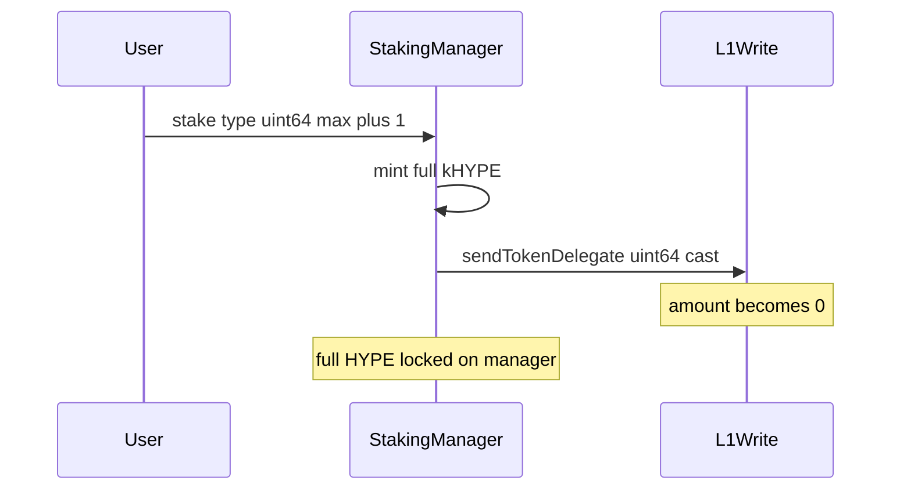

# Kinetiq — Funds can be permanently locked due to unsafe type casting

> **Vulnerability classes:** vuln/integer-bounds · frozen-funds · known-pattern

> **Reproduction:** a self-contained Foundry PoC that compiles & runs in an
> isolated project with **only `forge-std`** — no fork, no RPC, no `anvil_state`.
> Full trace: [output.txt](output.txt). PoC:
> [test/58613-h-05-funds-can-be-permanently-locked-due-to-unsafe-type-cast_exp.sol](test/58613-h-05-funds-can-be-permanently-locked-due-to-unsafe-type-cast_exp.sol).

<!-- non-defihacklabs -->
<!-- source-auditvault: https://github.com/Auditware/AuditVault/blob/main/findings/58613-h-05-funds-can-be-permanently-locked-due-to-unsafe-type-cast.md -->
<!-- date: 2025-02 -->

**AuditVault taxonomy:** `severity/high` · `sector/staking` · `integer-bounds` · `frozen-funds` · `known-pattern`

---

## Key info

| | |
|---|---|
| **Impact** | **HIGH** — stake above `type(uint64).max` mints full kHYPE but delegates 0; HYPE locked |
| **Protocol** | Kinetiq — StakingManager / L1Write |
| **Vulnerable code** | `_distributeStake` — `uint64(amount)` into `sendTokenDelegate` |
| **Bug class** | Unsafe downcast truncates delegation amount |
| **Finding** | Pashov Audit Group · Kinetiq 2025-02-26 · #58613 · H-05 |
| **Report** | [Kinetiq-security-review_2025-02-26](https://github.com/pashov/audits/blob/master/team/md/Kinetiq-security-review_2025-02-26.md) |
| **Source** | [AuditVault](https://github.com/Auditware/AuditVault/blob/main/findings/58613-h-05-funds-can-be-permanently-locked-due-to-unsafe-type-cast.md) |
| **Status** | Audit finding. Reproduced as a standalone local PoC. |
| **Compiler** | `^0.8.24` (PoC) |

---

## TL;DR

1. `L1Write.sendTokenDelegate` takes `uint64 amount`.
2. StakingManager casts `uint256 → uint64` without SafeCast.
3. For `amount = type(uint64).max + 1`, the cast becomes **0**.
4. Full HYPE is accepted and full kHYPE is minted, but **0** is delegated.
5. HYPE remains on the manager with no recovery path → permanent lock.

---

## The vulnerable code

```solidity
l1Write.sendTokenDelegate(delegateTo, uint64(amount), false); // @> VULN
// FIX: SafeCast.toUint64(amount)
```

---

## Root cause

Solidity's explicit cast to a smaller unsigned type **truncates** high bits (no revert). Values `>= 2^64` wrap in the low 64 bits; `2^64` itself becomes 0. Combined with unlimited `maxStakeAmount`, a single oversized stake bricks those funds while over-minting receipt tokens.

## Preconditions

- `maxStakeAmount == 0` (unlimited) or `> type(uint64).max`
- Stake amount `> type(uint64).max` (PoC uses `max + 1`)

## Attack walkthrough

1. Stake `type(uint64).max + 1` HYPE (~18.45 ether).
2. `kHYPE.mint` for the full amount.
3. `_distributeStake` calls L1 with `uint64` **0**.
4. Manager balance still holds the full HYPE; nothing usable on L1 for that stake.

## Diagrams



## Impact

User (or protocol) HYPE can be accepted and receipt-minted while never delegated. Withdrawal paths that assume L1 holdings cannot recover the truncated amount. Large stakes under unlimited caps are permanently stuck.

## Sources

- [AuditVault finding #58613](https://github.com/Auditware/AuditVault/blob/main/findings/58613-h-05-funds-can-be-permanently-locked-due-to-unsafe-type-cast.md)
- [Pashov Kinetiq review 2025-02-26](https://github.com/pashov/audits/blob/master/team/md/Kinetiq-security-review_2025-02-26.md)
- Reduced source: [kinetiq-research/lst @ c83aa17](https://github.com/kinetiq-research/lst/tree/c83aa178eb429a7e084bdda402aadafe1a58dcc6) — `StakingManager` `_distributeStake` / `uint64(amount)`
