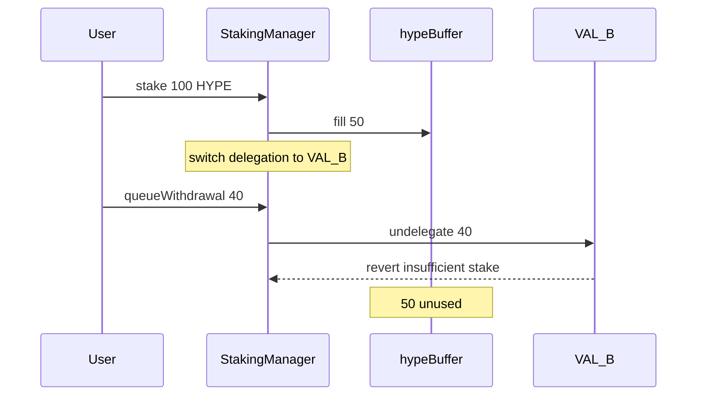

# Kinetiq — Some stakers may fail to withdraw staking HYPE

> **Vulnerability classes:** vuln/reward-accounting · dos/lockup · loss-of-funds/locked-funds

> **Reproduction:** a self-contained Foundry PoC that compiles & runs in an
> isolated project with **only `forge-std`** — no fork, no RPC, no `anvil_state`.
> Full trace: [output.txt](output.txt). PoC:
> [test/58614-h-06-some-stakers-may-fail-to-withdraw-staking-hype-pashov-a_exp.sol](test/58614-h-06-some-stakers-may-fail-to-withdraw-staking-hype-pashov-a_exp.sol).

<!-- non-defihacklabs -->
<!-- source-auditvault: https://github.com/Auditware/AuditVault/blob/main/findings/58614-h-06-some-stakers-may-fail-to-withdraw-staking-hype-pashov-a.md -->
<!-- date: 2025-02 -->

**AuditVault taxonomy:** `severity/high` · `sector/staking` · `sector/liquid-staking` · `reward-accounting` · `dos-resistance` · `dos/lockup` · `loss-of-funds/locked-funds` · `known-pattern`

---

## Key info

| | |
|---|---|
| **Impact** | **HIGH** — withdrawals ignore `hypeBuffer` and force validator undelegation; can revert when current validator has insufficient stake |
| **Protocol** | Kinetiq — StakingManager buffer |
| **Vulnerable code** | `queueWithdrawal` → always `_withdrawFromValidator` |
| **Bug class** | Buffer not used on exit (Lido-style buffer inverted) |
| **Finding** | Pashov Audit Group · Kinetiq 2025-02-26 · #58614 · H-06 |
| **Report** | [Kinetiq-security-review_2025-02-26](https://github.com/pashov/audits/blob/master/team/md/Kinetiq-security-review_2025-02-26.md) |
| **Source** | [AuditVault](https://github.com/Auditware/AuditVault/blob/main/findings/58614-h-06-some-stakers-may-fail-to-withdraw-staking-hype-pashov-a.md) |
| **Status** | Audit finding. Reproduced as a standalone local PoC. |
| **Compiler** | `^0.8.24` (PoC) |

---

## TL;DR

1. Stake path fills `hypeBuffer` up to `targetBuffer` before delegating.
2. `queueWithdrawal` **never** spends the buffer; it always undelegates from `currentDelegation`.
3. After a delegation switch to a validator with 0 stake, even a buffer-covered withdrawal reverts.
4. Control path that drains buffer first succeeds for the same request.
5. Fix: service from buffer first; only undelegate the shortfall.

---

## The vulnerable code

```solidity
_withdrawFromValidator(currentDelegation, amount); // @> VULN
// FIX: use hypeBuffer first, then undelegate remainder
```

---

## Root cause

The buffer exists only on the deposit path. Exit logic treats every withdrawal as a validator exit, defeating the reserve and coupling user exits to the **current** validator's L1 balance (which may be empty after rebalance).

## Preconditions

- Non-zero `targetBuffer` with buffer actually filled.
- `currentDelegation` has less stake than the withdrawal (e.g. after `setDelegation` to a fresh validator).

## Attack walkthrough

1. Stake 100 HYPE with `targetBuffer = 50` → 50 buffer, 50 on VAL_A.
2. Operator sets current delegation to VAL_B (0 stake).
3. User queues 40 HYPE — buffer has 50, but code undelegates 40 from VAL_B → **revert**.
4. Fixed path consumes 40 from buffer and succeeds.

## Diagrams



## Impact

Stakers can be unable to queue withdrawals despite idle buffer liquidity. Combined with rebalancing (L-08-adjacent), this becomes a selective / systemic exit DoS and forces unnecessary validator exits when the buffer could have paid.

## Sources

- [AuditVault finding #58614](https://github.com/Auditware/AuditVault/blob/main/findings/58614-h-06-some-stakers-may-fail-to-withdraw-staking-hype-pashov-a.md)
- [Pashov Kinetiq review 2025-02-26](https://github.com/pashov/audits/blob/master/team/md/Kinetiq-security-review_2025-02-26.md)
- Reduced source: [kinetiq-research/lst @ c83aa17](https://github.com/kinetiq-research/lst/tree/c83aa178eb429a7e084bdda402aadafe1a58dcc6) — `StakingManager.queueWithdrawal`
