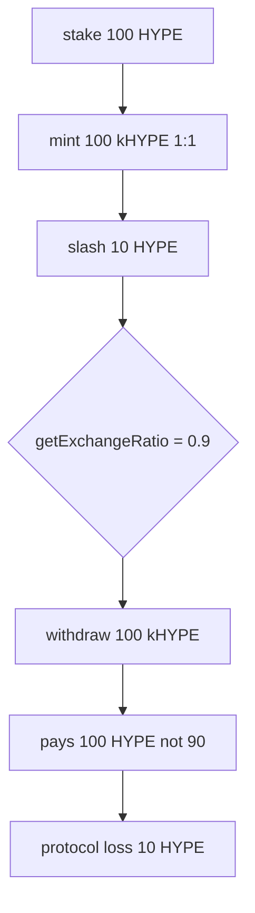

# Kinetiq — Exchange rate implementation not used in token operations

> **Vulnerability classes:** vuln/cross-contract-state-consistency · reward-accounting

> **Reproduction:** a self-contained Foundry PoC that compiles & runs in an
> isolated project with **only `forge-std`** — no fork, no RPC, no `anvil_state`.
> Full trace: [output.txt](output.txt). PoC:
> [test/58615-h-07-exchange-rate-implementation-not-used-in-token-operatio_exp.sol](test/58615-h-07-exchange-rate-implementation-not-used-in-token-operatio_exp.sol).

<!-- non-defihacklabs -->
<!-- source-auditvault: https://github.com/Auditware/AuditVault/blob/main/findings/58615-h-07-exchange-rate-implementation-not-used-in-token-operatio.md -->
<!-- date: 2025-02 -->

**AuditVault taxonomy:** `severity/high` · `sector/staking` · `cross-contract-state-consistency` · `use-reentrancy-guard`

---

## Key info

| | |
|---|---|
| **Impact** | **HIGH** — 1:1 mint/redeem ignores `getExchangeRatio`; after slash, redeem overpays and drains protocol |
| **Protocol** | Kinetiq — StakingManager |
| **Vulnerable code** | `stake` mints `msg.value` 1:1; withdraw pays 1:1 |
| **Bug class** | Exchange-rate API unused in ops |
| **Finding** | Pashov Audit Group · Kinetiq 2025-02-26 · #58615 · H-07 |
| **Report** | [Kinetiq-security-review_2025-02-26](https://github.com/pashov/audits/blob/master/team/md/Kinetiq-security-review_2025-02-26.md) |
| **Source** | [AuditVault](https://github.com/Auditware/AuditVault/blob/main/findings/58615-h-07-exchange-rate-implementation-not-used-in-token-operatio.md) |
| **Status** | Audit finding. Reproduced as a standalone local PoC. |
| **Compiler** | `^0.8.24` (PoC) |

---

## TL;DR

1. `getExchangeRatio` / `kHYPEToHYPE` / `HYPEToKHYPE` implement NAV-based rates.
2. `stake()` still does `kHYPE.mint(msg.sender, msg.value)` (1:1).
3. Withdraw pays 1 HYPE per kHYPE instead of `kHYPEToHYPE`.
4. After 10 HYPE slash on 100 staked, ratio is 0.9 but redeem of 100 kHYPE pays **100** instead of **90**.
5. Protocol loss of 10 HYPE. Fix: mint/burn via conversion helpers.

---

## The vulnerable code

```solidity
kHYPE.mint(msg.sender, msg.value); // @> VULN
// FIX: kHYPE.mint(msg.sender, HYPEToKHYPE(msg.value));
```

---

## Root cause

Accounting views and state transitions diverged. The ratio reflects rewards/slashing, but share mint and redeem paths hardcode 1:1, so NAV changes do not adjust user claims.

## Preconditions

- Exchange rate has moved off 1:1 (slashing or rewards).
- User redeems (or stakes) under the 1:1 path.

## Attack walkthrough

1. Stake 100 HYPE → 100 kHYPE minted.
2. Report slash 10 → ratio 0.9; fair redeem of 100 kHYPE = 90 HYPE.
3. Buggy withdraw pays 100 HYPE → **10 HYPE protocol loss**.

## Diagrams



## Impact

Protocol and remaining stakers subsidize redeemers after negative PnL (and inverse distortion after rewards). Share supply no longer tracks economic claim on HYPE.

## Sources

- [AuditVault finding #58615](https://github.com/Auditware/AuditVault/blob/main/findings/58615-h-07-exchange-rate-implementation-not-used-in-token-operatio.md)
- [Pashov Kinetiq review 2025-02-26](https://github.com/pashov/audits/blob/master/team/md/Kinetiq-security-review_2025-02-26.md)
- Reduced source: [kinetiq-research/lst @ c83aa17](https://github.com/kinetiq-research/lst/tree/c83aa178eb429a7e084bdda402aadafe1a58dcc6) — `StakingManager.stake` mint line
